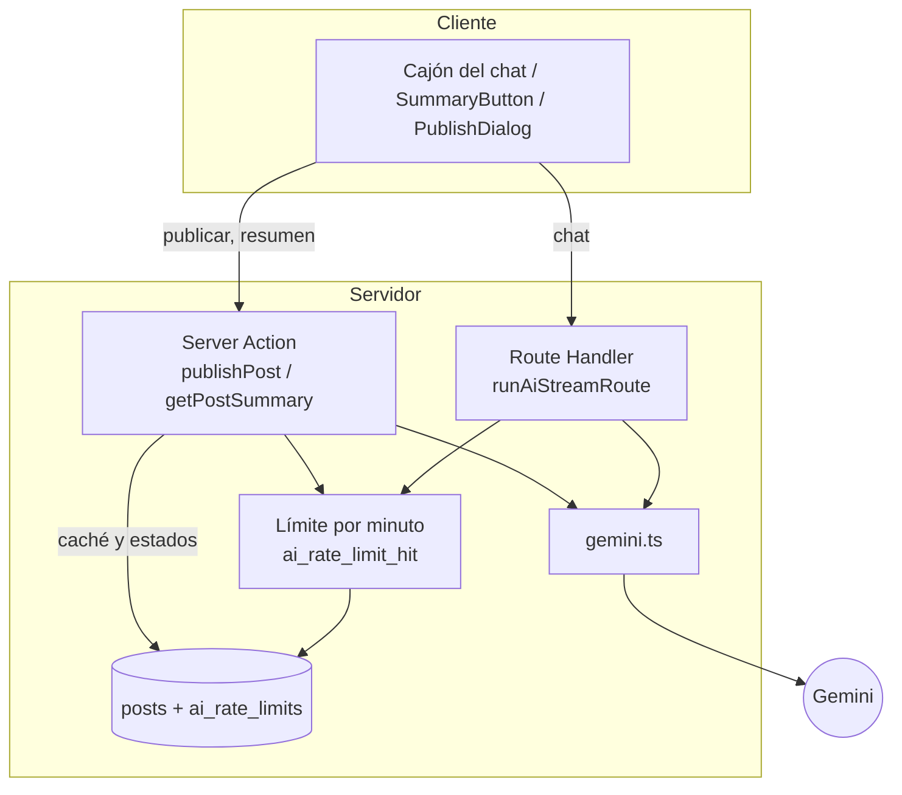

# La capa de IA

Toda la IA del proyecto vive en `src/features/ai/`, solo en el servidor, y pasa por un **proveedor intercambiable**: Gemini (por defecto) u OpenRouter, según `AI_PROVIDER` ([ADR 0031](../adr/0031-proveedor-de-ia-intercambiable-openrouter.md)). Esta página es el mapa: qué hace la IA, por dónde entra cada función, qué límites y protecciones tiene y cómo agregar una función nueva. Las decisiones y sus motivos están en los ADRs enlazados.

## Proveedor: un puerto, dos adaptadores

`types.ts` define el puerto (`GenerateText`, `GenerateStructured`, `StreamText`) y toda la orquestación depende de esas firmas, nunca del SDK. Cambiar de proveedor o de modelo es una variable de entorno.

| Archivo | Rol |
| :--- | :--- |
| `types.ts` | El puerto: las tres funciones que consume el resto de la capa |
| `provider.server.ts` | Único lugar que elige el adaptador según `AI_PROVIDER`. Es lo que se importa |
| `gemini.ts` | Adaptador de Gemini (`@google/genai`) |
| `openrouter.ts` | Adaptador de OpenRouter (`fetch` contra su API compatible con OpenAI, sin dependencia nueva) |
| `openrouter-protocol.ts` | Traducción pura del protocolo de OpenRouter, sin I/O y con pruebas sin red |
| `feature-config.ts` | Temperatura y tope de tokens por función, comunes a ambos |
| `provider-telemetry.ts` | Registro de metadatos y conversión de cualquier fallo en `AiError`, común a ambos |

Diferencia de comportamiento a tener presente: en Gemini cada fragmento del stream trae la llamada a herramienta completa, mientras que en OpenRouter los argumentos llegan troceados y solo se pueden validar al terminar el stream. Con OpenRouter, entonces, el texto de la respuesta aparece primero y las tarjetas de propuesta después, todas juntas. Lo que se valida y cómo es idéntico: ambas pasan por `modelPartsToStreamParts`.

## Qué hace la IA hoy

| Función | Quién la usa | Punto de entrada | Salida | PRD |
| :--- | :--- | :--- | :--- | :--- |
| **Chat del editor**: responde, propone ediciones y presenta análisis | Autor, en `/editor/[id]` (cajón `Cmd/Ctrl+I`) | `POST /api/ai/chat` (stream NDJSON) | Texto, propuestas (`propose_edit`), análisis (`present_analysis`), pasos | [PRD-8](../prds/PRD-8-ai-chat.md) |
| **Acciones rápidas** (Estructura, Títulos, Tono, Analizar) | Autor, en el cajón | Envían un prompt ya escrito al chat | Lo mismo que el chat | [PRD-8](../prds/PRD-8-ai-chat.md), [PRD-5](../prds/PRD-5-ai-author.md) |
| **Moderación y auto-tagging al publicar** | Servidor, dentro de `publishPost` | Server Action | `{ is_appropriate, reason, suggested_tags }` | [PRD-5](../prds/PRD-5-ai-author.md) |
| **Resumen para lectores** | Lector, en `/post/[id]` (`SummaryButton`) | Server Action `getPostSummary` | Texto plano de 2 a 3 oraciones, guardado en el post | [PRD-6](../prds/PRD-6-ai-reader.md) |
| Outline, títulos, tono y score como herramientas independientes | **Nadie** (ninguna pantalla las llama) | `POST /api/ai/outline`, `/titles`, `/tone`, `/score` | JSON | Deprecadas: [ADR 0019](../adr/0019-rutas-legacy-de-ia-deprecadas.md) |

Reglas de alcance: las funciones del autor operan **solo sobre artículos** (nunca notas) y, salvo el chat, solo sobre los del propio autor. El chat no consulta la base: recibe el estado vivo del editor, así que cualquier usuario autenticado puede usarlo ([ADR 0013](../adr/0013-chat-ia-protocolo-ndjson-y-function-calling.md)).

**Lo que la IA no cubre:** las notas se publican sin moderación (`createNote` inserta directo `published`); editar un artículo ya publicado no lo vuelve a moderar; y la moderación es de mejor esfuerzo, no una frontera de seguridad ([ADR 0011](../adr/0011-ia-con-gemini.md)).

## Cómo circula una petición

| Etapa | Qué pasa | Dónde |
| :--- | :--- | :--- |
| 1. Pre-vuelo (solo Route Handlers) | Origin contra Host, `Content-Type` JSON, tamaño declarado, sesión, lectura del cuerpo con tope de 200 KB, Zod | `route-runner.server.ts`, `route-helpers.ts` |
| 2. Límite por minuto | `ai_rate_limit_hit` cuenta por usuario y luego global; falla cerrado | `rate-limit.ts`, `rate-limit.server.ts`, migración `0007` |
| 3. Caché (resumen y funciones legacy) | Un acierto no consume cupo ni llama al modelo | `cached-feature.ts`, `cache.ts`, `cache.server.ts` |
| 4. Prompt | Instrucción de sistema fija, contenido entre delimitadores, truncado | `prompts.ts` |
| 5. Modelo | Salida JSON validada con Zod, o texto, o stream con function calling | `gemini.ts`, `schemas.ts`, `function-calls.ts` |
| 6. Post-proceso | Validar acciones contra los bloques vistos, limpiar texto | `chat-stream.ts`, `output.ts`, `moderation.ts` |
| 7. Respuesta | JSON tipado `{ ok, data }` o `{ ok:false, error }`, o NDJSON | `route-helpers.ts`, `stream-response.ts`, `stream-protocol.ts` |

## Límite por minuto: dos carriles

Ventana fija de un minuto en Postgres, sin Redis ([ADR 0011](../adr/0011-ia-con-gemini.md)). Cuenta primero por usuario y, si no lo superó, por el contador global. Un usuario que ya se pasó **no** consume el cupo global.

| Carril | Claves | Lo usan | Límite por usuario | Límite global |
| :--- | :--- | :--- | :--- | :--- |
| `assist` | `user:<id>` y `global` | Chat, resumen y las rutas legacy | `AI_RATE_LIMIT_USER_PER_MIN` (5) | `AI_RATE_LIMIT_GLOBAL_PER_MIN` (6) |
| `moderation` | `moderation:user:<id>` y `moderation:global` | `publishPost` | `AI_RATE_LIMIT_USER_PER_MIN` (5) | `AI_RATE_LIMIT_MODERATION_GLOBAL_PER_MIN` (4) |

Los números entre paréntesis son los valores por defecto (`src/lib/env.server.ts`). Ajustarlos según el RPM que muestre Google AI Studio para el proyecto: la suma de los dos globales debería quedar por debajo. Si el limitador falla, se rechaza (falla cerrado).

## Cómo se comporta ante fallos

| Situación | Resultado |
| :--- | :--- |
| Límite por usuario o global | El chat y el resumen muestran un aviso con los segundos de espera (`retryAfter`); **publicar no se publica**: se libera el reclamo y el autor reintenta |
| Caída, timeout, cuota o JSON inválido del proveedor | El chat y el resumen muestran el error con "Reintentar"; **publicar publica igual sin tags automáticos** |
| Bloqueo por filtros de seguridad de Gemini | Al publicar, el artículo queda `rejected` con un motivo genérico |
| Contenido inapropiado según el moderador | `rejected` con el motivo (hasta 300 caracteres) en `rejection_reason` |
| Falta `GEMINI_API_KEY` o el modelo no existe | Error `not_configured`; la app sigue funcionando sin IA |

Tipos de error (`AiErrorKind`, `errors.ts`): `rate_limited`, `quota`, `timeout`, `unavailable`, `invalid_response`, `blocked`, `not_configured`, `input_too_long`, `input_too_short`, `not_allowed`, `unauthenticated`. Cada uno tiene un mensaje en español (`AI_ERROR_MESSAGES`) y la interfaz los muestra en línea (`AiErrorMessage`).

## Configuración del modelo

| Aspecto | Valor | ADR |
| :--- | :--- | :--- |
| Proveedor | `AI_PROVIDER`, por defecto `gemini`. Solo se exige la configuración del proveedor activo | [0031](../adr/0031-proveedor-de-ia-intercambiable-openrouter.md) |
| Modelo con Gemini | `GEMINI_MODEL`, por defecto `gemini-3.5-flash-lite` | [0011](../adr/0011-ia-con-gemini.md) |
| Modelo con OpenRouter | `OPENROUTER_MODEL`, **sin valor por defecto**. Debe admitir `tools` y `response_format` | [0031](../adr/0031-proveedor-de-ia-intercambiable-openrouter.md) |
| Thinking | Solo Gemini (2.5 Flash: presupuesto 0; 3.x: nivel `MINIMAL`). El protocolo de OpenAI no tiene equivalente | [0017](../adr/0017-politica-de-thinking-y-reintentos-gemini.md) |
| Reintentos | Ninguno. En Gemini `attempts: 1`; en OpenRouter `fetch` no reintenta por su cuenta | [0017](../adr/0017-politica-de-thinking-y-reintentos-gemini.md) |
| Timeouts | Moderación 8 s; defecto 15 s; tono 25 s; chat 45 s, con 15 s para el primer fragmento | [0017](../adr/0017-politica-de-thinking-y-reintentos-gemini.md) |
| Temperatura / tokens máx. | Por función en `FEATURE_CONFIG` (`feature-config.ts`), compartida por ambos proveedores | [0017](../adr/0017-politica-de-thinking-y-reintentos-gemini.md) |
| Verificación | `pnpm ai:smoke` (Gemini) y `pnpm ai:smoke:openrouter` (OpenRouter, comprueba además el streaming con function calling) | [getting-started](../guides/getting-started.md) |

## Protecciones

| Riesgo | Mitigación |
| :--- | :--- |
| Inyección de instrucciones en el texto del usuario | El texto va entre `<<<CONTENIDO>>>` y `<<<FIN>>>`, se neutralizan los delimitadores y la instrucción de sistema dice que es dato, no órdenes (`prompts.ts`) |
| El modelo inventa acciones sobre bloques que no existen | Cada acción se valida contra los bloques que el modelo realmente vio; las inválidas se descartan; máximo 8 por turno (`chat-stream.ts`) |
| JSON inesperado | Se pide `responseJsonSchema` y se vuelve a validar con Zod |
| Abuso de cuota | Límite por usuario y global; carril aparte para moderar |
| Petición desde otro origen | Comprobación de `Origin` contra `Host` en los Route Handlers |
| Cuerpos enormes | Tope de 200 KB medido mientras se lee el cuerpo, no después |
| Filtración de contenido en logs | Los logs `[ai]` llevan solo metadatos; nunca prompt, respuesta ni clave |
| Cliente que salta la moderación | Privilegios por columna: solo el servidor escribe `status` y `ai_*` ([ADR 0012](../adr/0012-integridad-de-escritura-de-posts.md)) |
| Privacidad | En la capa gratuita, Google puede usar el texto enviado para mejorar sus productos; la interfaz lo avisa |

## Mapa de archivos (`src/features/ai/`)

| Grupo | Archivos | Rol |
| :--- | :--- | :--- |
| Entrada HTTP | `route-runner.server.ts`, `route-helpers.ts`, `stream-response.ts`, `stream-protocol.ts` | Pre-vuelo, JSON tipado y NDJSON |
| Modelo | `gemini.ts`, `thinking.ts`, `first-chunk-deadline.ts`, `errors.ts`, `types.ts` | Llamadas, configuración, plazos y errores |
| Chat | `function-calls.ts`, `chat-stream.ts`, `chat-history.ts`, `prompts.ts` | Herramientas, validación de acciones, historial y prompts |
| Funciones | `handlers.server.ts` (chat y legacy), `moderation.ts`, `summary-actions.ts`, `posts.server.ts` | Orquestación por función |
| Límite y caché | `rate-limit.ts`, `rate-limit.server.ts`, `cached-feature.ts`, `cache.ts`, `cache.server.ts` | Cupo por minuto y resultados guardados |
| Utilidades | `schemas.ts`, `constants.ts`, `output.ts`, `words.ts` | Zod, límites numéricos, limpieza de salida y conteo de palabras |
| Interfaz | `components/` (`SummaryButton`, `AiErrorMessage`, `use-ai-request`, y los cuatro diálogos legacy) y `components/chat/` (cajón, mensajes, tarjetas, estado) | Pantallas |
| Aplicar ediciones | `src/features/posts/components/editor/` (`editor-context.ts`, `apply-action.ts`, `action-overlap.ts`, `editor-bridge.ts`) | Localizar y aplicar propuestas en Tiptap ([ADR 0014](../adr/0014-aplicacion-de-ediciones-en-el-cliente-con-fingerprints.md)) |

Casi todos los archivos puros tienen su `*.test.ts` al lado. Lo que necesita un ProseMirror real (`editor-bridge.ts`) lo cubre Playwright ([testing](../guides/testing.md)).

## Caché en el post

`posts.ai_generated_summary` guarda el resumen; `ai_generated_titles` y `content_score` guardan resultados de las funciones legacy y hoy no los usa ninguna pantalla. Un trigger los pone en `NULL` cuando cambia `content` y sube `updated_at`. Los resultados se guardan con compare-and-set sobre el `updated_at` leído: si el autor editó durante la generación, el resultado se devuelve pero no se guarda. Un acierto de caché no consume cupo. Detalle en [db/schema](../db/schema.md).

## Cómo agregar una función de IA nueva

Ejemplo: "sugerir un subtítulo". Sigue el orden de las capas, y escribir el test primero en cada paso.

1. **Decidir el punto de entrada.** Si el usuario espera una respuesta corta y única: Server Action (como `getPostSummary`). Si necesita streaming, propuestas o entradas grandes: Route Handler con `runAiRoute` o `runAiStreamRoute`. Para algo conversacional lo más simple suele ser una acción rápida que envía un prompt al chat existente (ver `PostEditor.tsx`).
2. **Agregar la función al tipo `AiFeature`** (`types.ts`) y su configuración en `FEATURE_CONFIG` (`gemini.ts`): temperatura y `maxOutputTokens`. Definir su timeout en `constants.ts`.
3. **Escribir el esquema de salida** en `schemas.ts` (Zod). Se convierte solo en `responseJsonSchema` con `toResponseJsonSchema`.
4. **Escribir el prompt** en `prompts.ts` reutilizando `DATA_RULES`, `wrapUserText` y `neutralizeDelimiters`. Todo texto del usuario va entre delimitadores.
5. **Escribir el handler.** Aplicar el límite (`enforceAiRateLimit`, o `checkAiRateLimit` con el carril adecuado); si el resultado es caro y estable, pasar por `runCachedFeature` y guardar con `saveAiCache`. Cargar el post con `loadOwnArticleForAi` si es una función del autor sobre su artículo.
6. **Decidir qué pasa si falla**: ¿bloquea la acción del usuario o degrada? El caso general es no bloquear nunca escribir, publicar ni leer.
7. **Conectar la interfaz** mostrando los errores con `AiErrorMessage` y respetando el canal de una sola petición en vuelo (`useAiRequest`).
8. **Si agrega columnas**, escribir una migración y actualizar `database.types.ts` a mano ([ADR 0016](../adr/0016-migraciones-sql-manuales.md)); las columnas de IA solo las escribe el servidor.
9. **Documentar**: una fila en la tabla de arriba, y un ADR si cambia una decisión (el carril del límite, el modelo, el protocolo).

## Documentos relacionados

- Producto: [PRD-5](../prds/PRD-5-ai-author.md) (IA para el autor), [PRD-6](../prds/PRD-6-ai-reader.md) (IA para el lector), [PRD-8](../prds/PRD-8-ai-chat.md) (chat del editor).
- Decisiones: [0011](../adr/0011-ia-con-gemini.md), [0012](../adr/0012-integridad-de-escritura-de-posts.md), [0013](../adr/0013-chat-ia-protocolo-ndjson-y-function-calling.md), [0014](../adr/0014-aplicacion-de-ediciones-en-el-cliente-con-fingerprints.md), [0017](../adr/0017-politica-de-thinking-y-reintentos-gemini.md), [0019](../adr/0019-rutas-legacy-de-ia-deprecadas.md).
- Arquitectura: [flujo de publicar y del chat](../architecture/overview.md).
