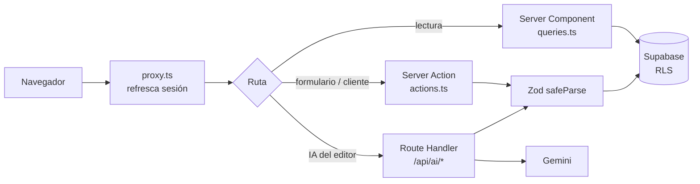
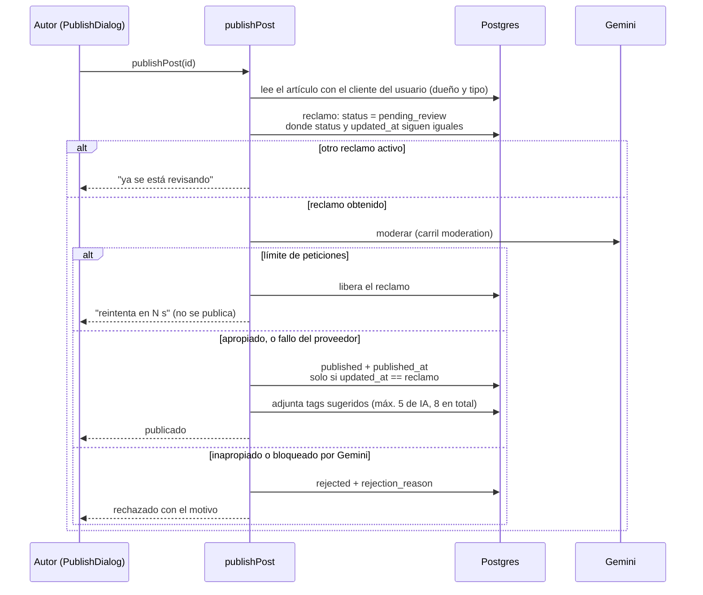
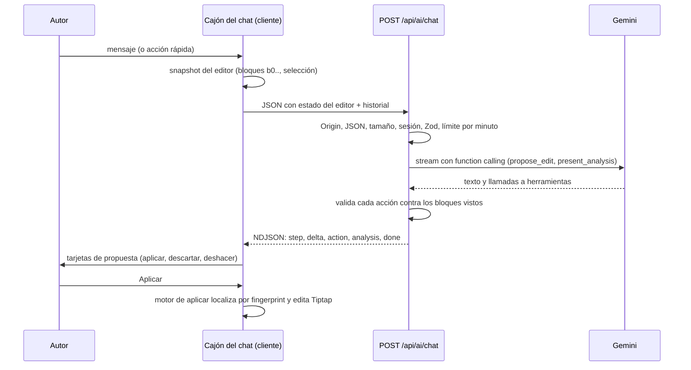

# Visión general de la arquitectura

`blog-ia` es un monolito Next.js 16 (App Router, React 19) que habla directo con Supabase. Las lecturas ocurren en Server Components y las escrituras en Server Actions, ambas validadas con Zod. La excepción son las funciones de IA del editor, que usan Route Handlers (`/api/ai/*`). La autorización real la hace RLS en la base de datos, reforzada con privilegios por columna ([ADR 0001](../adr/0001-monolito-nextjs-sin-capas.md), [ADR 0003](../adr/0003-seguridad-rls-y-proxy-minimo.md), [ADR 0012](../adr/0012-integridad-de-escritura-de-posts.md)).

> Este proyecto usa una versión de Next.js con cambios respecto a versiones previas (`proxy.ts` en lugar de `middleware`, tipos globales `PageProps<"/ruta">` y `LayoutProps`). Antes de escribir código, consultar `node_modules/next/dist/docs/` como indica `AGENTS.md`.

## Por qué está hecho así

| Pregunta | Respuesta corta | ADR |
| :--- | :--- | :--- |
| ¿Por qué no hay capas Controller/Service/Repository ni backend aparte? | Una Server Action que valida y llama a Supabase basta a esta escala | [0001](../adr/0001-monolito-nextjs-sin-capas.md) |
| ¿Por qué no hay roles autor/lector? | Un solo tipo de usuario; "autor" se deriva de los datos | [0002](../adr/0002-un-solo-tipo-de-usuario.md) |
| ¿Quién protege los datos? | RLS y privilegios por columna; `proxy.ts` es solo UX | [0003](../adr/0003-seguridad-rls-y-proxy-minimo.md), [0012](../adr/0012-integridad-de-escritura-de-posts.md) |
| ¿Por qué el login acepta username? | Se resuelve a email en el servidor con la secret key | [0007](../adr/0007-login-por-username-con-secret-key.md) |
| ¿Por qué notas y artículos comparten tabla? | Un feed y un sistema de likes; las reglas viven en la base | [0009](../adr/0009-tipos-de-post-y-likes.md), [0015](../adr/0015-notas-editables.md) |
| ¿Por qué el editor guarda markdown? | La IA y el render leen texto plano | [0010](../adr/0010-editor-markdown.md) |
| ¿Por qué las recomendaciones no usan IA? | Es un problema de ranking: más rápido, barato y explicable | [0004](../adr/0004-recomendaciones-scoring-determinista.md) |
| ¿Por qué la IA es un chat con propuestas aplicables? | Conversación con el texto a la vista y cambios que el autor decide | [0013](../adr/0013-chat-ia-protocolo-ndjson-y-function-calling.md), [0014](../adr/0014-aplicacion-de-ediciones-en-el-cliente-con-fingerprints.md) |
| ¿Por qué el límite de IA está en Postgres y hay dos carriles? | Sin Redis; la asistencia no puede agotar la cuota de la que depende publicar | [0011](../adr/0011-ia-con-gemini.md) |
| ¿Por qué se configura así Gemini? | Thinking mínimo, sin reintentos, timeouts por función | [0017](../adr/0017-politica-de-thinking-y-reintentos-gemini.md) |
| ¿Por qué las migraciones son manuales y no hay CI? | Cero herramientas nuevas para un equipo pequeño; el costo está documentado | [0016](../adr/0016-migraciones-sql-manuales.md), [0018](../adr/0018-sin-ci-gates-manuales.md) |
| ¿Por qué el feed está en `/` y los tags no se ven? | Decisiones de producto documentadas | [0021](../adr/0021-feed-en-raiz-y-global.md), [0020](../adr/0020-tags-como-metadato-interno.md) |

## Estructura del repositorio

```text
blog-ia/
├── src/                      # código de la aplicación (detalle abajo)
├── supabase/migrations/      # SQL numerado a mano, se aplica en el SQL Editor (ADR 0016)
├── e2e/                      # tests end-to-end de Playwright (5 specs + helpers)
├── scripts/                  # seed-dev.mjs, ai-smoke.mjs, verify-post-writes.mjs
├── docs/                     # esta documentación
└── AGENTS.md, CLAUDE.md      # reglas para agentes de IA que editan el código
```

## Estructura de `src/`

```text
src/
├── app/                      # rutas (App Router)
│   ├── (auth)/               # login, register, onboarding (sin AppShell)
│   ├── (public)/             # /, /explore, /post/[id], /author/[id] (con AppShell)
│   ├── (dashboard)/          # /posts, /profile, /settings, /activity (con AppShell)
│   ├── (editor)/             # /editor/[id] (pantalla completa, sin AppShell)
│   ├── api/ai/               # Route Handlers de IA: chat (stream), outline, titles, tone, score
│   ├── layout.tsx            # layout raíz (fuentes Geist, <html class="dark">)
│   ├── error.tsx             # error boundary de la app
│   └── not-found.tsx         # 404
├── components/
│   ├── ui/                   # primitivas shadcn/ui, incluye bubble, marker y message (ADR 0005)
│   └── shared/               # AppShell, MainNav, BottomNav, HeaderTitle, HeaderAccount, AccountDrawer, UserAvatar, navigation.ts
├── features/                 # código por dominio (ADR 0006)
│   ├── ai/                   # Gemini, chat, moderación, límite por minuto, caché, resumen
│   ├── auth/
│   ├── interests/            # paso 2 del onboarding: elegir temas de interés (ADR 0025)
│   ├── likes/
│   ├── posts/                # incluye el editor Tiptap y el motor de aplicar ediciones
│   ├── profile/
│   ├── recommendations/
│   └── subscriptions/
├── hooks/                    # use-is-desktop, use-visual-viewport-style (transversales)
├── lib/
│   ├── auth.ts               # requireUser(): usuario o redirect a /login
│   ├── env.ts                # variables públicas validadas con Zod al importarse
│   ├── env.server.ts         # SUPABASE_SECRET_KEY y variables de IA (server-only, validadas al usarse)
│   ├── format.ts             # getInitials, formatShortDate
│   ├── viewer.ts             # getViewer(): usuario + nombre, cacheado por request
│   ├── utils.ts              # re-exporta cn
│   └── supabase/             # server.ts, admin.ts, client.ts, database.types.ts
└── proxy.ts                  # refresco de sesión y redirección de rutas privadas
```

`lib/supabase/client.ts` existe pero hoy ningún componente lo importa.

## Grupos de ruta

Los paréntesis no forman parte de la URL: `(dashboard)/posts/page.tsx` responde en `/posts`.

| Grupo | Rutas | Acceso |
| :--- | :--- | :--- |
| `(auth)` | `/login`, `/register`, `/onboarding` | `/login` y `/register` son públicos; `/onboarding` exige sesión y onboarding pendiente (paso 1: perfil; paso 2: intereses). Sin barra de navegación |
| `(public)` | `/` (el feed), `/explore`, `/post/[id]`, `/author/[id]` | Público. El feed, `/explore` y `/post/[id]` solo muestran posts `published`. Seguir, dar like y registrar lecturas requieren sesión (las actions redirigen a `/login`) |
| `(dashboard)` | `/posts`, `/profile`, `/settings`, `/activity` | Requiere sesión. `/profile` redirige a `/author/<id>` del usuario. `/activity` es hoy una pantalla vacía |
| `(editor)` | `/editor/[id]` (`new` o el id de un artículo) | Requiere sesión. Layout propio sin `AppShell`; solo desde computadora (`DesktopOnly`) |
| `api/ai` | `POST /api/ai/chat` (stream NDJSON) y `/outline`, `/titles`, `/tone`, `/score` (JSON, deprecadas: [ADR 0019](../adr/0019-rutas-legacy-de-ia-deprecadas.md)) | Autentican dentro del handler; responden 401 en JSON |

`(public)` y `(dashboard)` tienen un `layout.tsx` que envuelve las páginas en `AppShell` ([ADR 0008](../adr/0008-tema-oscuro-y-shell-de-aplicacion.md)); `(editor)` tiene un layout mínimo ([ADR 0010](../adr/0010-editor-markdown.md)); `(auth)` no tiene layout propio.

**La protección no se deriva del grupo.** Hay tres mecanismos, y ninguno lee el nombre del grupo:

| Mecanismo | Rutas |
| :--- | :--- |
| Lista `PROTECTED_PATHS` en `src/proxy.ts` (redirige a `/login`) | `/settings`, `/editor`, `/posts` |
| La propia página llama a `getViewer()` y redirige | `/profile`, `/activity` |
| El propio handler responde 401 | `/api/ai/*` |

Una ruta privada nueva debe protegerse con uno de los tres; RLS protege los datos en cualquier caso.

`AppShell` (`components/shared/`) dibuja la barra superior y, con sesión, la barra inferior de cuatro destinos (Inicio, Explorar, Actividad, Perfil) y el botón "+" (`NewPostButton`, que el layout pasa como función `fab(viewer)` para que `shared/` no importe de `features/`). Las partes que dependen de la sesión están dentro de `<Suspense>` y usan `getViewer()`, cacheado por request, para que el shell no espere al chequeo de auth. Como un layout no se vuelve a renderizar al navegar entre páginas de su grupo, el avatar del header refleja el perfil al cargar el layout, no en cada cambio.

## Flujo de una petición



| Paso | Detalle |
| :--- | :--- |
| Lectura | La página (Server Component) llama a una función de `queries.ts` o a `createClient()` de `lib/supabase/server.ts`. Un id inválido o inexistente termina en `notFound()` |
| Escritura | Un formulario (`useActionState`) o un componente cliente (`useTransition`) invoca una Server Action |
| Validación | La action valida con `safeParse` de un schema de `schemas.ts` antes de tocar la base. Ante error devuelve `{ error }` o `{ ok: false }` con mensaje legible, nunca el error crudo de Supabase |
| Autorización | La action obtiene el usuario con `requireUser()` (`supabase.auth.getUser()`); sin sesión redirige a `/login`. RLS decide qué filas puede ver o modificar |
| Efectos | `redirect()` y `revalidatePath()` cierran la acción |

Las funciones de IA del editor van por **Route Handlers** porque las Server Actions se despachan de a una y una llamada de varios segundos dejaría en cola el autosave. El pre-vuelo (`runAiRoute` / `runAiStreamRoute`) comprueba `Origin` contra `Host`, exige JSON, valida el tamaño y el esquema, autentica con las cookies de Supabase y aplica el límite por minuto ([ADR 0011](../adr/0011-ia-con-gemini.md)). Publicar (moderación) y el resumen del lector siguen siendo Server Actions. El detalle de toda la capa está en [la guía de IA](../ai/overview.md).

## Autenticación y `proxy.ts`

| Momento | Qué ocurre |
| :--- | :--- |
| Cada request (excepto estáticos e imágenes, según `config.matcher`) | `proxy.ts` crea un cliente `@supabase/ssr` con las cookies del request y llama a `auth.getUser()`, lo que refresca la sesión |
| Ruta que empieza con `/settings`, `/editor`, `/posts` o `/onboarding` sin usuario | Redirección a `/login` |
| `GET` de página con usuario (no `POST`, no `/api`) | Una consulta `select id, onboarded_at` a `profiles` que da el estado del onboarding (`none`, `interests`, `done`): si no es `done` redirige a `/onboarding`; con `done`, `/onboarding` redirige a `/`. Si la consulta falla, deja pasar ([ADR 0024](../adr/0024-perfil-en-onboarding.md), [ADR 0025](../adr/0025-intereses-en-onboarding.md)) |
| Registro (`signUp`) | `supabase.auth.signUp` con email y contraseña (fuerte, más su confirmación; reglas en `password-rules.ts`) y redirección a `/onboarding`. La fila de `profiles` (nombre y username) la inserta `completeOnboarding` ([ADR 0024](../adr/0024-perfil-en-onboarding.md)), que redirige a `/onboarding` para el paso 2. No hay trigger en la base |
| Intereses (`saveInterests`) | Paso 2 de `/onboarding`: valida un mínimo de 3 temas (relajado si hay menos tags) contra los de `popular_tags`, guarda la diferencia en `user_interests` y marca `profiles.onboarded_at` ([ADR 0025](../adr/0025-intereses-en-onboarding.md)). Los intereses alimentan las recomendaciones |
| Login (`signIn`) | El identificador es email (si contiene `@`) o username. Un username se resuelve a email en el servidor con la secret key ([ADR 0007](../adr/0007-login-por-username-con-secret-key.md)); luego `signInWithPassword`. Ante cualquier fallo de credenciales responde `Credenciales inválidas.` `loginSchema` no exige la fortaleza de contraseña del registro, a propósito |
| Logout (`signOut`) | `auth.signOut()` y redirección a `/login` |

Clientes de Supabase:

| Cliente | Uso |
| :--- | :--- |
| `lib/supabase/server.ts` | Server Components y actions; lee y escribe cookies. Es el que aplica RLS como el usuario |
| `lib/supabase/client.ts` | Navegador. Existe, pero hoy ningún componente lo usa |
| `lib/supabase/admin.ts` | Secret key: **salta RLS**, `server-only`. Lo usan el login por username, `publishPost` (transiciones de estado), el guardado de la caché de IA y el límite por minuto. El navegador nunca lo ve |

## Publicar: moderación con reclamo

`publishPost` no publica directo: reclama el artículo con un compare-and-set, lo modera con Gemini y decide. Las transiciones de estado las hace solo el servidor ([ADR 0011](../adr/0011-ia-con-gemini.md), [ADR 0012](../adr/0012-integridad-de-escritura-de-posts.md)).



Reglas clave: un `pending_review` de más de 2 minutos puede reclamarse de nuevo; si el contenido cambió durante la revisión, el paso final falla y se libera el reclamo, así nunca se publica texto que el moderador no leyó; un fallo del **proveedor** (caída, cuota, timeout, JSON inválido) publica igual sin tags automáticos, pero un **límite de peticiones** no falla abierto porque un atacante podría provocarlo.

## Chat de IA del editor



Ver [ADR 0013](../adr/0013-chat-ia-protocolo-ndjson-y-function-calling.md) (protocolo) y [ADR 0014](../adr/0014-aplicacion-de-ediciones-en-el-cliente-con-fingerprints.md) (aplicación).

## Manejo de errores

| Mecanismo | Dónde | Comportamiento |
| :--- | :--- | :--- |
| `error.tsx` | `src/app/error.tsx` | Boundary único de la app: mensaje "Algo salió mal" y botón "Reintentar" (`reset`). No hay `error.tsx` por sección |
| `not-found.tsx` | `src/app/not-found.tsx` | 404 con enlace de vuelta a `/`. Se dispara con `notFound()` desde `queries.ts` |
| Errores de formulario | Actions de `auth` y `profile` | Devuelven `{ error }` mostrado en el formulario |
| Guardado del editor | `PostEditor` (`use-autosave.ts`) | Autoguardado con debounce de 2 s; la barra superior muestra "Guardando…", "Guardado" o "No se pudo guardar". El primer guardado con contenido crea el borrador en `/editor/new` |
| Validación de env | `lib/env.ts` | Zod falla al arrancar si faltan las variables públicas |
| Fallos de la IA | `features/ai/errors.ts`, `AiErrorMessage` | Cada fallo es un `AiError` con un `kind` (límite, cuota, timeout, respuesta inválida, bloqueo…) y un mensaje en español. Se muestra en línea con "Reintentar" y nunca bloquea escribir, publicar ni leer; al publicar, cualquier fallo del proveedor salvo un bloqueo de seguridad publica sin tags automáticos |

## Forma de un módulo de feature

Cada dominio en `src/features/<dominio>/` combina estos archivos según necesite:

| Archivo | Rol | Ejemplo |
| :--- | :--- | :--- |
| `actions.ts` | Server Actions (`"use server"`), escrituras | `posts/actions.ts`: `createDraftPost`, `savePostContent`, `publishPost`, `createNote`, `updateNote`, `deleteNote`, `addTag`, `removeTag`, `loadMoreFeed`, `recordRead` |
| `queries.ts` | Lecturas para Server Components | `posts/queries.ts`: `getFeedPage`, `getOwnPost`, `getOwnPosts`, `getPublishedPost`, `getAllTagNames` |
| `schemas.ts` | Schemas Zod de entrada | `auth/schemas.ts`: `registerSchema`, `loginSchema` |
| `utils.ts` | Funciones puras | `posts/utils.ts`: `flattenTags`, `excerpt` |
| `*.server.ts` | Código que importa `server-only` (Supabase admin, Gemini, límite) | `ai/handlers.server.ts`, `ai/rate-limit.server.ts` |
| `components/` | Componentes del dominio (`PascalCase`) | `PostEditor.tsx`, `LoginForm.tsx` |
| `*.test.ts` | Tests unitarios junto al archivo | `schemas.test.ts` |

Convención de importación: el alias `@/` apunta a `src/` (`tsconfig.json` y `vitest.config.mts`). Una checklist para agregar una feature está en [la guía de contribución](../guides/contributing.md).

## Pendiente y limitaciones conocidas

Las features de los PRDs 0 a 9 existen en código, con las limitaciones que cada PRD lista; lo siguiente es lo que **no** está hecho o está a medias. Las listas por PRD están en cada PRD (sección de limitaciones); aquí van las que afectan a la arquitectura.

| Tema | Estado | Dónde |
| :--- | :--- | :--- |
| Herramientas de IA "legacy" sin llamador | Propuesta de borrado pendiente de decisión | [ADR 0019](../adr/0019-rutas-legacy-de-ia-deprecadas.md) |
| `update_plan` del chat sin declarar como herramienta | El manejo existe pero el modelo no puede emitirlo | [ADR 0013](../adr/0013-chat-ia-protocolo-ndjson-y-function-calling.md) |
| Re-moderar artículos ya publicados al editarlos | No se hace | [ADR 0011](../adr/0011-ia-con-gemini.md) |
| Imágenes en el editor (subida y render a lectores) | No existe almacenamiento | [ADR 0010](../adr/0010-editor-markdown.md) |
| `/activity` con notificaciones reales | Pantalla vacía | [PRD-9](../prds/PRD-9-explore-activity.md) |
| Opciones de `PostOptionsDrawer` (Guardar, Seguir, Ocultar, Silenciar, Bloquear, Reportar, "Analizar texto con IA", "Guardar como imagen") | Solo cierran el panel; no hay funcionalidad detrás | [PRD-9](../prds/PRD-9-explore-activity.md) |
| Ajustes de cuenta: email | Solo lectura | [PRD-1](../prds/PRD-1-auth.md) |
| Pestaña "Subscriptions" del perfil | Siempre vacía; las pestañas tienen etiquetas en inglés | [PRD-3](../prds/PRD-3-feed-follows.md) |
| Búsqueda por texto y feed de seguidos | No existen | [ADR 0021](../adr/0021-feed-en-raiz-y-global.md) |
| Avatares | `profiles.avatar_url` existe sin uso; se muestran iniciales | [PRD-1](../prds/PRD-1-auth.md) |
| CI, hooks y e2e vigentes | Sin CI; los e2e necesitan arreglos | [ADR 0018](../adr/0018-sin-ci-gates-manuales.md) |
| Migraciones con CLI y tipos generados | Manual | [ADR 0016](../adr/0016-migraciones-sql-manuales.md) |
