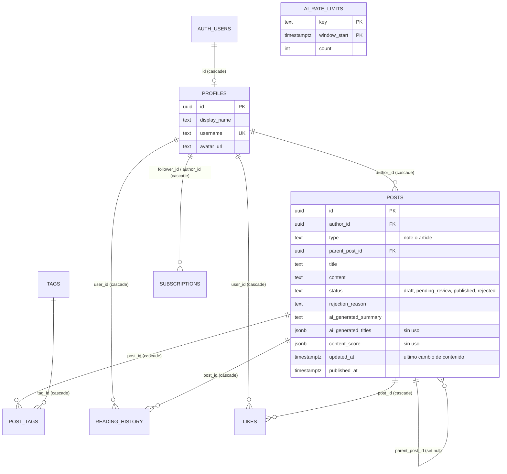

# Esquema de la base de datos

Derivado de `supabase/migrations/0001_profiles.sql` a `0008_post_images.sql`. Todas las tablas están en el esquema `public` y tienen RLS habilitado. Las migraciones se corren a mano en el SQL Editor de Supabase ([ADR 0016](../adr/0016-migraciones-sql-manuales.md)); este documento describe el esquema **resultante de aplicarlas todas**, no el estado de ningún proyecto en particular.

| Tabla / objeto | Migración | PRD |
| :--- | :--- | :--- |
| `profiles` | `0001_profiles.sql` | [PRD-1](../prds/PRD-1-auth.md) |
| `posts`, `tags`, `post_tags` | `0002_posts.sql` | [PRD-2](../prds/PRD-2-posts.md) |
| `subscriptions`, `reading_history` e índices del feed | `0003_feed.sql` | [PRD-3](../prds/PRD-3-feed-follows.md) |
| `profiles.username` y la función `login_email_for_username` | `0004_username.sql` | [PRD-1](../prds/PRD-1-auth.md) |
| `posts.type`, `posts.parent_post_id`, restricciones del modelo, función `can_attach_note`, tabla `likes`, políticas de `posts` y `post_tags` ajustadas | `0005_post_types_and_likes.sql` | [PRD-7](../prds/PRD-7-notes-likes.md) |
| Política de UPDATE de `posts` sin restricción a artículos (notas editables) | `0006_allow_note_updates.sql` | [ADR 0015](../adr/0015-notas-editables.md) |
| Columnas de caché de IA, trigger, privilegios por columna, `ai_rate_limits` y `ai_rate_limit_hit` | `0007_ai_features.sql` | [PRD-5](../prds/PRD-5-ai-author.md), [PRD-6](../prds/PRD-6-ai-reader.md) |
| Bucket `post-images` de Storage y sus políticas | `0008_post_images.sql` | [ADR 0022](../adr/0022-imagenes-en-supabase-storage.md) |

`0001` a `0004` no se pueden repetir. `0005`, `0006` y `0007` solo se repiten como cadena completa y en orden, nunca `0005` sola: recrea las políticas de INSERT y UPDATE de `posts` en su versión original ([db/README](README.md)).

## Relaciones

- `post_tags` resuelve la relación muchos a muchos entre `posts` y `tags`.
- Borrar un usuario de `auth.users` borra su perfil, sus posts y las filas de `post_tags`, `likes`, `subscriptions` y `reading_history` en cascada.
- Borrar un tag borra sus filas de `post_tags`, no los posts.
- Borrar un post borra sus `likes` y su `reading_history` y deja las notas que colgaban de él sin padre (`set null`).
- `ai_rate_limits` no tiene relaciones: es un contador por clave y minuto que solo toca el servidor.

## Matriz de políticas RLS

`S` seleccionar, `I` insertar, `U` actualizar, `D` borrar. "—" significa que no hay política: la operación está denegada para `anon` y `authenticated`.

| Tabla | S | I | U | D |
| :--- | :--- | :--- | :--- | :--- |
| `profiles` | Todos | Solo el propio perfil | Solo el propio perfil | — |
| `posts` | Publicados o propios | Propios; artículo solo `draft`; nota con padre válido (`can_attach_note`) | Propios (columnas `title` y `content`) | Propios |
| `tags` | Todos | Cualquier usuario autenticado | — | — |
| `post_tags` | Los de posts publicados o propios | Solo sobre artículos propios | — | Solo sobre posts propios |
| `subscriptions` | Todos | Como uno mismo | — | Las propias |
| `reading_history` | Solo el propio usuario | Propio, sobre posts publicados | Propio, sobre posts publicados | — |
| `likes` | Todos | Propio, sobre posts publicados | — | Los propios |
| `ai_rate_limits` | — (RLS sin políticas) | — | — | — |

Los privilegios de columna sobre `posts` (`0007`) se suman a estas políticas; ver la sección de `posts` y [ADR 0012](../adr/0012-integridad-de-escritura-de-posts.md). El servidor (`service_role`, la secret key) salta RLS: escribe `status`, `published_at`, `rejection_reason`, las columnas `ai_*`, `updated_at` al reclamar un post, y llama a las funciones reservadas.

## Funciones

| Función | Migración | Seguridad | Quién puede ejecutarla | Para qué |
| :--- | :--- | :--- | :--- | :--- |
| `login_email_for_username(p_username text)` | `0004` | `security definer`, `search_path` vacío | Solo `service_role` | Resolver un username a email en el login ([ADR 0007](../adr/0007-login-por-username-con-secret-key.md)) |
| `can_attach_note(p_parent_id uuid)` | `0005` | `security definer`, `stable`, `search_path` vacío | `authenticated` (revocada a `public` y `anon`) | Comprobar que el padre de una nota existe, está `published` y no es a su vez una respuesta. Va en una función porque una política de `posts` que consulta `posts` falla con el error `42P17` (recursión infinita de RLS) |
| `posts_invalidate_ai_cache()` | `0007` | trigger `before update`, `security invoker` | — | Invalidar la caché de IA al cambiar `content` |
| `ai_rate_limit_hit(p_user_key, p_user_limit, p_global_limit, p_global_key default 'global')` | `0007` | `security definer`, `search_path` vacío | Solo `service_role` | Límite de peticiones a la IA por minuto |

## Tipos de TypeScript

`src/lib/supabase/database.types.ts` **se mantiene a mano** ([ADR 0016](../adr/0016-migraciones-sql-manuales.md)): declara `profiles`, `posts`, `tags`, `post_tags`, `subscriptions`, `reading_history` y `likes`, y las funciones `ai_rate_limit_hit` y `login_email_for_username`. **No** incluye la tabla `ai_rate_limits` ni la función `can_attach_note` (ninguna se usa desde un cliente con tipos). Al cambiar una columna en SQL hay que actualizar este archivo a mano.

## `profiles`

| Columna | Tipo | Nulo | Default | Notas |
| :--- | :--- | :--- | :--- | :--- |
| `id` | `uuid` | No | | PK; FK a `auth.users(id)` con `on delete cascade` |
| `display_name` | `text` | No | | Nombre visible |
| `username` | `text` | No | | Identificador para iniciar sesión (`0004_username.sql`). Único y con `check (username ~ '^[a-z0-9_]{3,20}$')`: minúsculas, dígitos y `_`, de 3 a 20 caracteres. Los perfiles anteriores a `0004` reciben `user_<8 hex del id>` |
| `avatar_url` | `text` | Sí | | Sin uso en la UI todavía |
| `created_at` | `timestamptz` | No | `now()` | |

| Política | Operación | Regla |
| :--- | :--- | :--- |
| Profiles are viewable by everyone | SELECT | `true` |
| Users can insert their own profile | INSERT | `auth.uid() = id` |
| Users can update their own profile | UPDATE | `auth.uid() = id` (using y with check) |

No hay política de DELETE: nadie puede borrar perfiles desde la API.

`username` es público como el resto de `profiles`; el email **no** está en esta tabla. La función `public.login_email_for_username(text)` (`security definer`, `search_path` vacío) lee `auth.users` y devuelve el email de un username. Tiene `revoke` a `public`, `anon` y `authenticated`, y `grant execute` solo a `service_role`: únicamente el servidor con la secret key puede llamarla ([ADR 0007](../adr/0007-login-por-username-con-secret-key.md)). Para verificarlo, una llamada RPC con la publishable key debe fallar con `permission denied`.

## `posts`

| Columna | Tipo | Nulo | Default | Notas |
| :--- | :--- | :--- | :--- | :--- |
| `id` | `uuid` | No | `gen_random_uuid()` | PK |
| `author_id` | `uuid` | No | | FK a `profiles(id)` con `on delete cascade` |
| `type` | `text` | No | `'article'` | `check` en `note`, `article` (`0005`). Se fija al insertar y no cambia: el cliente no tiene privilegio de UPDATE sobre esta columna (`0007`) |
| `parent_post_id` | `uuid` | Sí | | FK a `posts(id)` con `on delete set null` (`0005`). Solo una nota puede tenerlo: es la nota dejada sobre otro post. Si el padre se borra, la nota sobrevive sin referencia |
| `title` | `text` | Sí | | Solo aplica a artículos; una nota siempre lo tiene en `null` |
| `content` | `text` | No | `''` | |
| `status` | `text` | No | `'draft'` | `check` en `draft`, `pending_review`, `published`, `rejected` |
| `rejection_reason` | `text` | Sí | | Motivo de rechazo de la moderación de IA (PRD-5). Solo lo escribe el servidor |
| `ai_generated_summary` | `text` | Sí | | Resumen para lectores ([PRD-6](../prds/PRD-6-ai-reader.md)). Caché: solo lo escribe el servidor (`0007`) |
| `ai_generated_titles` | `jsonb` | Sí | | Últimos títulos sugeridos por la ruta `/api/ai/titles`. **Sin uso efectivo:** ninguna pantalla llama a esa ruta ([ADR 0019](../adr/0019-rutas-legacy-de-ia-deprecadas.md)). Caché: solo la escribe el servidor (`0007`) |
| `content_score` | `jsonb` | Sí | | Último Content Score de la ruta `/api/ai/score`. **Sin uso efectivo**, igual que la anterior; el análisis del chat no se guarda. Caché: solo la escribe el servidor (`0007`) |
| `created_at` | `timestamptz` | No | `now()` | |
| `updated_at` | `timestamptz` | No | `now()` | Fecha del último cambio de **contenido**: lo mueve solo el trigger (`0007`) cuando cambia `content` (y el servidor al reclamar un post para moderarlo). El cliente no tiene privilegio de escribirla, así que un cambio de título no la mueve. Sirve de versión para la caché de IA y la moderación |
| `published_at` | `timestamptz` | Sí | | Lo completa `publishPost` al publicar (ver nota del ciclo de estados) |

| Política | Operación | Regla |
| :--- | :--- | :--- |
| Published posts are public, drafts only for the owner | SELECT | `status = 'published' or author_id = auth.uid()` |
| Users can create their own posts | INSERT | `author_id = auth.uid()`; un artículo solo nace `draft` (`0007`); y, si tiene `parent_post_id`, la función `can_attach_note` confirma que el padre está `published` y no es a su vez una respuesta (sin hilos anidados) |
| Users can update their own posts | UPDATE | `author_id = auth.uid()` (using y with check). `0006` quitó la restricción a artículos para poder editar notas; lo que el cliente puede tocar lo limitan los privilegios por columna de abajo |
| Users can delete their own posts | DELETE | `author_id = auth.uid()` |

Ciclo de estados de un artículo (PRD-5): `draft` a `pending_review` (mientras se modera; el reclamo es un compare-and-set sobre `status` y `updated_at`) y de ahí a `published` o `rejected`; un `rejected` se puede volver a publicar, y un `pending_review` que quedó colgado también una vez pasados 2 minutos. Si el proveedor de IA falla, se publica igual sin tags automáticos; si se alcanza el límite de peticiones, **no** se publica: se libera el reclamo y el autor reintenta. Una nota nace `published`. Las transiciones las hace solo el servidor (`publishPost`, con `service_role`).

Privilegios por columna (`0007`, [ADR 0012](../adr/0012-integridad-de-escritura-de-posts.md)): `anon` y `authenticated` no tienen `insert` ni `update` a nivel de tabla. El cliente solo puede insertar `author_id, type, title, content, status, published_at, parent_post_id` y actualizar `title, content`. `status`, `published_at` (al publicar), `rejection_reason` y las columnas de IA solo las escribe el servidor. `0006` había dejado que cualquier autor pudiera escribir `status` desde el navegador.

Trigger `posts_invalidate_ai_cache` (`before update`, `security invoker`): si cambia `content`, pone en `NULL` `ai_generated_summary`, `ai_generated_titles` y `content_score` y sube `updated_at`. El servidor guarda cada resultado de IA con compare-and-set sobre el `updated_at` que leyó.

Restricciones del modelo de tipos (`0005`), validadas en la base y no solo en las Server Actions:

| Restricción | Regla |
| :--- | :--- |
| `posts_type_check` | `type in ('note', 'article')` |
| `posts_note_shape_check` | Una nota está siempre `published`, con `published_at` y sin `title` |
| `posts_note_length_check` | Una nota tiene entre 1 y 500 caracteres. Está `NOT VALID`: no revisa las filas previas a la migración (las notas convertidas pueden ser más largas) pero sí toda fila nueva o modificada |
| `posts_article_no_parent_check` | Un artículo no tiene `parent_post_id` |

La migración `0005` convierte los posts existentes (datos de prueba) en notas sin título y `published`, y borra los borradores fantasma vacíos. Solo corre esa conversión la primera vez, cuando la columna `type` todavía no existe. Los tags y el ciclo `draft`/`pending_review` aplican solo a artículos.

## `tags`

| Columna | Tipo | Nulo | Default | Notas |
| :--- | :--- | :--- | :--- | :--- |
| `id` | `uuid` | No | `gen_random_uuid()` | PK |
| `name` | `text` | No | | `unique`. La app lo normaliza a minúsculas (`tagNameSchema`); la base no lo fuerza |

| Política | Operación | Regla |
| :--- | :--- | :--- |
| Tags are viewable by everyone | SELECT | `true` |
| Authenticated users can create tags | INSERT | rol `authenticated`, `with check (true)` |

No hay políticas de UPDATE ni DELETE.

## `post_tags`

| Columna | Tipo | Nulo | Notas |
| :--- | :--- | :--- | :--- |
| `post_id` | `uuid` | No | FK a `posts(id)` con `on delete cascade` |
| `tag_id` | `uuid` | No | FK a `tags(id)` con `on delete cascade` |

PK compuesta `(post_id, tag_id)`: impide asociar el mismo tag dos veces a un post.

| Política | Operación | Regla |
| :--- | :--- | :--- |
| Users can view tags of their own posts or published posts | SELECT | Existe un `posts` con ese `post_id` que esté `published` o sea del usuario |
| Users can tag their own posts | INSERT | Existe un `posts` con ese `post_id` cuyo `author_id = auth.uid()` **y `type = 'article'`** (`0005`): las notas no llevan tags |
| Users can untag their own posts | DELETE | Igual que INSERT |

No hay política de UPDATE.

## `subscriptions`

| Columna | Tipo | Nulo | Default | Notas |
| :--- | :--- | :--- | :--- | :--- |
| `id` | `uuid` | No | `gen_random_uuid()` | PK |
| `follower_id` | `uuid` | No | | FK a `profiles(id)` con `on delete cascade` (quien sigue) |
| `author_id` | `uuid` | No | | FK a `profiles(id)` con `on delete cascade` (a quien se sigue) |
| `created_at` | `timestamptz` | No | `now()` | |

`unique (follower_id, author_id)` impide seguir dos veces. `check (follower_id <> author_id)` impide seguirse a uno mismo (la app también lo rechaza; esto es defensa en profundidad).

| Política | Operación | Regla |
| :--- | :--- | :--- |
| Subscriptions are viewable by everyone | SELECT | `true` (permite el contador de seguidores) |
| Users can follow as themselves | INSERT | `follower_id = auth.uid()` |
| Users can unfollow their own follows | DELETE | `follower_id = auth.uid()` |

No hay política de UPDATE.

## `reading_history`

| Columna | Tipo | Nulo | Default | Notas |
| :--- | :--- | :--- | :--- | :--- |
| `id` | `uuid` | No | `gen_random_uuid()` | PK |
| `user_id` | `uuid` | No | | FK a `profiles(id)` con `on delete cascade` |
| `post_id` | `uuid` | No | | FK a `posts(id)` con `on delete cascade` |
| `read_at` | `timestamptz` | No | `now()` | Última lectura; `recordRead` lo refresca con un upsert |

`unique (user_id, post_id)`: abrir el mismo post dos veces actualiza `read_at`, no duplica la fila. Es la fuente del motor de recomendaciones (PRD-4), que la lee con el cliente del usuario (RLS: solo sus filas).

| Política | Operación | Regla |
| :--- | :--- | :--- |
| Users can view their own reading history | SELECT | `user_id = auth.uid()` |
| Users can record reads of published posts | INSERT | `user_id = auth.uid()` y el post existe con `status = 'published'` |
| Users can refresh their own reads of published posts | UPDATE | Igual que INSERT (using y with check) |

La condición `published` va más allá del PRD: las claves foráneas se validan sin RLS, así que sin ella un usuario podría registrar lecturas sobre el id de un borrador ajeno. No hay política de DELETE.

## `likes`

| Columna | Tipo | Nulo | Default | Notas |
| :--- | :--- | :--- | :--- | :--- |
| `id` | `uuid` | No | `gen_random_uuid()` | PK |
| `user_id` | `uuid` | No | | FK a `profiles(id)` con `on delete cascade` (quien da el like) |
| `post_id` | `uuid` | No | | FK a `posts(id)` con `on delete cascade` (nota o artículo) |
| `created_at` | `timestamptz` | No | `now()` | |

`unique (user_id, post_id)` impide likes duplicados, también ante un doble click. No se cachea un `likes_count` en `posts`: el conteo se calcula al leer (`likes(count)`), como pide el PRD-7.

| Política | Operación | Regla |
| :--- | :--- | :--- |
| Likes are viewable by everyone | SELECT | `true` (permite mostrar el conteo a cualquiera) |
| Users can like published posts as themselves | INSERT | `user_id = auth.uid()` y el post existe con `status = 'published'` |
| Users can remove their own likes | DELETE | `user_id = auth.uid()` |

La condición `published` sigue el mismo criterio que `reading_history`: la FK se valida sin RLS y sin ella se podría dar like a un borrador ajeno. No hay política de UPDATE.

## `ai_rate_limits`

Contadores del límite de peticiones a la IA (`0007`). Ventana fija de un minuto. Las claves son `user:<id>` y `global` para las funciones de asistencia, y `moderation:user:<id>` y `moderation:global` para la moderación al publicar (carril separado). `ai_rate_limit_hit(p_user_key, p_user_limit, p_global_limit, p_global_key)` solo la ejecuta `service_role`.

| Columna | Tipo | Nulo | Default | Notas |
| :--- | :--- | :--- | :--- | :--- |
| `key` | `text` | No | | `user:<id>` o `global` |
| `window_start` | `timestamptz` | No | | Inicio del minuto. PK junto con `key` |
| `count` | `int` | No | `0` | Peticiones contadas en esa ventana |

RLS habilitada **sin políticas** y `revoke all` a `anon` y `authenticated`: solo se accede por la función `public.ai_rate_limit_hit(p_user_key text, p_user_limit int, p_global_limit int, p_global_key text default 'global')` (`security definer`, `search_path` vacío), que devuelve `(allowed, scope, retry_after)`. La versión anterior de tres parámetros se elimina al re-ejecutar `0007` (`drop function if exists`). Cuenta primero por usuario y, si no lo superó, por el contador global. `grant execute` solo a `service_role`. Limpia ventanas de más de una hora de forma oportunista.

## Storage: bucket `post-images`

Bucket público (`0008`) para las imágenes de los artículos, con límite de 2 MB y solo `image/webp`, `image/jpeg` e `image/png`. Los objetos viven en `<user_id>/<uuid>-<ancho>x<alto>.webp`. Las URLs públicas se sirven sin RLS, así que no hay política de SELECT abierta: nadie puede listar el bucket. Las políticas de `storage.objects` valen solo para `authenticated` y solo dentro de la carpeta propia (`(storage.foldername(name))[1] = auth.uid()::text`):

| Política | Operación |
| :--- | :--- |
| Users can upload their own post images | INSERT |
| Users can view their own post images | SELECT (Storage lo necesita para borrar) |
| Users can update their own post images | UPDATE |
| Users can delete their own post images | DELETE |

## Índices y triggers

- Índices de `0003_feed.sql`: `posts (published_at desc) where status = 'published'` (orden del feed), `post_tags (tag_id)` (filtro por tag; la PK de `post_tags` empieza por `post_id`), `subscriptions (author_id)` y `reading_history (user_id)`.
- Índices de `0005_post_types_and_likes.sql`: `posts (parent_post_id) where parent_post_id is not null` (notas de un post) y `likes (post_id)` (conteo de likes).
- Además, los índices implícitos de las claves primarias y de los `unique`.
- Un solo trigger: `posts_invalidate_ai_cache` (`0007`, ver `posts`). La fila de `profiles` no se crea por trigger: la inserta la action `signUp`.
