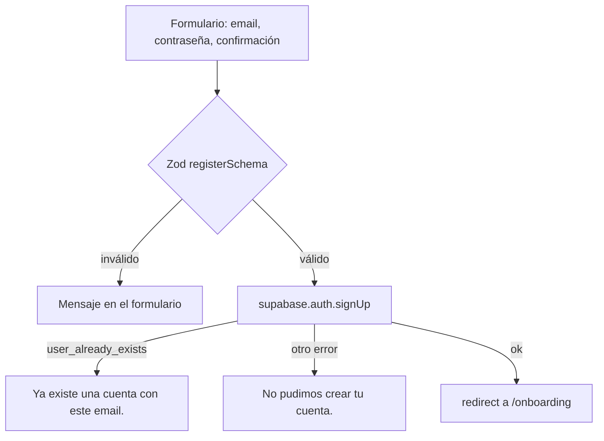

# PRD 1 — Autenticación, perfiles y modelo de datos base

| Campo | Valor |
| :--- | :--- |
| Estado | Implementado. Incluye el username (login por email o username), que **no tiene PRD propio: vive en este documento** |
| Depende de | [PRD 0](PRD-0-design-system.md) |
| Migraciones | `0001_profiles.sql`, `0004_username.sql` |
| ADRs relacionados | [0002](../adr/0002-un-solo-tipo-de-usuario.md), [0003](../adr/0003-seguridad-rls-y-proxy-minimo.md), [0007](../adr/0007-login-por-username-con-secret-key.md), [0024](../adr/0024-perfil-en-onboarding.md) |
| Código | `src/features/auth/`, `src/features/profile/`, `src/proxy.ts`, `src/lib/auth.ts`, `src/lib/viewer.ts`, `src/lib/supabase/`, `src/app/(auth)/`, `src/app/(dashboard)/settings/`, `src/app/(dashboard)/profile/` |

## Paquetes de trabajo

Este PRD se reparte en tres paquetes que se pueden asignar por separado ([reparto del equipo](../team/reparto-de-tareas.md)).

| Paquete | Qué cubre | Dificultad | Esfuerzo |
| :--- | :--- | :--- | :--- |
| [PRD-1.1 — Formularios de registro y login](PRD-1.1-auth-forms.md) | `LoginForm`, `RegisterForm`, `LoginDrawer`, schemas de Zod | B | M |
| [PRD-1.2 — Seguridad de autenticación](PRD-1.2-auth-security.md) | Acciones `signUp`/`signIn`/`signOut`, `completeOnboarding`, username → email, `proxy.ts`, RLS de `profiles` | A | L |
| [PRD-1.3 — Perfil y ajustes de cuenta](PRD-1.3-profile-settings.md) | `/settings`, `updateProfile`, `/profile` | B | S |

## Resumen

Una persona se registra con **email y contraseña (fuerte y con confirmación)**, completa su perfil en `/onboarding` con **nombre para mostrar y nombre de usuario (`username`)**, inicia sesión con **email o username**, y edita su nombre y username desde `/settings`. Las políticas RLS de `profiles` quedan definidas aquí porque todos los PRDs siguientes las heredan. El username existe para dar una identidad pública corta (`@usuario`); como Supabase solo autentica por email, se resuelve a email **en el servidor** sin exponer nunca el email.

## Problema y objetivo

* Un usuario puede registrarse, iniciar y cerrar sesión.
* Al terminar el onboarding que sigue al registro se crea su fila en `profiles`.
* Puede ver y editar su perfil (nombre para mostrar y username).
* Las rutas privadas son inaccesibles sin sesión.
* Se puede iniciar sesión con el username, sin filtrar los emails de los demás (`profiles` es pública).

## Alcance / fuera de alcance

| Dentro | Fuera |
| :--- | :--- |
| Registro, login (email o username), logout | Roles de usuario ([ADR 0002](../adr/0002-un-solo-tipo-de-usuario.md)) |
| `profiles` con `display_name` y `username` únicos | Login social, recuperación de contraseña propia, panel de administración |
| Edición de nombre y username en `/settings` | **Subida de avatar** (`avatar_url` existe en la tabla y no se usa) |
| Protección de rutas privadas | Edición real del email (ver limitaciones) |
| Verificación de email | Solo la que traiga por defecto la configuración de Supabase Auth: la app no la exige ni la gestiona |

## Cómo funciona

### Registro (`signUp`, `src/features/auth/actions.ts`)



* **Validación** (`src/features/auth/schemas.ts`): email válido, contraseña fuerte (8 o más caracteres, minúscula, mayúscula, número y símbolo, y como máximo 72 bytes por el límite de bcrypt; reglas en `password-rules.ts`, compartidas con el indicador del formulario) y confirmación idéntica ("Las contraseñas no coinciden.", error sobre `confirmPassword`). `loginSchema` **no** aplica estas reglas a propósito: las cuentas creadas antes deben poder seguir entrando.
* `signUp` **no crea el perfil**: solo la cuenta en Auth. No hay trigger en la base.

### Onboarding (`completeOnboarding`, `src/features/profile/actions.ts`)

Página `/onboarding` (`OnboardingForm`): nombre para mostrar y username (`onboardingSchema`; el username usa `^[a-z0-9_]{3,20}$` y se normaliza a minúsculas). Incluye un botón "Cerrar sesión".

* Con sesión (`requireUser`) y datos válidos, **inserta** la fila de `profiles` (`id = auth.uid()`, bajo RLS) y redirige a `/`. Si el perfil ya existe, redirige a `/` sin tocarlo.
* Ante un conflicto `23505` vuelve a consultar el perfil: si existe (doble envío) redirige a `/`; si no, el username está tomado: "Ese nombre de usuario ya está en uso.". La unicidad la garantiza el índice, sin chequeo previo.
* Quien tiene sesión pero no perfil solo puede ver `/onboarding` (lo fuerza el proxy, ver más abajo). Decisión y alternativas en el [ADR 0024](../adr/0024-perfil-en-onboarding.md).

### Inicio de sesión (`signIn`)

```text
identificador = campo "email o usuario"
si contiene "@"  -> es un email
si no            -> es un username: se pasa a minúsculas y se resuelve a email en el servidor
                    (RPC login_email_for_username con la secret key)
si el username no existe -> se llama igual a signInWithPassword con una dirección reservada
                            (unknown-user@example.invalid) para que el tiempo de respuesta
                            no revele qué usernames existen
cualquier fallo de credenciales -> "Credenciales inválidas." (mismo mensaje siempre)
éxito -> redirect a la ruta pedida (resolveAuthRedirect) o a /
```

Un username no puede contener `@` (lo impide `usernameSchema`), así que no hay ambigüedad entre email y username. Si falla la consulta de resolución (por ejemplo, falta `SUPABASE_SECRET_KEY`), el mensaje es "No pudimos iniciar sesión. Intentá de nuevo.". El login por **email** funciona sin la secret key.

### Cierre de sesión

`signOut` llama a `supabase.auth.signOut()` y redirige a `/login`.

### Protección de rutas

`src/proxy.ts` (Next.js 16; reemplaza a `middleware`) corre en cada request salvo estáticos e imágenes:

1. Crea un cliente `@supabase/ssr` con las cookies del request y llama a `auth.getUser()`, lo que **refresca la sesión**.
2. Si la ruta empieza con **`/settings`, `/editor`, `/posts` o `/onboarding`** y no hay usuario, redirige a `/login`.
3. En cada `GET` de página (no `POST`, no `/api`) de un usuario con sesión hace **una consulta `select id` a `profiles`**: sin fila redirige a `/onboarding`; con fila, `/onboarding` redirige a `/`. Si la consulta falla, deja pasar y lo registra en el log. La decisión es la función pura `getGateRedirect` (`src/features/auth/onboarding-gate.ts`).

La protección **no se deriva de los grupos de ruta** (`(dashboard)`, etc.): depende de esa lista (`PROTECTED_PATHS`, en `onboarding-gate.ts`). `/profile` y `/activity` **no** están en la lista; cada página llama a `redirect("/login")` si no hay sesión. Las rutas `/api/ai/*` **sí pasan por el proxy** (el `matcher` solo excluye estáticos e imágenes, así que también refresca la sesión ahí), pero no están en `PROTECTED_PATHS`: no las redirige a `/login`. Autentican por su cuenta y devuelven 401 en JSON.

Las Server Actions que escriben usan `requireUser()` (`src/lib/auth.ts`), que redirige a `/login` sin sesión. `getViewer()` (`src/lib/viewer.ts`) devuelve el usuario y su nombre, cacheado por request.

### Perfil, ajustes y `/profile`

| Ruta | Qué hace |
| :--- | :--- |
| `/settings` | `AccountSettings`: filas Profile, Email y Handle. **Solo Profile y Handle son reales:** abren `SettingsForm` (nombre + username) y guardan con `updateProfile`. El email se muestra, no se edita |
| `/profile` | Redirige a `/author/<id propio>`, o a `/login` sin sesión. El perfil propio es la vista pública del autor ([PRD-3](PRD-3-feed-follows.md)) |

`updateProfile` valida con `updateProfileSchema`; un conflicto de unicidad (código `23505`) se traduce a "Ese nombre de usuario ya está en uso.". El username se puede cambiar cuando se quiera, y el login funciona con el nuevo de inmediato.

## Datos

### Tabla `profiles`

| Campo | Tipo | Notas |
| :--- | :--- | :--- |
| `id` | `uuid` | PK, igual al `id` de `auth.users` (`on delete cascade`) |
| `display_name` | `text` | Nombre visible. Obligatorio |
| `username` | `text` | Único, `NOT NULL`, `CHECK` con `^[a-z0-9_]{3,20}$`. Migración `0004`: los perfiles previos recibieron `user_<8 hex>` |
| `avatar_url` | `text`, nullable | Reservado; hoy solo se muestran iniciales |
| `created_at` | `timestamptz` | Default `now()` |

### Función `login_email_for_username(p_username text)`

`SECURITY DEFINER`, `search_path` vacío, ejecutable **solo por `service_role`** (se revoca de `public`, `anon` y `authenticated`). Devuelve el email de un username. No puede ser ejecutable por el cliente: `profiles` es pública, y cualquiera obtendría el email de cualquier usuario.

### RLS de `profiles`

| Acción | Regla |
| :--- | :--- |
| SELECT | Público (`using (true)`): son datos de un perfil de autor |
| INSERT | Solo una fila con `id = auth.uid()` |
| UPDATE | Solo el dueño (`auth.uid() = id`) |
| DELETE | No hay política: no existe borrado de cuenta en el alcance |

### Variables de entorno

| Variable | Para qué |
| :--- | :--- |
| `NEXT_PUBLIC_SUPABASE_URL`, `NEXT_PUBLIC_SUPABASE_PUBLISHABLE_KEY` | Clientes de Supabase (validadas al arrancar) |
| `SUPABASE_SECRET_KEY` | Solo el login por username y otras escrituras de servidor (ver PRD-5). Salta RLS, es `server-only`, nunca llega al navegador |

## Decisiones y por qué

| Decisión | Alternativas descartadas | Consecuencia |
| :--- | :--- | :--- |
| **Resolver username → email en el servidor** con una función solo `service_role` ([ADR 0007](../adr/0007-login-por-username-con-secret-key.md)) | Guardar el email en `profiles` (es público: lo filtra); función RPC ejecutable por `anon` (cualquiera obtiene el email); login solo por email (no cumple el pedido) | El email nunca sale del servidor. Costo: hay una segunda clave que proteger |
| **Mensaje único "Credenciales inválidas." y una llamada a Auth aun para usernames inexistentes** | Mensajes distintos ("usuario no existe"); devolver antes | No se pueden enumerar usuarios por mensaje ni por tiempo de respuesta |
| **Crear el perfil en `/onboarding`, no en `signUp`** ([ADR 0024](../adr/0024-perfil-en-onboarding.md)) | Trigger en `auth.users`; insertar el perfil en `signUp` con todos los datos | Registro de tres campos, sin cuentas huérfanas por un username repetido. Costo: una cuenta puede existir sin perfil, y el proxy hace una consulta por navegación para retenerla en `/onboarding`. Si se migra a un trigger, el [ADR 0007](../adr/0007-login-por-username-con-secret-key.md) lo marca como motivo para revisar el login por username |
| **`INSERT` con re-consulta ante `23505`**, no `upsert` ni chequeo previo | `upsert`; `isUsernameAvailable` antes de insertar | Nunca pisa un perfil existente y no depende del nombre del índice; la carrera la resuelve el índice único |
| **`proxy.ts` con lista de prefijos, no por grupo de ruta** ([ADR 0003](../adr/0003-seguridad-rls-y-proxy-minimo.md)) | Verificar sesión en cada layout; roles en el proxy | Es UX (redirigir), no seguridad: la seguridad real es RLS. Costo: cada ruta privada nueva debe agregarse a la lista o guardarse a sí misma |
| **Un solo tipo de usuario** ([ADR 0002](../adr/0002-un-solo-tipo-de-usuario.md)) | Roles autor/lector | Sin flujos de conversión; "autor" es un estado derivado |

## Criterios de aceptación

- [x] Un usuario nuevo se registra con email y una contraseña fuerte (con confirmación), completa nombre y usuario en `/onboarding`, termina en `/` y tiene una fila en `profiles`.
- [x] Quien tiene sesión y no tiene perfil es llevado a `/onboarding` desde cualquier página; quien ya lo tiene es llevado de `/onboarding` a `/`.
- [x] Puede iniciar sesión con su email **o** con su username (sin distinguir mayúsculas), y el mismo error genérico aparece con contraseña incorrecta, usuario inexistente o email inexistente.
- [x] Un username o email repetido muestra un mensaje amable (no el error crudo de Supabase).
- [x] `/settings`, `/editor`, `/posts` y `/onboarding` redirigen a `/login` sin sesión; `/profile` y `/activity` también, por su cuenta.
- [x] Cambiar el username en `/settings` funciona, y un username ajeno da "Ese nombre de usuario ya está en uso.".
- [x] Un usuario no puede editar el perfil de otro (RLS).
- [x] Cerrar sesión re-protege las rutas privadas y lleva a `/login`.

## Limitaciones conocidas y deuda

| Tema | Detalle |
| :--- | :--- |
| Email "Edit" | El botón abre un panel informativo; no hay cambio de email |
| **Confirmación de email de Supabase sin verificar** | Si el proyecto la exige, `signUp` no devuelve sesión y `/onboarding` redirige a `/login`. No se comprobó la configuración ([ADR 0024](../adr/0024-perfil-en-onboarding.md)) |
| Abandono del onboarding | Quien no completa `/onboarding` queda retenido ahí: solo puede completar el perfil o cerrar sesión |
| Costo del proxy | Una consulta a `profiles` por cada `GET` de página con sesión, incluidos los prefetch |
| Textos en inglés | `AccountSettings` usa "Account", "Profile", "Edit", "Handle", "Publications" |
| Contador "Publications" engañoso | Cuenta todos los artículos del autor (`type = 'article'`), incluidos borradores y rechazados, porque `src/app/(dashboard)/settings/page.tsx` no filtra por `status`. Ver [PRD-1.3](PRD-1.3-profile-settings.md) |
| Sin avatar | `avatar_url` existe en la tabla y `getCurrentProfile` lo selecciona, pero ninguna pantalla lo muestra ni hay subida; solo iniciales |
| Sin recuperación de contraseña | No hay pantalla ni flujo propio |
| Sin borrado de cuenta | Ver RLS: no hay política DELETE |

## Pruebas

| Tipo | Archivo | Cubre |
| :--- | :--- | :--- |
| Unitarias | `src/features/auth/schemas.test.ts`, `src/features/auth/onboarding-gate.test.ts`, `src/features/profile/schemas.test.ts` | Validación de registro, login, username, perfil y onboarding, `resolveAuthRedirect` y la puerta del proxy |
| e2e | `e2e/auth.spec.ts` | Protección de rutas (incluye `/onboarding`), registro con onboarding, redirecciones sin/con perfil, login por email y por username (incluye mayúsculas), errores genéricos, email/username duplicados, cambio de username en `/settings` y login con el nuevo |
