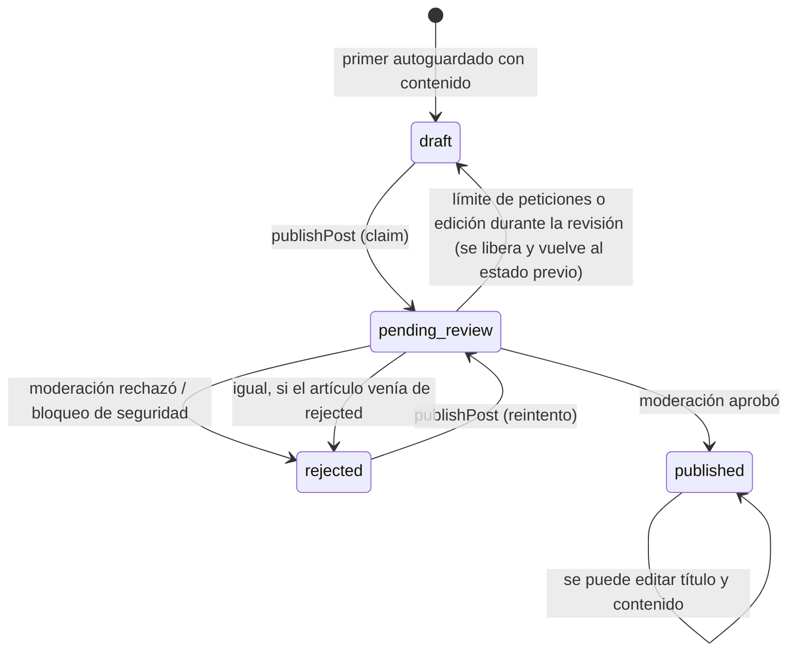

# PRD 2 — Posts: artículos, editor y publicación

| Campo | Valor |
| :--- | :--- |
| Estado | Implementado. La publicación pasa por la moderación de IA ([PRD-5](PRD-5-ai-author.md)) |
| Depende de | [PRD 0](PRD-0-design-system.md), [PRD 1](PRD-1-auth.md) |
| Migraciones | `0002_posts.sql`; modifican el modelo `0005`, `0006`, `0007` |
| ADRs relacionados | [0009](../adr/0009-tipos-de-post-y-likes.md), [0010](../adr/0010-editor-markdown.md), [0011](../adr/0011-ia-con-gemini.md), [0012](../adr/0012-integridad-de-escritura-de-posts.md) |
| Código | `src/features/posts/`, `src/app/(editor)/editor/[id]/`, `src/app/(dashboard)/posts/`, `src/app/(public)/post/[id]/` |

## Paquetes de trabajo

Este PRD se reparte en seis paquetes que una persona puede asumir por separado (ver [reparto de tareas](../team/reparto-de-tareas.md)).

| ID | Paquete | Dificultad | Esfuerzo |
| :--- | :--- | :--- | :--- |
| [2.1](PRD-2.1-posts-data-rls.md) | Datos de posts y seguridad (RLS y columnas) | A | L |
| [2.2](PRD-2.2-editor-tiptap.md) | Editor Tiptap y markdown | A | L |
| [2.3](PRD-2.3-autosave-drafts.md) | Autoguardado y borradores | M | M |
| [2.4](PRD-2.4-publish-dialog-tags.md) | Diálogo de publicar, tags y barra superior | M | M |
| [2.5](PRD-2.5-my-posts-page.md) | Página "Mis posts" | B | S |
| [2.6](PRD-2.6-post-detail.md) | Vista pública del post | B | S |

> **Alcance de este PRD:** el post de tipo **artículo** (borrador, editor, tags, publicación, vista pública). La **nota** (texto corto) y los **me gusta** están en [PRD-7](PRD-7-notes-likes.md). Las funciones de IA del editor están en [PRD-8](PRD-8-ai-chat.md).

## Resumen

Un usuario autenticado escribe artículos en un **editor markdown** (Tiptap) de pantalla completa, con **autoguardado** cada 2 segundos, les asigna tags y los publica. Publicar no es un cambio de estado directo: el artículo pasa por **moderación con IA** y termina `published` o `rejected`. Cualquiera puede leer un artículo publicado en `/post/[id]`.

## Problema y objetivo

* Crear, editar, ver y publicar artículos propios sin perder texto.
* Un ciclo de estados claro: borrador → en revisión → publicado o rechazado.
* Tags como catálogo propio, asociados a los artículos (many-to-many).
* Un listado de los artículos propios, sin importar su estado.
* Que un artículo no publicado no lo vea nadie más que su autor, y que **el cliente no pueda saltarse la moderación**.

## Alcance / fuera de alcance

| Dentro | Fuera |
| :--- | :--- |
| Editor markdown con autoguardado y vista previa | Edición colaborativa, control de versiones del contenido |
| Tags manuales (y los sugeridos por la IA al publicar) | Subida de imágenes o portada (no hay botón; ver limitaciones) |
| Publicación con moderación ([PRD-5](PRD-5-ai-author.md)) | Programar publicación, borradores compartidos |
| Listado propio en `/posts`, vista pública en `/post/[id]` | Borrado de artículos desde la interfaz |
| Editor solo en pantallas `md` o mayores | Edición de artículos desde el móvil |

## Cómo funciona

### Ciclo de vida de un artículo

`pending_review` es un estado **transitorio** (la "reserva" del artículo mientras se modera). Al liberar la reserva, el artículo vuelve a su estado previo: `draft`, o `rejected` si venía rechazado (`previousStatus` en `publishPost`). Si una revisión quedó colgada más de 2 minutos (`PENDING_REVIEW_STALE_MS`), se puede volver a reservar.

### Crear y editar (`/editor/[id]`)

| Paso | Qué ocurre |
| :--- | :--- |
| Entrar a `/editor/new` | La página no crea nada en la base: renderiza un editor vacío con `postId = "new"` |
| Primer autoguardado con contenido | `createDraftPost` inserta la fila (`type = 'article'`, `status = 'draft'`) y la URL pasa a `/editor/<id>` con `history.replaceState`. **La fila se crea de forma perezosa**, no al pulsar "Nuevo artículo" |
| Guardados siguientes | `savePostContent` actualiza solo `title` y `content` (debounce de **2 s** de inactividad; las escrituras se encolan para no pisarse) |
| Salir de la página | Si hay cambios pendientes, se guardan al desmontar |
| Abrir `/editor/<id>` ajeno o inexistente | 404 (`getOwnPost` filtra por `author_id` y `type = 'article'`) |
| Pantalla estrecha (< `md`) | `DesktopOnly` **no monta** el editor y muestra "Editá artículos desde una computadora": así tampoco corre el autoguardado |

La barra superior (`EditorTopBar`) muestra el estado ("Guardando…", "Guardado", "No se pudo guardar" y los avisos de límite), el contador de caracteres cerca del máximo, la vista previa, el panel de IA y el botón **"Continuar"** (que abre `PublishDialog`; en un artículo ya publicado el botón dice "Tags").

**Editor** (`use-article-editor.ts`, [ADR 0010](../adr/0010-editor-markdown.md)):

* Tiptap 3 con la extensión Markdown: el **markdown es la fuente de verdad** que se guarda en `posts.content`.
* Solo encabezados H2 y H3. Cmd/Ctrl+I está reservado para el chat de IA, así que la cursiva usa Cmd/Ctrl+Shift+I.
* Tablas, imágenes (sin base64) y listas de tareas no tienen botón en la barra: están registradas para que un markdown que ya las contenga sobreviva a abrir/editar/guardar.
* Los enlaces pasan por `SafeLink`: una URL insegura (`javascript:` y similares) se degrada a texto plano al leer el markdown y no se guarda como enlace (`link-safety.ts`).

**Límites** (`constants.ts`, `limits.ts`): título ≤ 200 caracteres, contenido ≤ 100 000, hasta **8 tags** por artículo. Superarlos bloquea el autoguardado con un aviso; el servidor los vuelve a validar (`savePostSchema`). El límite de contenido no es una restricción de la base: lo hace cumplir la aplicación.

### Tags

`addTag` normaliza (trim, minúsculas, 1–50 caracteres), crea el tag si no existe (`ON CONFLICT DO NOTHING`; un `upsert` común intentaría un UPDATE que RLS rechaza en `tags`) y lo asocia en `post_tags`. `removeTag` borra la relación. Los tags se reutilizan (`name` es único). Solo los artículos llevan tags.

### Publicar (`publishPost`)

Resumen (el detalle de la moderación está en [PRD-5](PRD-5-ai-author.md)):

1. Lee el artículo propio con el cliente del usuario; valida que no esté vacío ni ya publicado.
2. **Reserva** el post pasándolo a `pending_review` con el cliente de servidor, con compare-and-set sobre `(status, updated_at)`: dos llamadas simultáneas no pueden reservarlo a la vez.
3. Modera con Gemini en el carril de moderación del límite de peticiones.
4. Cierra con otro compare-and-set (guardado por la versión de la reserva): si el autor editó el texto durante la revisión, el texto moderado nunca se cambia por uno sin revisar.

| Resultado | Qué ve el autor |
| :--- | :--- |
| Aprobado | `published` con `published_at`; se agregan hasta 5 tags sugeridos (8 en total) y se redirige al artículo |
| Rechazado | `rejected` con `rejection_reason`; el editor muestra "Rechazado: <motivo>" para editar y reintentar |
| Falla del proveedor de IA (caída, timeout, JSON inválido, cuota) | Se **publica igual, sin tags automáticos** |
| Bloqueo de seguridad de Gemini | `rejected` con un motivo genérico |
| Límite de peticiones alcanzado | **No se publica**; se libera la reserva y se muestra "reintentá en N s" |

**Por qué `status`, `published_at` y `rejection_reason` solo los escribe el servidor:** ver "Decisiones" y [ADR 0012](../adr/0012-integridad-de-escritura-de-posts.md).

### Listado propio (`/posts`)

Lista plana de los artículos propios ordenada por `updated_at` descendente, con una etiqueta de estado (`PostStatusBadge`: Borrador, En revisión, Publicado, Rechazado). **No agrupa ni filtra por estado.** Cada fila lleva a `/editor/<id>`. Al cargar, `getOwnPosts` **borra silenciosamente los borradores completamente vacíos** ("fantasmas") para que no ensucien la lista.

### Vista pública (`/post/[id]`)

Solo devuelve posts `status = 'published'` (`getPublishedPost`); un id inválido o no publicado da 404. Muestra el título ("Sin título" si falta), autor, fecha relativa, el contenido renderizado (`MarkdownContent`, react-markdown), el botón de resumen de IA para artículos de al menos 300 palabras ([PRD-6](PRD-6-ai-reader.md)), el me gusta y las notas ([PRD-7](PRD-7-notes-likes.md)). Si quien mira está autenticado y es un artículo, un `ReadTracker` registra la lectura ([PRD-3](PRD-3-feed-follows.md)).

## Datos

### Tabla `posts` (vigente, tras las migraciones 0002, 0005 y 0007)

| Campo | Tipo | Notas |
| :--- | :--- | :--- |
| `id` | `uuid` | PK |
| `author_id` | `uuid` | → `profiles.id`, `on delete cascade` |
| `type` | `text` | `'article'` (default) o `'note'` ([PRD-7](PRD-7-notes-likes.md)) |
| `title` | `text`, nullable | Solo artículos; una nota no puede tener título (`CHECK`) |
| `content` | `text` | Markdown del artículo |
| `status` | `text` | `draft`, `pending_review`, `published`, `rejected` (`CHECK`) |
| `rejection_reason` | `text`, nullable | Motivo si `rejected` |
| `parent_post_id` | `uuid`, nullable | Solo notas ([PRD-7](PRD-7-notes-likes.md)); un artículo no puede tenerlo (`CHECK`) |
| `created_at`, `published_at` | `timestamptz` | |
| `updated_at` | `timestamptz` | **Fecha del último cambio de contenido.** Solo la mueve un trigger cuando cambia `content`; sirve de versión para los compare-and-set |
| `ai_generated_summary`, `ai_generated_titles`, `content_score` | `text` / `jsonb` | Caché de IA; solo las escribe el servidor; el trigger las anula si cambia `content` |

### Tablas `tags` y `post_tags`

`tags(id, name unique)`; `post_tags(post_id, tag_id)` con clave primaria compuesta y `on delete cascade`. Índice `post_tags_tag_id_idx`.

### Seguridad de `posts`: RLS y privilegios por columna

| Acción | RLS | Privilegio de columna (`0007`) |
| :--- | :--- | :--- |
| SELECT | Público si `status = 'published'`; si no, solo el dueño | — |
| INSERT | Solo el dueño; una nota, o un artículo **solo como `draft`**; `parent_post_id` solo vía `can_attach_note` | El cliente puede insertar `author_id, type, title, content, status, published_at, parent_post_id` |
| UPDATE | Solo el dueño | El cliente **solo** puede actualizar `title` y `content` |
| DELETE | Solo el dueño | — (no hay acción de borrado de artículos en la interfaz) |

| Tabla | Regla |
| :--- | :--- |
| `tags` | SELECT público; INSERT cualquier usuario autenticado; sin UPDATE |
| `post_tags` | SELECT si el post es público o propio; INSERT y DELETE solo el dueño del post, y el INSERT solo sobre artículos |

## Decisiones y por qué

| Decisión | Alternativas descartadas | Consecuencia |
| :--- | :--- | :--- |
| **Tiptap con markdown como fuente de verdad** ([ADR 0010](../adr/0010-editor-markdown.md)) | Textarea plano; guardar el JSON de ProseMirror; un editor HTML | El contenido es texto portable y lo entiende la IA sin conversión (consta en [ADR 0010](../adr/0010-editor-markdown.md)). Costo: hay que registrar las extensiones (tablas, imágenes) aunque no tengan botón para que el round-trip no pierda contenido |
| **Crear la fila en el primer autoguardado con contenido** | Crear el borrador al pulsar "Nuevo artículo" (el diseño original) | No nacen borradores vacíos por abrir el editor y salir †. El motivo del cambio respecto al diseño original no quedó registrado. Costo: la ruta `/editor/new` es un caso especial y aun así queda la limpieza de "fantasmas" en `getOwnPosts` como red de seguridad |
| **Autoguardado con debounce de 2 s y cola de escrituras** | Guardar en cada tecla; botón "Guardar" | Sin pérdida de texto ni escrituras que se pisen †; a cambio, hasta 2 s de trabajo sin guardar (la cola de escrituras y el debounce constan en `use-autosave.ts`) |
| **`status`, `published_at`, `rejection_reason` y `ai_*` solo escribibles por el servidor** ([ADR 0012](../adr/0012-integridad-de-escritura-de-posts.md)) | Confiar en que la interfaz no lo haga; RLS por sí sola | RLS decide qué **filas**, no qué **columnas**: con la anon key pública un autor podía hacer `update posts set status = 'published'`. Los privilegios por columna cierran el hueco. Costo: las transiciones de estado necesitan el cliente admin |
| **Reserva `pending_review` con compare-and-set sobre `(status, updated_at)`** ([ADR 0011](../adr/0011-ia-con-gemini.md)) | Un simple `update status`; una cola | Sin doble publicación ni texto editado publicado sin revisar. Costo: lógica más delicada en `publishPost` |
| **`updated_at` = último cambio de contenido, movido solo por trigger** | Que lo escriba el cliente o cada action | El cliente no puede falsearla ni moverla con un cambio de título; sirve como versión confiable |
| **El editor solo se monta desde `md`** ([ADR 0009](../adr/0009-tipos-de-post-y-likes.md)) | Detectar móvil por user agent en el servidor | Es UX, no seguridad: el ancho de pantalla no se conoce en el servidor. La media query es la fuente correcta |
| **Tope de 8 tags y de 5 sugeridos por IA** | Sin tope | Evita que la IA sature el catálogo †; los tags existentes del autor siempre ganan (comportamiento verificable en `publishPost`; el porqué de los números 8 y 5 no quedó registrado) |

## Criterios de aceptación

- [x] Escribir en `/editor/new` crea un borrador al primer autoguardado y la URL pasa a `/editor/<id>`.
- [x] Editar refleja "Guardado" y actualiza `updated_at` cuando cambia el contenido.
- [x] Un usuario no puede abrir ni editar el borrador de otro (404).
- [x] Un post no publicado da 404 en `/post/[id]` para cualquiera, incluido su autor.
- [x] Los tags se reutilizan: agregar el mismo nombre dos veces no lo duplica.
- [x] Publicar un artículo vacío da "El artículo no puede estar vacío para publicarlo."
- [x] Publicar pasa por moderación: puede quedar `published` (con o sin tags automáticos), `rejected` con motivo, o sin publicar por límite de peticiones.
- [x] Desde una pantalla estrecha el editor no se monta.
- [x] Un cliente con la anon key no puede cambiar `status` de un post (verificable con `pnpm verify:writes`).

## Limitaciones conocidas y deuda

| Tema | Detalle |
| :--- | :--- |
| **Editar un artículo ya publicado no lo vuelve a moderar** | `savePostContent` sigue permitiendo cambiar título y contenido de un `published`. Un autor puede publicar algo inocuo y reemplazarlo después. Pendiente: re-moderar las ediciones (mencionado en [ADR 0010](../adr/0010-editor-markdown.md) y [ADR 0011](../adr/0011-ia-con-gemini.md)) |
| **No se puede borrar un artículo** | Solo existe `deleteNote`. RLS permite borrar, pero no hay acción ni botón |
| Sin imágenes | El editor conserva las que ya estén en el markdown, pero no hay botón ni subida |
| Los tags no se ven en las tarjetas ni en el post | Solo aparecen en el diálogo de publicar y como chips en `/explore` ([PRD-9](PRD-9-explore-activity.md)). El PRD original preveía mostrarlos |
| El listado `/posts` no agrupa por estado | El PRD original decía "agrupados o filtrados por status" |
| Longitud del contenido no está en la base | Solo la valida la aplicación (`POST_CONTENT_MAX_LENGTH`); una escritura directa con el cliente podría superar 100 000 caracteres |
| Borrador fantasma | Se limpia como efecto colateral de una lectura (`getOwnPosts`); es una lectura con efecto de escritura |
| **e2e desactualizado** | El helper `createDraft` (`e2e/helpers.ts`) hace click en un botón "Nuevo post" que ya no existe (hoy se entra por el "+" o el menú "Crear", o directo a `/editor/new`). `e2e/posts.spec.ts` además espera los tags en línea en el editor y un botón "Publicar" en la barra; hoy los tags y "Publicar" están dentro del diálogo que abre "Continuar", y el mensaje de vacío dice "artículo", no "post". Estos specs necesitan reescribirse. Se concluye leyendo `e2e/` contra `src/`; los e2e no se ejecutaron al escribir este PRD |

## Pruebas

| Tipo | Archivo | Cubre |
| :--- | :--- | :--- |
| Unitarias | `src/features/posts/schemas.test.ts`, `limits.test.ts`, `utils.test.ts`, `publish.test.ts`, `link-safety.test.ts` (conteos actuales en [testing](../guides/testing.md)) | Validación de entrada, límites, extractos y tags, clasificación de la reserva de publicación, enlaces seguros |
| Unitarias del editor | `components/editor/apply-action.test.ts`, `action-overlap.test.ts`, `editor-context.test.ts` | Motor de aplicación de ediciones del chat ([PRD-8](PRD-8-ai-chat.md)) |
| e2e | `e2e/posts.spec.ts` | Escrito para borrador y autoguardado, tags, publicación, 404s y acceso a borrador ajeno, pero **desactualizado** respecto a la interfaz actual (ver limitaciones) |
| Verificación de escritura | `pnpm verify:writes` (`scripts/verify-post-writes.mjs`) | Que el cliente no pueda escribir columnas reservadas (requiere aplicar `0007`) |
