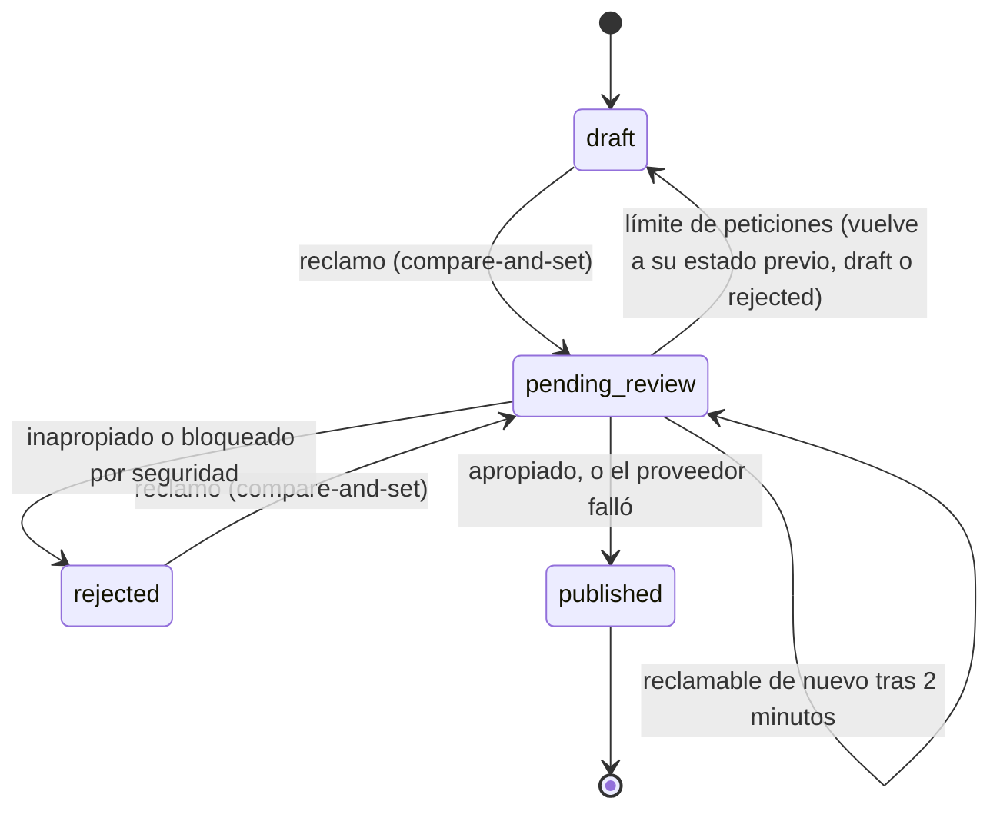

# PRD 5 - IA para el autor

| Campo | Valor |
| :--- | :--- |
| Estado | **Reemplazado parcialmente.** Vigente: moderación con auto-tagging al publicar, límite por minuto, caché de resultados y salida validada. Reemplazado por [PRD-8](PRD-8-ai-chat.md): las cuatro herramientas de asistencia (estructura, títulos, tono, score) como diálogos independientes. Sus rutas siguen en el código pero están **deprecadas** ([ADR 0019](../adr/0019-rutas-legacy-de-ia-deprecadas.md)) |
| Depende de | [PRD-0](PRD-0-design-system.md), [PRD-2](PRD-2-posts.md) (posts y publicación), [PRD-7](PRD-7-notes-likes.md) (la IA de autor aplica solo a artículos) |
| Migraciones | `0007_ai_features.sql` |
| ADRs relacionados | [0009](../adr/0009-tipos-de-post-y-likes.md), [0011](../adr/0011-ia-con-gemini.md), [0012](../adr/0012-integridad-de-escritura-de-posts.md), [0017](../adr/0017-politica-de-thinking-y-reintentos-gemini.md), [0019](../adr/0019-rutas-legacy-de-ia-deprecadas.md) |
| Código | `src/features/ai/` (`moderation.ts`, `gemini.ts`, `rate-limit*.ts`, `cache*.ts`, `cached-feature.ts`, `handlers.server.ts`, `route-runner.server.ts`, `errors.ts`), `src/features/posts/{actions,publish}.ts`, `src/features/posts/components/editor/PublishDialog.tsx`, `src/app/api/ai/` |

## Paquetes de trabajo

| Paquete | Qué cubre | Dificultad | Esfuerzo | Dueño sugerido |
| :--- | :--- | :--- | :--- | :--- |
| [PRD-5.1](PRD-5.1-ai-foundation.md) | Cliente de Gemini, errores, *thinking*, plazos y entorno | A | L | D1 |
| [PRD-5.2](PRD-5.2-rate-limit.md) | Límite por minuto en Postgres, dos carriles | A | M | D1 |
| [PRD-5.3](PRD-5.3-publish-moderation.md) | Publicación con moderación, reclamo y auto-tagging | A | L | D1 |
| [PRD-5.4](PRD-5.4-ai-route-runner.md) | Seguridad de las rutas, caché y rutas deprecadas | A | M | D2 |

## Resumen

Toda la IA que asiste al autor usa Gemini en el servidor, con salida validada, un límite de peticiones por minuto guardado en Postgres y una caché en la fila del post. La pieza que sigue siendo obligatoria del flujo es la **moderación al publicar**: una llamada síncrona que decide si el artículo se publica, se rechaza o espera, y sugiere tags. Las herramientas de asistencia (outline, títulos, tono, score) nacieron aquí como botones y hoy las cubre el chat de [PRD-8](PRD-8-ai-chat.md).

## Problema y objetivo

**Problema.** Un blog abierto a cualquier usuario necesita algún filtro antes de publicar, y los autores se benefician de ayuda para estructurar, titular y revisar. Todo eso depende de un proveedor externo con cuota gratuita limitada que puede fallar.

**Objetivo.**

- Moderar cada artículo antes de que sea público y proponerle tags, sin que una caída del proveedor impida publicar.
- Ofrecer asistencia de escritura sin que ninguna llamada bloquee escribir, guardar o publicar.
- Acotar el gasto de cuota por usuario y por proyecto sin infraestructura nueva.
- Que nadie pueda saltarse la moderación desde el navegador.

## Alcance / fuera de alcance

| Dentro | Fuera |
| :--- | :--- |
| Moderación y auto-tagging al publicar (solo artículos) | Panel de administración para revisar rechazos: el autor edita y reintenta |
| Límite de peticiones por minuto en Postgres, con dos carriles | Redis, Upstash o colas para moderación asíncrona |
| Caché de resultados de IA en la fila del post | Re-moderar un artículo ya publicado cuando se edita (ver limitaciones) |
| Contrato de las herramientas de asistencia (deprecadas, ver más abajo) | El chat de escritura: es [PRD-8](PRD-8-ai-chat.md) |
| Integridad de escritura de `status` y columnas de IA | El resumen para lectores: es [PRD-6](PRD-6-ai-reader.md) |

## Cómo funciona

### 1. Moderación y auto-tagging al publicar

El autor pulsa "Continuar" en el editor, revisa sus tags en el diálogo y pulsa "Publicar" (`PublishDialog.tsx`), que invoca la Server Action `publishPost` (`src/features/posts/actions.ts`).



```text
publishPost(postId):
  cargar el artículo propio (author_id = usuario, type = article)
  si ya está publicado -> error; si está vacío -> error
  si está en pending_review y tiene menos de 2 min -> "ya se está revisando"

  reclamar: UPDATE status = pending_review
            WHERE id, author_id, status y updated_at coinciden con lo leído   (cliente admin)
    si no actualizó ninguna fila -> "ya se está revisando"

  moderar en el carril "moderation" (límite propio):
    pedir a Gemini { is_appropriate, reason, suggested_tags } (8 s de plazo)

  decidir (decideModeration):
    límite de peticiones      -> liberar el reclamo, responder "busy" con retryAfter
    bloqueo de seguridad      -> rejected con motivo genérico
    is_appropriate = false    -> rejected con el motivo del modelo (recortado a 300)
    is_appropriate = true     -> published con los tags nuevos sugeridos
    cualquier otro fallo del proveedor (caída, timeout, cuota, JSON inválido,
      sin configurar, limitador caído) -> published SIN tags automáticos

  cerrar: UPDATE status/published_at/rejection_reason
          WHERE status = pending_review Y updated_at = el del reclamo
    si no coincide (el autor editó durante la revisión) -> liberar y "cambió mientras lo revisábamos"

  adjuntar los tags sugeridos con el cliente del usuario (RLS vigente)
```

Resultado para el autor (`PublishDialog.tsx`):

| Resultado | Qué ve el autor |
| :--- | :--- |
| Publicado con tags | "Publicado. Tags sugeridos: …" y redirección al post |
| Publicado sin IA | "Publicado sin tags automáticos: la IA no estuvo disponible. Podés agregarlos desde el editor." (con "Seguir editando") |
| Rechazado | Se cierra el diálogo y el editor muestra "Rechazado: <motivo>" para editar y reintentar |
| Ocupado | "Estamos revisando muchas publicaciones, reintentá en N s." con cuenta regresiva; el artículo **no** se publica |
| Ya en revisión / cambió | Mensaje de error y se puede reintentar |

Reglas de tags: hasta 5 sugeridos por la IA, normalizados (minúsculas, 2 a 30 caracteres, sin símbolos) y 8 en total por artículo; los tags existentes del autor nunca se descartan (`mergeTags`, `MAX_AI_TAGS`, `MAX_TAGS_PER_POST`).

### 2. Política de fallos: qué abre y qué cierra

| Situación | Decisión | Motivo |
| :--- | :--- | :--- |
| Caída, timeout, cuota, JSON inválido o sin configurar | **Publica sin tags** (falla abierto) | La disponibilidad del blog pesa más que la moderación en una demo; el PRD lo pedía |
| Límite de peticiones alcanzado | **No publica** (falla cerrado): libera el reclamo y pide reintentar | Un atacante puede provocar el límite a propósito; si el límite abriera, cualquiera saltaría la moderación agotándolo |
| Filtros de seguridad de Gemini | **Rechaza** con motivo genérico | El propio contenido disparó el filtro; no es una caída |
| Limitador sin respuesta (`unavailable`) | Tratado como caída del proveedor: publica sin tags | El limitador no debe volver la publicación dependiente de él; para el resto de funciones sí falla cerrado |

### 3. Infraestructura común

| Pieza | Comportamiento | Archivos |
| :--- | :--- | :--- |
| Proveedor | Gemini vía `@google/genai`, solo en el servidor. Modelo `GEMINI_MODEL` (por defecto `gemini-3.5-flash-lite`). Clave leída de forma perezosa: sin clave solo se degrada la IA | `gemini.ts`, `src/lib/env.server.ts` |
| Salida validada | El JSON esperado sale del mismo schema Zod (`responseJsonSchema`) y se **vuelve a validar** con Zod; un JSON inválido cuenta como fallo y nunca llega a la pantalla | `gemini.ts`, `schemas.ts` |
| Plazos | Moderación 8 s; general 15 s; tono 25 s (`constants.ts`). Sin reintentos del SDK ([ADR 0017](../adr/0017-politica-de-thinking-y-reintentos-gemini.md)) | `constants.ts`, `gemini.ts` |
| Límite por minuto | RPC `ai_rate_limit_hit` con ventana fija de 1 minuto: cuenta primero por usuario y solo si pasa cuenta contra el global. Falla cerrado. Solo la ejecuta `service_role` | migración `0007`, `rate-limit.ts`, `rate-limit.server.ts` |
| Carriles | **asistencia** (claves `user:<id>` y `global`) y **moderación** (`moderation:user:<id>` y `moderation:global`), con contadores separados | `laneKeys` en `rate-limit.ts` |
| Valores por defecto | Por usuario 5 por minuto (`AI_RATE_LIMIT_USER_PER_MIN`, en ambos carriles); global de asistencia 6 (`AI_RATE_LIMIT_GLOBAL_PER_MIN`); global de moderación 4 (`AI_RATE_LIMIT_MODERATION_GLOBAL_PER_MIN`) | `src/lib/env.server.ts` |
| Caché | Columnas `ai_generated_summary`, `ai_generated_titles` y `content_score` en `posts`. Un trigger las pone en `NULL` cuando cambia `content`; cada resultado se guarda con compare-and-set sobre el `updated_at` leído. Un acierto de caché no consume cupo y una escritura de caché fallida nunca falla la petición | migración `0007`, `cache.server.ts`, `cached-feature.ts` |
| `updated_at` | Significa "fecha del último cambio de contenido": lo mueve solo el trigger, el cliente no puede escribirlo, así que un cambio de título no invalida nada | migración `0007` |
| Solo artículos | Cada función carga el post con `author_id = usuario` y `type = 'article'`; una nota, un post ajeno o un id inexistente reciben la misma respuesta y nunca llegan al modelo | `posts.server.ts` |
| Integridad | `status`, `published_at`, `rejection_reason` y `ai_*` los escribe solo el servidor ([ADR 0012](../adr/0012-integridad-de-escritura-de-posts.md)) | migración `0007` |
| Route Handlers | `POST /api/ai/*`: `Origin` contra `Host`, solo JSON, tamaño máximo de 200 KB leído mientras llega el cuerpo, sesión, Zod. Los fallos esperados devuelven HTTP 200 con `{ ok: false, error }`; solo petición mal formada, sin sesión o de otro origen reciben 4xx | `route-runner.server.ts`, `route-helpers.ts` |
| Prompts | Instrucción de sistema fija; el texto del usuario va entre `<<<CONTENIDO>>>` y `<<<FIN>>>` con esas marcas neutralizadas y se trata como datos, no instrucciones | `prompts.ts` |

### 4. Herramientas de asistencia originales (deprecadas)

> **Deprecadas.** Ninguna pantalla llama hoy a estas rutas ni monta estos componentes (verificado: ningún módulo de `src/` importa `OutlineDialog`, `ScorePanel`, `TitleSuggestions` ni `ToneCompareDialog`). El chat de [PRD-8](PRD-8-ai-chat.md) cubre los mismos casos con mensajes predefinidos. El código sigue en el repositorio y decidir si se borra es el tema de [ADR 0019](../adr/0019-rutas-legacy-de-ia-deprecadas.md). Como consecuencia, las columnas `ai_generated_titles` y `content_score` ya no se escriben desde ninguna pantalla.

| Herramienta | Ruta | Entrada | Salida | Mínimos | Componente (sin uso) |
| :--- | :--- | :--- | :--- | :--- | :--- |
| Outline | `POST /api/ai/outline` | `{ topic }` (3 a 200 caracteres) | `{ sections: [{ title, subsections }] }`, hasta 12 secciones y 6 subsecciones | Sin mínimo | `OutlineDialog.tsx` |
| Títulos | `POST /api/ai/titles` | `{ postId, regenerate? }` | `{ titles (5), cached }` | 30 palabras | `TitleSuggestions.tsx` |
| Tono | `POST /api/ai/tone` | `{ postId, tone }` con `informal`, `formal` o `investigacion` | `{ markdown }` | 10 palabras y hasta 15 000 caracteres | `ToneCompareDialog.tsx` |
| Content Score | `POST /api/ai/score` | `{ postId, regenerate? }` | `{ analysis: { score 0-100, suggestions [{ type: claridad/seo/engagement, text }], keywords }, cached }` | 80 palabras | `ScorePanel.tsx` |

Los dos que dependían del caché (títulos y score) usaban `runCachedFeature`: si hay resultado guardado y no se pide regenerar, se devuelve sin llamar al modelo ni consumir cupo.

## Decisiones y por qué

Cada decisión indica su fuente. "Registrado" significa que consta en un ADR, en un comentario o en el propio código; "deducido" es una hipótesis razonable sin registro explícito.

### 1. Gemini Flash en la capa gratuita, solo en el servidor

- **Elegido.** `@google/genai`, modelo configurable, clave perezosa ([ADR 0011](../adr/0011-ia-con-gemini.md)).
- **Por qué (registrado).** El [ADR 0011](../adr/0011-ia-con-gemini.md) fija Gemini Flash en la capa gratuita. El documento original ([PRD-global](../PRD-global-vision.md) §4) decía solo "API externa (OpenAI/Anthropic)" sin elegir proveedor.
- **Por qué además (deducido).** Ausencia de presupuesto de IA: la capa gratuita cubre el uso previsto sin costo.
- **Consecuencia.** Los límites de la capa gratuita no se publican (se ven en AI Studio por proyecto) y Google puede usar el texto enviado para mejorar sus productos: por eso la interfaz lo avisa.

### 2. Moderación síncrona, sin colas

- **Elegido.** Una llamada al publicar, con estado de carga.
- **Por qué (registrado, PRD-global).** Colas o eventos serían infraestructura para un problema de escala que el proyecto no tiene.
- **Consecuencia.** El autor espera unos segundos al publicar.

### 3. Falla abierto en caídas, cerrado en el límite de peticiones

- **Elegido.** Ver la tabla de "Política de fallos".
- **Por qué (registrado en el código, `moderation.ts`).** Un fallo del proveedor no debe impedir publicar; pero un límite de peticiones es un estado que un atacante puede provocar, así que abrirlo permitiría saltarse la moderación.
- **Descartado.** Fallar abierto también ante el límite de peticiones: el comentario de `src/features/ai/moderation.ts` lo explica: el límite de peticiones es un estado que un atacante puede provocar a propósito, así que fallar abierto permitiría saltarse la moderación.
- **Consecuencia.** Riesgo residual aceptado: si el proveedor cae o se agota su cuota diaria, se publica sin revisión.

### 4. Reclamo con compare-and-set y cierre condicionado

- **Elegido.** Reclamar el artículo pasándolo a `pending_review` con una condición sobre `(status, updated_at)`; cerrar solo si el `updated_at` sigue siendo el del reclamo; un `pending_review` de más de 2 minutos puede reclamarse de nuevo.
- **Por qué (registrado, [ADR 0011](../adr/0011-ia-con-gemini.md)).** Evita moderar dos veces con dos clics simultáneos y evita publicar un texto que el moderador no leyó (si el autor edita durante la revisión, el trigger cambia `updated_at` y el cierre no coincide). El plazo de 2 minutos recupera reclamos abandonados por una petición interrumpida.
- **Descartado.** Bloqueo a nivel de aplicación o una tabla de trabajos (deducido: más piezas para el mismo resultado).

### 5. Dos carriles de límite

- **Elegido.** Contadores separados para asistencia y moderación.
- **Por qué (registrado).** Una revisión encontró que las funciones de asistencia podían agotar el cupo global del que depende publicar, y por lo tanto inhabilitar la moderación.
- **Consecuencia.** La suma de ambos globales debería quedar por debajo del RPM que muestre AI Studio para el proyecto.

### 6. Límite en Postgres, sin Redis

- **Elegido.** Función `security definer` con ventana fija de 1 minuto, solo ejecutable por `service_role`.
- **Por qué (registrado, ADR 0011).** Un contador en memoria no se comparte entre instancias del servidor, y Redis o Upstash agregarían infraestructura para un problema que Postgres ya resuelve.
- **Contexto.** El [PRD-global](../PRD-global-vision.md) había descartado el rate limiting con infraestructura externa y pedía solo un límite simple por sesión; el PRD-5 original lo definía como "salvaguarda defensiva" contra dobles clics. La implementación lo llevó a Postgres con contadores por usuario y globales (motivo deducido: la cuota gratuita es un recurso compartido de todo el proyecto).
- **Consecuencia.** Falla cerrado: si el limitador no responde, no hay llamada al modelo (salvo la moderación, ver la política de fallos).

### 7. Caché en el post con trigger e invalidación por contenido

- **Elegido.** Columnas en `posts`; un trigger las anula al cambiar `content` y mueve `updated_at`; el guardado usa compare-and-set.
- **Por qué (registrado, ADR 0011).** Comparar `updated_at` en la aplicación depende de que cada escritor lo actualice; el trigger cubre a todos. Como `updated_at` solo lo mueve el trigger, un cambio de título no invalida resultados válidos.
- **Consecuencia.** Si el autor edita durante la generación, el resultado se devuelve pero no se guarda.

### 8. Privilegios por columna

- **Elegido.** El cliente solo escribe `title` y `content` (y las columnas de creación); el resto lo escribe el servidor con `service_role`.
- **Por qué (registrado, [ADR 0012](../adr/0012-integridad-de-escritura-de-posts.md)).** Con la clave pública, un autor podía hacer `update posts set status = 'published'` y saltarse la moderación por completo.

### 9. Route Handlers para las herramientas del editor

- **Elegido.** `POST /api/ai/*` en lugar de Server Actions; publicar y el resumen siguen siendo Server Actions.
- **Por qué (registrado, ADR 0011).** Las Server Actions se despachan de a una: una llamada de varios segundos dejaría en cola el autosave.
- **Consecuencia.** Hay que verificar `Origin` a mano (los Route Handlers no traen el chequeo CSRF de las actions).

## Criterios de aceptación

- [x] Publicar un artículo apropiado lo deja `published` con `published_at`, y agrega hasta 5 tags nuevos sin superar 8 en total.
- [x] Un artículo inapropiado queda `rejected` con el motivo visible en el editor, que permite editar y reintentar.
- [x] Si el proveedor de IA falla (caída, timeout, JSON inválido, cuota, sin configurar), el artículo se publica sin tags automáticos y el diálogo lo avisa.
- [x] Si se alcanza el límite de peticiones, el artículo **no** se publica; el autor ve "reintentá en N s" y puede reintentar cuando termina la cuenta.
- [x] Si los filtros de seguridad de Gemini bloquean el texto, el artículo queda `rejected`.
- [x] Dos clics simultáneos en "Publicar" no moderan dos veces.
- [x] Editar el artículo mientras se revisa impide publicar el texto que el moderador no leyó.
- [x] Un autor no puede cambiar `status`, `published_at`, `rejection_reason` ni columnas `ai_*` desde el navegador (`pnpm verify:writes`).
- [x] Una nota, un post ajeno o un id inexistente reciben "no disponible" de las funciones de IA de autor.
- [x] Un JSON malformado de la IA no rompe la pantalla.
- [x] Repetir un resultado cacheable sin editar el post no llama de nuevo al modelo ni consume cupo.
- [x] Ningún fallo de IA impide escribir, guardar o publicar (salvo el límite, que retrasa publicar unos segundos).

## Limitaciones conocidas y deuda

| Tema | Detalle |
| :--- | :--- |
| Moderación parcial en artículos largos | El texto enviado al moderador se recorta a 30 000 caracteres (`AI_MAX_INPUT_CHARS`) y el prompt lo avisa. Un artículo puede llegar a 100 000 caracteres, así que **lo que pasa de los 30 000 no se modera** |
| Las ediciones no se re-moderan | Un artículo publicado se puede editar (guardado directo de `title` y `content`) sin volver a moderarlo ([ADR 0011](../adr/0011-ia-con-gemini.md)) |
| Falla abierto ante caída o cuota | Si el proveedor cae o se agota la cuota diaria, se publica sin revisión (decisión de disponibilidad) |
| No es una frontera de seguridad | El texto puede intentar manipular al modelo; la moderación es de mejor esfuerzo |
| Sin marca de "revisar tags a mano" | Un artículo publicado sin IA no queda marcado (`needs_manual_tags` se descartó): es simplemente un post sin tags |
| Sin panel de revisión | Un rechazo solo lo resuelve el autor editando |
| Herramientas de asistencia sin uso | Cuatro rutas, cuatro componentes y dos columnas de caché sin consumidor ([ADR 0019](../adr/0019-rutas-legacy-de-ia-deprecadas.md)) |
| Un solo valor de límite por usuario | Los dos carriles llevan contadores por usuario distintos, pero ambos usan `AI_RATE_LIMIT_USER_PER_MIN`; solo el límite global de moderación tiene su propia variable |
| Sin cancelación al publicar | `publishPost` no pasa la señal de la petición al modelo; un cierre de pestaña no cancela la moderación en curso |
| Pruebas e2e de publicación desactualizadas | `e2e/posts.spec.ts` y `e2e/feed.spec.ts` pulsan "Publicar" directamente en el editor y usan `createDraft` con un botón inexistente; hoy se publica desde "Continuar" > "Publicar" ([PRD-8](PRD-8-ai-chat.md), sección de pruebas) |

## Pruebas

**Unitarias (Vitest, `pnpm test`)**

| Área | Archivo |
| :--- | :--- |
| Decisión de moderación, fusión de tags, `moderateArticle` | `src/features/ai/moderation.test.ts` |
| Reclamo, reclamo vencido y actualización final | `src/features/posts/publish.test.ts` |
| Límite por minuto y carriles | `src/features/ai/rate-limit.test.ts` |
| Caché y flujo cacheable | `src/features/ai/cache.test.ts`, `cached-feature.test.ts` |
| Schemas, normalización de tags | `src/features/ai/schemas.test.ts` |
| Prompts y neutralización | `src/features/ai/prompts.test.ts` |
| Errores, encabezados y tamaño de petición | `src/features/ai/errors.test.ts`, `route-helpers.test.ts` |
| Limpieza de salidas y mínimos de palabras | `src/features/ai/output.test.ts`, `words.test.ts` |
| Cliente de las herramientas y mensajes | `src/features/ai/components/ai-client.test.ts`, `ai-ui.test.ts` |

**Scripts (manuales, requieren `.env.local`)**: `pnpm ai:smoke` (modelo y salida JSON contra Gemini) y `pnpm verify:writes` (cada ruta de escritura como usuario sembrado; confirma que no se puede escribir `status` desde el cliente).

**E2E**: la publicación con moderación no tiene una prueba e2e vigente (ver limitaciones).
