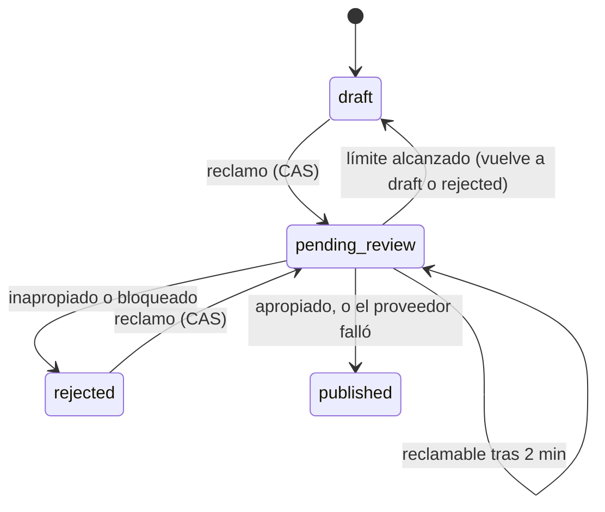

# PRD-5.3 — Publicación con moderación y auto-tagging (servidor)

| Campo | Valor |
| :--- | :--- |
| Padre | [PRD-5 — IA para el autor](PRD-5-ai-author.md) |
| Dificultad / Esfuerzo | A (avanzada) / L (más de 3 días) |
| Dueño sugerido / Mentor | D1 / — |
| Depende de | [PRD-2.1](PRD-2.1-posts-data-rls.md) (privilegios por columna), [PRD-5.1](PRD-5.1-ai-foundation.md) (Gemini), [PRD-5.2](PRD-5.2-rate-limit.md) (carril de moderación) |
| Alimenta a | [PRD-2.4](PRD-2.4-publish-dialog-tags.md) (el diálogo que llama a `publishPost`) |
| Código | `src/features/posts/actions.ts` (`publishPost`, `attachTag`), `src/features/posts/publish.ts`, `src/features/ai/moderation.ts`, `buildModerationPrompt` en `src/features/ai/prompts.ts` |
| ADRs | [0011](../adr/0011-ia-con-gemini.md), [0012](../adr/0012-integridad-de-escritura-de-posts.md) |

## Resumen

Al publicar un artículo, el servidor **lo reserva**, le pide a Gemini que decida si es apropiado y qué tags sugiere, y recién entonces lo deja `published` o `rejected`. Es la única puerta hacia el estado `published` de un artículo: el navegador no puede escribir `status` (privilegios por columna). El diseño busca tres cosas a la vez: que dos clics no moderen dos veces, que nunca se publique un texto que el moderador no leyó y que una caída de la IA no impida publicar.

## Qué necesitás entender antes

- [ ] Los estados de un post: `draft`, `pending_review`, `published`, `rejected`.
- [ ] Qué es un **compare-and-set** (CAS): "actualizá solo si la fila sigue como la leí". Es la forma de evitar que dos peticiones simultáneas se pisen sin usar bloqueos.
- [ ] Qué es una **Server Action** (`"use server"`): una función del servidor que el navegador llama como si fuera local.
- [ ] Por qué se usa el **cliente admin** (salta RLS) para transiciones de estado, después de comprobar con el cliente del usuario que el artículo es suyo.
- [ ] Fallar abierto vs. cerrado ([PRD-5.2](PRD-5.2-rate-limit.md)).
- [ ] Glosario: [docs/README.md](../README.md#glosario) (reclamo, compare-and-set, moderación).

## Alcance / fuera de alcance

| Dentro | Fuera |
| :--- | :--- |
| `publishPost`: reclamo, moderación, decisión, cierre y auto-tagging | El diálogo, la cuenta regresiva y la redirección: [PRD-2.4](PRD-2.4-publish-dialog-tags.md) |
| La política de qué hacer ante cada tipo de fallo | El cliente de Gemini y los errores: [PRD-5.1](PRD-5.1-ai-foundation.md) |
| El prompt de moderación y la fusión de tags | Los contadores del límite: [PRD-5.2](PRD-5.2-rate-limit.md) |
| Publicar solo artículos propios | Moderar notas (no se moderan, [PRD-7](PRD-7-notes-likes.md)) |

## Cómo funciona

Orden de lectura sugerido: `publish.ts` (corto) → `moderation.ts` → `publishPost` en `actions.ts` → el prompt en `prompts.ts`.

### 1. Los estados y el ciclo de vida



### 2. `publishPost(postId)` paso a paso

```text
1. Validar el id y exigir sesión (requireUser)
2. Leer el artículo con el cliente del USUARIO: id, content, status, updated_at, tags
   filtrado por author_id = yo Y type = 'article'   -> si no existe: "No encontramos el artículo"
3. Si ya está published -> error. Si está vacío -> error
4. classifyPublishClaim(status, updated_at, ahora):
     draft / rejected              -> "claim"
     pending_review con > 2 min    -> "claim"  (una revisión interrumpida se puede retomar)
     pending_review reciente       -> "in_progress" -> "ya se está revisando"
5. RECLAMAR (cliente admin): UPDATE status = pending_review, updated_at = claimedAt
     WHERE id, author_id, status = lo leído, updated_at = lo leído
   si no actualizó ninguna fila -> otro clic ganó -> "ya se está revisando"
6. moderateArticle(...) con el carril "moderation"
7. decideModeration(...)  ->  published | rejected | pending
8. si pending (límite alcanzado): liberar el reclamo y responder "busy" con retryAfter
9. CERRAR (cliente admin): UPDATE status/published_at/rejection_reason
     WHERE status = pending_review Y updated_at = claimedAt
   si no coincide (el autor editó mientras se revisaba) -> liberar y "cambió mientras lo revisábamos"
10. Si published: adjuntar los tags sugeridos con el cliente del usuario (RLS vigente)
11. revalidatePath de "/", "/posts", el post, el editor y el perfil
```

Por qué el paso 5 y el 9 son la parte más delicada:

- `updated_at` significa "fecha del **último cambio de contenido**": lo mueve un *trigger* de la base solo cuando cambia `content` ([PRD-2.1](PRD-2.1-posts-data-rls.md)). Como el cliente no puede escribirla, es una **versión confiable** del texto.
- El reclamo escribe `updated_at = claimedAt` a propósito (lo puede hacer porque usa `service_role`). Así el cierre compara contra `claimedAt`: si el autor edita durante la revisión, el trigger cambia `updated_at`, el cierre no coincide y **el texto que el moderador leyó nunca se intercambia por otro sin revisar**.
- Dos clics simultáneos: solo uno logra el reclamo (la condición `status` + `updated_at` ya no coincide para el segundo).

### 3. La decisión (`decideModeration`, en `moderation.ts`)

| Resultado de la moderación | Qué se decide |
| :--- | :--- |
| Error `blocked` (filtros de seguridad de Gemini) | `rejected` con motivo genérico |
| Error `rate_limited` | `pending`: **no se publica**, se libera el reclamo, `retryAfter` en segundos |
| Cualquier otro error (caída, timeout, cuota, JSON inválido, sin configurar, limitador caído) | `published` **sin tags automáticos** (falla abierto), con `aiSkippedReason` |
| `is_appropriate = false` | `rejected` con el motivo del modelo (recortado a 300) o uno genérico si viene vacío |
| `is_appropriate = true` | `published` con los tags **nuevos** sugeridos |

Tags: hasta 5 sugeridos por la IA (`MAX_AI_TAGS`), normalizados (minúsculas, 2 a 30 caracteres, sin símbolos), máximo 8 por artículo (`MAX_TAGS_PER_POST`). `mergeTags` respeta los tags que el autor ya puso: **nunca se descartan** y las sugerencias solo llenan los lugares libres. Cada tag se adjunta con `attachTag`, que crea el tag si no existe (`ON CONFLICT DO NOTHING`, porque `tags` no tiene política de UPDATE) y revisa el tope de 8.

### 4. El prompt de moderación

`buildModerationPrompt(content)`: el sistema pide `is_appropriate`, `reason` y `suggested_tags` y define lo inapropiado (odio, acoso, amenazas, violencia explícita, contenido sexual explícito, spam evidente, contenido ilegal). Aclara que las opiniones críticas o polémicas **son** apropiadas si son respetuosas. El texto va entre `<<<CONTENIDO>>>` y `<<<FIN>>>` con esos delimitadores neutralizados, como **datos, no instrucciones**. Se envían como máximo los primeros 30 000 caracteres; si se recorta, el prompt lo avisa.

## Decisiones y por qué

| Decisión | Alternativas descartadas | Consecuencia |
| :--- | :--- | :--- |
| **Moderación síncrona en una llamada** (PRD global, [ADR 0011](../adr/0011-ia-con-gemini.md)) | Colas o eventos asíncronos: infraestructura para un problema de escala que el proyecto no tiene | El autor espera unos segundos con un estado de carga |
| **Falla abierto ante caída del proveedor** (comentario en `moderation.ts`; el PRD original lo pedía) | Bloquear la publicación si la IA cae | La disponibilidad pesa más que la moderación. Riesgo aceptado: si el proveedor cae, se publica sin revisión |
| **Falla cerrado ante el límite de peticiones** (comentario en `moderation.ts`: un atacante puede provocarlo a propósito) | Publicar igual | Se pide al autor reintentar en N segundos. Un atacante no puede saltarse la moderación agotando el cupo |
| **Reclamo y cierre con compare-and-set sobre `(status, updated_at)`** ([ADR 0011](../adr/0011-ia-con-gemini.md)) | Un bloqueo en la aplicación o una tabla de trabajos (más piezas para el mismo resultado †) | Evita doble moderación y publicar texto no revisado. Un reclamo colgado se recupera a los 2 minutos (`PENDING_REVIEW_STALE_MS`) |
| **Transiciones de estado con el cliente admin, después de leer con el del usuario** ([ADR 0012](../adr/0012-integridad-de-escritura-de-posts.md)) | Dejar que el cliente escriba `status` | Con la clave pública, un autor podía hacer `update posts set status = 'published'` y saltarse todo |
| **Carril de moderación separado** ([PRD-5.2](PRD-5.2-rate-limit.md)) | Compartir el cupo con la asistencia | Publicar no depende de que la asistencia tenga cupo |
| **Sin marca de "revisar tags a mano"** (el diseño original de `needs_manual_tags` se descartó) | Una columna para marcar posts publicados sin IA | Un artículo publicado sin IA es simplemente un post sin tags |

## Criterios de aceptación

- [ ] Publicar un artículo apropiado lo deja `published` con `published_at` y hasta 5 tags nuevos sin superar 8 en total.
- [ ] Un artículo inapropiado queda `rejected` con el motivo y el autor puede editar y reintentar.
- [ ] Si Gemini falla (caída, timeout, cuota, JSON inválido, sin clave), el artículo se publica sin tags automáticos.
- [ ] Si se alcanza el límite del carril de moderación, el artículo **no** se publica y la respuesta trae `retryAfter`.
- [ ] Si los filtros de seguridad bloquean el texto, queda `rejected`.
- [ ] Dos clics simultáneos en "Publicar" moderan una sola vez.
- [ ] Editar el artículo durante la revisión impide publicar el texto no revisado ("cambió mientras lo revisábamos").
- [ ] Un `pending_review` de más de 2 minutos puede volver a reclamarse.
- [ ] Un usuario no puede publicar un artículo ajeno ni una nota, y no puede escribir `status` desde el navegador (`pnpm verify:writes`).

## Cómo verificarla a mano

1. `pnpm test`: mirá `moderation.test.ts` (decisiones, fusión de tags) y `publish.test.ts` (clasificación del reclamo y actualización final).
2. Con `GEMINI_API_KEY` válida: escribí un artículo, tocá **Continuar → Publicar**. Esperá "Publicado" y, si la IA sugirió tags, verlos listados.
3. Sin clave (comentala en `.env.local` y reiniciá): repetí. Esperá "Publicado sin tags automáticos: la IA no estuvo disponible".
4. Límite: `AI_RATE_LIMIT_MODERATION_GLOBAL_PER_MIN=1`; publicá dos artículos seguidos: el segundo debe mostrar "reintentá en N s" y seguir como borrador.
5. `pnpm verify:writes` (necesita `.env.local` con secret key y usuarios sembrados con `pnpm seed:dev`): comprueba que el navegador no puede cambiar `status`.

## Trabajo pendiente asignable

| Tarea | Dificultad |
| :--- | :--- |
| **Moderación parcial.** Solo se envían los primeros 30 000 caracteres (`AI_MAX_INPUT_CHARS`) y un artículo puede tener 100 000: lo que pasa de 30 000 no se modera. Diseñar cómo cubrir el resto (varias llamadas o rechazar) | A |
| **Las ediciones de un artículo ya publicado no se re-moderan.** `savePostContent` guarda directo `title` y `content` sin mirar el estado. Decidir la política (re-moderar, volver a `pending_review`, o aceptar el riesgo) | A |
| `publishPost` no pasa la señal de la petición a `moderateArticle`: cerrar la pestaña no cancela la llamada a Gemini | M |
| Los dos carriles comparten `AI_RATE_LIMIT_USER_PER_MIN`; agregar una variable propia para el límite por usuario de moderación ([PRD-5.2](PRD-5.2-rate-limit.md)) | M |
| Las pruebas e2e de publicación pulsan "Publicar" sin pasar por "Continuar": actualizar `e2e/posts.spec.ts` y `e2e/feed.spec.ts` ([PRD-X.1](PRD-X.1-testing-e2e.md)) | M |
| `attachTag` cuenta los tags y luego inserta: dos adjuntos simultáneos podrían superar 8. Valorar una restricción en la base | M |

## Preguntas de autoevaluación

1. ¿Por qué el reclamo escribe `updated_at = claimedAt` y qué garantiza el cierre condicionado?
2. ¿Qué pasa si el autor edita el artículo mientras Gemini lo está revisando?
3. ¿Por qué un fallo del proveedor **publica** pero un límite de peticiones **no**? ¿Quién podría aprovechar lo contrario?
4. ¿Por qué se lee con el cliente del usuario y se escribe con el cliente admin?
5. ¿Cómo se recupera un artículo que quedó en `pending_review` porque se cortó la petición?
6. Un artículo tiene 3 tags propios y Gemini sugiere 7: ¿cuántos quedan y cuáles?
