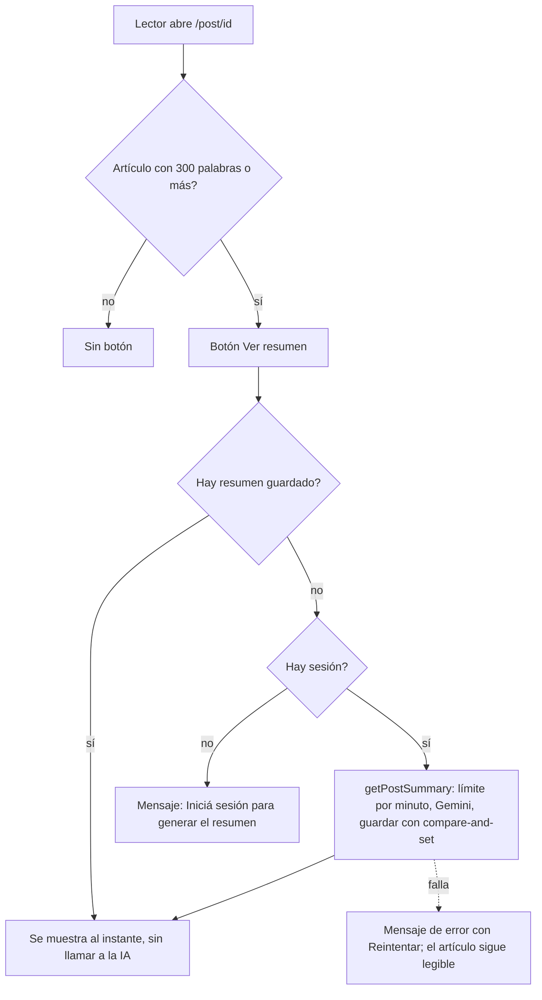

# PRD 6 - IA para el lector: resumen de artículos

| Campo | Valor |
| :--- | :--- |
| Estado | Implementado |
| Depende de | [PRD-2](PRD-2-posts.md) (artículos y vista pública), [PRD-5](PRD-5-ai-author.md) (Gemini, límite por minuto, caché en el post), [PRD-7](PRD-7-notes-likes.md) (solo artículos, no notas) |
| Migraciones | `0007_ai_features.sql` (columna `ai_generated_summary`, trigger de invalidación y límite por minuto) |
| ADRs relacionados | [0011](../adr/0011-ia-con-gemini.md), [0012](../adr/0012-integridad-de-escritura-de-posts.md) |
| Código | `src/features/ai/summary-actions.ts` (`getPostSummary`), `src/features/ai/components/SummaryButton.tsx`, `src/app/(public)/post/[id]/page.tsx`, `src/features/ai/{prompts,output,words,cached-feature,cache.server}.ts` |

## Paquetes de trabajo

| Paquete | Qué cubre | Dificultad | Esfuerzo | Dueño sugerido |
| :--- | :--- | :--- | :--- | :--- |
| [PRD-6.1](PRD-6.1-summary-backend.md) | Acción del servidor `getPostSummary`, prompt y limpieza | M | S | D3 |
| [PRD-6.2](PRD-6.2-summary-ui.md) | Botón "Ver resumen", tarjeta y errores | B | S | D5 |

## Resumen

En un artículo publicado de al menos 300 palabras, cualquier visitante ve un botón "Ver resumen". Si el resumen ya existe se muestra al instante y sin costo; si no, un lector con sesión lo genera bajo demanda con Gemini (2 o 3 oraciones en texto plano) y queda guardado en el post para todos los demás. La lectura del artículo nunca depende de esta función.

## Problema y objetivo

**Problema.** Un lector que llega a un artículo largo quiere saber de qué trata antes de invertir tiempo. Generar el resumen para todos los posts al publicar gastaría cuota de IA en textos que nadie resume.

**Objetivo.**

- Resumen breve de un artículo largo con un solo botón.
- Generarlo una vez y reutilizarlo: el costo lo paga el primer lector que lo pide.
- Que un fallo de la IA no afecte a la lectura.

## Alcance / fuera de alcance

| Dentro | Fuera |
| :--- | :--- |
| Resumen bajo demanda de **artículos publicados** con 300 palabras o más | Resumir al publicar (se hace solo cuando alguien lo pide) |
| Resumen guardado en el post y visible para cualquiera, con o sin sesión | Resumir notas, borradores o posts ajenos no publicados |
| Generar exige sesión y pasa por el límite por minuto | Regenerar a demanda, resumen de varios posts o "resumen del día" |
| Texto plano de 2 o 3 oraciones | Configurar longitud o formato del resumen |

## Cómo funciona



### Flujo en el servidor (`getPostSummary`)

```text
getPostSummary(postId):
  validar el id
  cargar el post con status = published y type = article   (cliente del usuario, RLS vigente)
    si no existe -> "no disponible"

  si ai_generated_summary tiene texto -> devolverlo (cached = true)   // sin sesión, sin costo

  exigir sesión              -> si no hay: "unauthenticated"
  exigir 300 palabras        -> si no llega: "input_too_short"

  runCachedFeature:
    límite por minuto (carril asistencia)      -> si se excede: "rate_limited" con retryAfter
    Gemini: resumir en 2-3 oraciones, texto plano (15 s de plazo)
    limpiar (quitar Markdown, colapsar espacios, máximo 1200 caracteres)
    guardar con compare-and-set sobre el updated_at leído (cliente admin)
      si el post cambió mientras tanto, el resumen se devuelve pero no se guarda
```

### Interfaz (`SummaryButton.tsx`)

| Situación | Qué ve el lector |
| :--- | :--- |
| Resumen guardado | "Ver resumen" abre la tarjeta al instante. El botón alterna con "Ocultar resumen" |
| Sin resumen, con sesión | Al abrir, "Generando resumen…" y un aviso: "Al generar el resumen, el texto se envía a Google Gemini. En la capa gratuita, Google puede usarlo para mejorar sus productos." |
| Sin resumen, sin sesión | "Iniciá sesión para generar el resumen.", donde "Iniciá sesión" abre el cajón `LoginDrawer` (no navega a `/login`) |
| Resumen mostrado | Tarjeta "Resumen" con el texto y la nota "Generado con IA (Google Gemini); puede contener errores." |
| Error | Mensaje con "Reintentar" (con cuenta regresiva si es límite de peticiones). Sin sesión (error `unauthenticated`), el mismo aviso con `LoginDrawer` |

El botón solo se renderiza si el post es un artículo y `wordCount >= MIN_WORDS_SUMMARY` (300), calculado al cargar la página (`getPublishedPost`); el servidor repite el umbral, así que llamar a la acción a mano con un artículo corto no genera nada.

### Datos

| Campo (`posts`) | Uso |
| :--- | :--- |
| `ai_generated_summary` | Último resumen generado. Se anula por trigger cuando cambia `content` |
| `updated_at` | Versión del contenido: lo mueve solo el trigger, y el guardado del resumen lo usa como condición (compare-and-set) |

No hay tabla nueva ni campo de "fecha de generación": la invalidación se resuelve con el trigger de la base.

## Decisiones y por qué

Cada decisión indica su fuente. "Registrado" significa que consta en un ADR, en un comentario o en el propio código; "deducido" es una hipótesis razonable sin registro explícito.

### 1. Bajo demanda, no al publicar

- **Elegido.** El resumen se genera cuando un lector lo pide.
- **Por qué (registrado en el PRD original).** Ahorra llamadas a la IA en posts que nadie resume.
- **Consecuencia.** El primer lector espera unos segundos; los siguientes lo ven al instante.

### 2. Generar exige sesión; leer uno guardado no

- **Elegido.** Un resumen ya guardado lo ve cualquiera; generarlo requiere sesión y pasa por el límite por minuto.
- **Por qué (registrado en el comentario de `summary-actions.ts`).** Ver uno guardado no cuesta nada, pero generar gasta la cuota gratuita, así que se acota a usuarios autenticados y limitados.
- **Consecuencia.** Un visitante sin sesión ve resúmenes existentes pero no puede provocar generaciones.

### 3. Invalidación por trigger, no comparando fechas en la aplicación

- **Elegido.** Un trigger anula `ai_generated_summary` cuando cambia `content`, y el resumen se guarda con compare-and-set sobre el `updated_at` leído ([ADR 0011](../adr/0011-ia-con-gemini.md)).
- **Por qué (registrado).** Comparar `updated_at` en la aplicación depende de que cada escritor lo actualice; el trigger cubre a todos. Además, como `updated_at` solo lo mueve el trigger, un cambio de título no invalida un resumen que sigue siendo válido.
- **Descartado.** Una columna `summary_generated_at` comparada con `updated_at` (el diseño original de este PRD).
- **Consecuencia.** Si el autor edita mientras se genera el resumen, este se devuelve al lector pero no se guarda.

### 4. Guardado con el cliente admin

- **Elegido.** El resumen lo escribe el servidor con la clave de servicio, aunque lo dispare un lector que no es el autor.
- **Por qué (registrado, [ADR 0012](../adr/0012-integridad-de-escritura-de-posts.md)).** Las columnas `ai_*` no son escribibles por el cliente: un lector o autor no podría fabricar un resumen falso desde el navegador. La condición sobre `updated_at` garantiza que solo se escriba para la versión del contenido que se resumió.

### 5. Texto plano

- **Elegido.** El resumen se limpia de Markdown y se muestra como texto plano (`cleanSummary`, máximo 1200 caracteres).
- **Por qué (registrado en un comentario de `output.ts`).** El resumen se renderiza como texto plano, por eso se elimina cualquier Markdown que agregue el modelo.
- **Por qué además (deducido).** Un modelo puede devolver Markdown o HTML inesperado; mostrar texto plano evita renderizar contenido que no se controla, y un resumen de 2 o 3 oraciones no lo necesita.

### 6. Solo artículos publicados

- **Elegido.** La acción exige `status = published` y `type = article`.
- **Por qué (registrado en el comentario del código).** Nunca se produce un resumen de una nota ni de un borrador ([ADR 0009](../adr/0009-tipos-de-post-y-likes.md)).

## Criterios de aceptación

- [x] El botón "Ver resumen" aparece solo en artículos publicados de 300 palabras o más.
- [x] Pedir el resumen de un artículo no editado dos veces no genera una segunda llamada a la IA.
- [x] Un visitante sin sesión ve un resumen ya guardado y, si no existe, un aviso "Iniciá sesión" que abre el `LoginDrawer` en lugar de generarlo.
- [x] Editar el contenido de un artículo publicado anula el resumen guardado.
- [x] Si la IA falla, el artículo sigue siendo legible y se ofrece "Reintentar".
- [x] El resumen se muestra como texto plano, con el aviso de que lo generó IA.
- [x] Llamar a la acción con una nota, un borrador o un artículo de menos de 300 palabras no genera nada.
- [x] Si se alcanza el límite de peticiones, se muestra una cuenta regresiva y el botón queda deshabilitado hasta que termina.

## Limitaciones conocidas y deuda

| Tema | Detalle |
| :--- | :--- |
| Sin regeneración | No hay forma de pedir un resumen nuevo sin editar el contenido |
| Artículos muy largos | El texto enviado se recorta a 30 000 caracteres (`AI_MAX_INPUT_CHARS`); el resumen refleja solo esa parte |
| Generaciones simultáneas | Dos lectores que piden a la vez un resumen aún inexistente lanzan dos llamadas; solo la primera escritura gana el compare-and-set. Ambas consumen cupo |
| Sin cancelación | `getPostSummary` no recibe la señal de la petición; cerrar la pestaña no cancela la llamada al modelo |
| Umbral de palabras al cargar | El botón depende del recuento al renderizar la página; el servidor lo verifica de nuevo solo al generar, no al leer uno guardado |
| Cobertura de pruebas | No hay prueba de la acción completa ni e2e del botón: solo se cubren piezas puras (`cleanSummary`, el prompt y el flujo cacheable) |

## Pruebas

**Unitarias (Vitest, `pnpm test`)**

| Área | Archivo |
| :--- | :--- |
| Limpieza del resumen (Markdown, espacios, vacío) | `src/features/ai/output.test.ts` |
| Prompt y neutralización de delimitadores | `src/features/ai/prompts.test.ts` |
| Mínimos de palabras | `src/features/ai/words.test.ts` |
| Flujo de caché y límite | `src/features/ai/cached-feature.test.ts`, `cache.test.ts`, `rate-limit.test.ts` |

**E2E**: sin cobertura del resumen.
