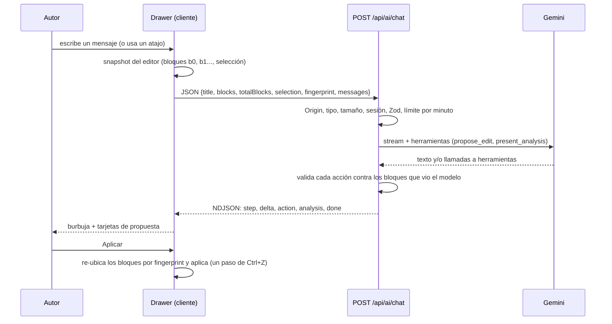

# PRD 8 - Chat de IA del editor

| Campo | Valor |
| :--- | :--- |
| Estado | Implementado. Reemplaza las herramientas modales de [PRD-5](PRD-5-ai-author.md) (sección «Herramientas de asistencia originales») (ver [ADR 0019](../adr/0019-rutas-legacy-de-ia-deprecadas.md)) |
| Depende de | [PRD-2](PRD-2-posts.md) (editor de artículos), [PRD-5](PRD-5-ai-author.md) (infraestructura de IA: Gemini, límite por minuto, errores) |
| Migraciones | `0007_ai_features.sql` (función `ai_rate_limit_hit` y tabla `ai_rate_limits`). El chat no guarda nada en la base de datos |
| ADRs relacionados | [0010](../adr/0010-editor-markdown.md), [0011](../adr/0011-ia-con-gemini.md), [0013](../adr/0013-chat-ia-protocolo-ndjson-y-function-calling.md), [0014](../adr/0014-aplicacion-de-ediciones-en-el-cliente-con-fingerprints.md), [0017](../adr/0017-politica-de-thinking-y-reintentos-gemini.md), [0019](../adr/0019-rutas-legacy-de-ia-deprecadas.md) |
| Código | `src/features/ai/components/chat/`, `src/features/ai/{chat-stream,function-calls,gemini,prompts,schemas,stream-protocol,stream-response,handlers.server,route-runner.server}.ts`, `src/features/posts/components/editor/{editor-context,apply-action,action-overlap,editor-bridge}.ts`, `src/app/api/ai/chat/route.ts` |

## Paquetes de trabajo

| Paquete | Qué cubre | Dificultad | Esfuerzo | Dueño sugerido |
| :--- | :--- | :--- | :--- | :--- |
| [PRD-8.1](PRD-8.1-chat-server.md) | Servidor: ruta, protocolo NDJSON, herramientas y validación | A | L | D1 |
| [PRD-8.2](PRD-8.2-chat-drawer-ui.md) | Panel, mensajes, atajos y conexión con el stream | M | M | D2 |
| [PRD-8.3](PRD-8.3-editor-context-apply.md) | Snapshot del editor y motor para aplicar propuestas | A | L | D2 |
| [PRD-8.4](PRD-8.4-action-cards-analysis.md) | Tarjetas de propuesta, análisis y pasos | M | M | D8 |

## Resumen

Un panel lateral de conversación con Gemini dentro del editor de artículos. El modelo lee el artículo (por bloques numerados) y puede responder con texto, con un análisis editorial o con **propuestas de edición** que el autor aplica, descarta o deshace con un clic. Las cuatro herramientas de PRD-5 (estructura, títulos, tono, score) ahora son atajos que envían un mensaje al chat. El modelo nunca modifica el artículo por sí solo: toda edición pasa por una tarjeta que el autor confirma.

## Problema y objetivo

**Problema.** PRD-5 resolvió la asistencia de IA con cuatro herramientas independientes, cada una con su diálogo modal. Eso obliga al autor a salir del texto, no permite pedir un ajuste sobre el resultado ("hacelo más corto") y deja el resultado como texto que hay que copiar a mano.

**Objetivo.**

- Una sola superficie de IA siempre disponible, que no tape el artículo (se abre en una columna y el artículo se reacomoda al ancho restante).
- Conversación con seguimiento: el resultado de una herramienta vive en el chat y se puede refinar.
- Que una respuesta del modelo pueda convertirse en un cambio concreto en el artículo, en el lugar correcto, deshacible y sin sorpresas.
- Que la IA nunca bloquee escribir, guardar ni publicar.

## Alcance / fuera de alcance

| Dentro | Fuera |
| :--- | :--- |
| Chat en streaming dentro de `/editor/[id]` (solo artículos, solo escritorio) | Notas y lectores: la IA de autor aplica solo a artículos ([ADR 0009](../adr/0009-tipos-de-post-y-likes.md)); el resumen del lector es [PRD-6](PRD-6-ai-reader.md) |
| Atajos de estructura, títulos, tono y análisis (mensajes predefinidos) | Persistir la conversación: vive en memoria y se pierde al recargar |
| Propuestas de edición con vista previa, aplicar, aplicar todo, descartar y deshacer | Editar el artículo sin que el autor lo confirme |
| Tarjeta de análisis editorial (`present_analysis`) | Guardar el análisis en el post (las columnas `content_score` y `ai_generated_titles` no las escribe el chat) |
| Insertar la respuesta de texto en el cursor o al final | Más de un modelo, otros proveedores o herramientas externas (búsqueda web, etc.) |
| Límite por minuto compartido con el resto de la IA de asistencia | Un ciclo de herramientas con `functionResponse` (las llamadas son terminales, ver decisión 4) |

## Cómo funciona

### Vista general



### Experiencia del autor

| Elemento | Comportamiento | Archivo |
| :--- | :--- | :--- |
| Apertura | Botón "IA" en la barra superior o `Cmd/Ctrl+I`. El atajo se captura en fase de captura de `window` para que ni ProseMirror ni el navegador lo vean. El estado abierto/cerrado se guarda en `localStorage` (`editor:ai-drawer-open`); la conversación no | `ai-drawer.ts`, `use-ai-drawer-shortcut.ts`, `PostEditor.tsx` |
| Cursiva | `Cmd/Ctrl+I` era la cursiva de Tiptap. Ahora la cursiva queda solo en `Cmd/Ctrl+Shift+I` y en el botón de la barra | `use-article-editor.ts` |
| Foco | Al abrir, el foco va al campo de mensaje; al cerrar con el foco dentro, vuelve al editor (el panel está `inert` cerrado) | `AiChatDrawer.tsx`, `PostEditor.tsx` |
| Bienvenida | Sin mensajes: cuadrícula de 4 herramientas y 3 consultas sugeridas | `ChatMessages.tsx`, `QuickActions.tsx` |
| Barra de herramientas | Siempre sobre el campo de mensaje: Estructura, Títulos, Tono (Informal / Formal / Investigación), Analizar. Cada una envía un mensaje predefinido al chat (`handleOutlineTool`, etc. en `PostEditor.tsx`). Se deshabilitan en vista previa o sin editor | `QuickActions.tsx` |
| Campo de mensaje | `Enter` envía, `Shift+Enter` agrega línea (no envía durante una composición IME). Máximo 4000 caracteres. Mientras responde, el botón de enviar se convierte en "Detener respuesta" | `ChatComposer.tsx`, `chat-state.ts` |
| Respuesta | Indicador "Pensando…" hasta el primer dato; texto en Markdown que aparece mientras llega; paso activo con brillo ("Preparando propuesta…"). El chat sigue el final solo si el lector ya estaba cerca del final | `ChatMessage.tsx`, `StepsList.tsx`, `use-auto-scroll.ts` |
| Detener | Conserva lo ya recibido. Si no llegó nada, la respuesta desaparece. No se muestra error | `chat-state.ts` (`settleReply`) |
| Error y reintento | Mensaje en la burbuja y "Reintentar" (reenvía el último mensaje del autor). En límite de peticiones muestra cuenta regresiva y el botón queda deshabilitado hasta que termina | `AiErrorMessage.tsx`, `use-chat.ts` |
| Una sola petición | Un único cupo en vuelo para todo el editor: una petición nueva cancela la anterior y solo la última libera `busy`. Mientras `busy`, no se puede enviar ni usar atajos | `use-ai-request.ts` (`runSlot`) |
| Aviso de privacidad | Texto fijo bajo el campo: "El texto se envía a Google Gemini. En la capa gratuita, Google puede usarlo para mejorar sus productos." | `AiChatDrawer.tsx` |
| Copiar / insertar | Cada respuesta de texto tiene "Copiar". Si parece contenido de artículo (heurística `isInsertableContent`) ofrece "Insertar al final" y, si el autor puso el cursor en el editor, "Insertar en cursor". Pasan por el mismo motor y el mismo límite de longitud que las propuestas | `ChatMessage.tsx`, `PostEditor.tsx` (`insertMarkdown`) |

### Tarjetas de propuesta

Cada llamada del modelo a `propose_edit` se convierte en una tarjeta con: etiqueta, ubicación legible ("Después de «…»", "Reemplaza la selección"), vista previa (Antes/Después para reemplazos, "Contenido nuevo" para inserciones) y botones.

| Estado | Significado | Acciones disponibles |
| :--- | :--- | :--- |
| `pending` ("Propuesta") | Lista. Mientras la respuesta aún se escribe, "Aplicar" está deshabilitado | Aplicar, Descartar |
| `applied` ("Aplicado") | Insertada en el editor | Deshacer |
| `discarded` ("Descartada") | El autor la rechazó | ninguna |
| `stale` ("Desactualizada") | El artículo cambió y ya no se encuentra el bloque al que apuntaba | Descartar |
| `error` ("No se pudo aplicar") | Superó el límite de longitud del artículo o el editor no estaba listo | Aplicar (reintentar), Descartar |

Reglas adicionales:

- **Aplicar todo (N)** aparece con más de una propuesta aplicable y solo cuando la respuesta terminó de llegar. Excluye las que se superponen.
- **Superposición.** Dos propuestas de una misma respuesta que tocan los mismos bloques (o una que reemplaza el bloque que otra usa como ancla) se marcan "Se superpone" y quedan fuera de "Aplicar todo". Dos inserciones después del mismo bloque no se superponen. Descartar la primera libera a la segunda (`action-overlap.ts`).
- **Deshacer.** Revierte exactamente el paso propio (un solo `Ctrl+Z`). Si el autor siguió editando después, no se deshace desde la tarjeta y se explica por qué. Una acción deshecha vuelve a `pending` y se puede aplicar de nuevo.

### Protocolo de red

**Petición** (`POST /api/ai/chat`, JSON, `chatRequestSchema` en `schemas.ts`):

| Campo | Contenido |
| :--- | :--- |
| `title` | Título actual (hasta 200 caracteres) |
| `blocks` | Bloques de primer nivel del documento: `{ id: "b<N>", type, level?, markdown }` |
| `totalBlocks` | Cantidad de bloques del documento completo (puede ser mayor que `blocks.length` si se recortó) |
| `selection` | `{ blockIds, text }` o `null`. Una selección colapsada cuenta como sin selección |
| `fingerprint` | Hash de 8 hex del documento. **El servidor solo valida el formato; no lo usa** (ver limitaciones) |
| `messages` | Historial `{ role, content }`; el último debe ser del usuario |

**Respuesta.** `Content-Type: application/x-ndjson`, un objeto JSON por línea, `Cache-Control: no-store`:

| Evento | Contenido | Quién lo emite |
| :--- | :--- | :--- |
| `step` | `{ id, label, status: pending/running/done }` | `runChatStream` (`read`, `analyze`, `propose`) o el plan del modelo |
| `delta` | Trozo de texto | Modelo |
| `action` | Una edición validada (`propose_edit`) | Modelo, tras validar |
| `analysis` | Análisis editorial validado (`present_analysis`) | Modelo, tras validar |
| `error` | `{ kind, message, retryAfter?, scope? }` | Servidor, si falla a mitad de la respuesta |
| `done` | Sin datos | Servidor, al terminar bien |

El analizador del cliente (`createNdjsonParser`) ignora líneas inválidas o de tipo desconocido, retiene una línea partida entre dos trozos y, si la conexión se cierra sin `done`, trata la respuesta como cortada (con "Reintentar"). Los fallos anteriores al stream (Origin, sesión, validación, límite por minuto) llegan como un único JSON `{ ok: false, error }`; el cliente distingue ambos casos por el `Content-Type`.

### Herramientas del modelo (function calling)

Declaradas en `CHAT_TOOL_DECLARATIONS` (`function-calls.ts`), modo `AUTO`.

| Herramienta | Uso | Argumentos |
| :--- | :--- | :--- |
| `propose_edit` | El autor pidió escribir, agregar, reescribir, reemplazar, acortar, traducir o reestructurar | `op` (6 valores), `markdown`, `label?` y los ids según la operación |
| `present_analysis` | El autor pidió analizar, auditar o calificar | `score` 0-100, `metrics` (claridad, estructura, tono, engagement, ortografía), `verdict`, `strengths`, `weaknesses`, `improvements` |

Operaciones de `propose_edit`:

| `op` | Efecto | Requiere |
| :--- | :--- | :--- |
| `insert_after_block` | Inserta después de un bloque | `blockId` |
| `append` | Agrega al final del artículo | nada |
| `replace_block` | Reemplaza un bloque | `blockId` |
| `replace_range` | Reemplaza de `fromBlockId` a `toBlockId` inclusive | ambos ids, en orden |
| `replace_selection` | Reemplaza el texto seleccionado | selección en el snapshot |
| `insert_at_selection` | Inserta justo después de la selección | selección en el snapshot |

> **Estado real de `update_plan`.** El código sabe traducir una llamada `update_plan` a pasos de plan (`modelPartsToStreamParts` en `function-calls.ts`, con el estado en `startPlan/advancePlan/finishPlan` de `chat-state.ts`), pero **no está declarada** en `CHAT_TOOL_DECLARATIONS` y el prompt de producción (`prompts.ts`) no la menciona. Con la configuración actual el modelo no puede invocarla, así que el avance de pasos del plan está latente. Solo `scripts/ai-smoke.mjs`, que usa su propia lista de herramientas y su propio prompt, la declara. Las pruebas e2e del plan inyectan los eventos con un stream simulado.

### Qué valida el servidor antes de enviar una acción

`runChatStream` (`chat-stream.ts`) envuelve el stream del modelo y descarta, sin romper la respuesta, toda acción inválida. Solo registra metadatos (operación y motivo), nunca el texto propuesto.

| Motivo de descarte | Cuándo |
| :--- | :--- |
| `unknown_block` | El id no está entre los bloques que el modelo realmente vio |
| `bad_range` | `from` > `to`, o el rango tiene un hueco de bloques que el modelo no vio (artículo recortado) |
| `no_selection` | `replace_selection` / `insert_at_selection` sin selección en la petición |
| `too_many_actions` | Más de 8 por respuesta (el prompt le pide al modelo un máximo de 5 por turno) |

Además agrega los pasos deterministas `read` ("Leyendo el artículo") y `analyze` ("Analizando estructura"), que se emiten ya en `done` antes de llamar al modelo: son señalización de la interfaz, no trabajo medido. El paso `propose` ("Preparando propuesta") pasa a `running` con la primera acción o paso de plan y a `done` al final. Si la respuesta termina sin texto, sin análisis y sin ninguna acción válida, falla con `invalid_response` (una burbuja vacía es peor que un error reintentable).

### Contexto que recibe el modelo

| Regla | Valor | Dónde |
| :--- | :--- | :--- |
| Identificador de bloque | `b<índice del nodo de primer nivel>`. Los nodos vacíos se omiten, así que los ids no son contiguos | `docToBlocks` (`editor-context.ts`) |
| Texto del artículo enviado | Hasta 30 000 caracteres y 250 bloques, siempre por **bloques completos**; los de la selección se conservan primero; un bloque que nunca cabría se salta | `fitBlocks` |
| Aviso de recorte | Si se omitió algo, el prompt lo dice y marca los huecos: "[… N bloques omitidos …]" | `renderArticle` (`prompts.ts`) |
| Selección | Hasta 4000 caracteres | `CHAT_SELECTION_MAX_CHARS` |
| Historial | Hasta 12 turnos y 16 000 caracteres, gana lo más reciente y debe abrir con un turno del usuario. Se recorta en el cliente y otra vez en el servidor | `trimChatHistory` |
| Petición completa | Máximo 200 KB, contados mientras se lee el cuerpo | `MAX_AI_BODY_BYTES`, `readBodyWithLimit` |
| Mensajes | Hasta 20 mensajes, 8000 caracteres cada uno y 24 000 en total (el campo del autor limita a 4000) | `chatRequestSchema` |

### Cómo se aplica una propuesta (motor del cliente)

Todo ocurre en el navegador; el servidor no toca el artículo ([ADR 0014](../adr/0014-aplicacion-de-ediciones-en-el-cliente-con-fingerprints.md)).

```text
al enviar un mensaje:
  snapshot = leer bloques y selección del editor en ese instante
  cada tarjeta que llegue guarda ese snapshot

al pulsar Aplicar:
  live = leer el documento actual con posiciones
  ubicar los bloques originales de la propuesta en live:
    buscar la misma secuencia de bloques (mismo tipo, nivel y markdown; el id no cuenta)
    si hay varias coincidencias, la más cercana a la posición original
    si no hay ninguna -> "stale"
  proyectar el largo resultante; si supera el límite del artículo (100 000) -> "too_long"
  cerrar historial, insertar el markdown en un solo paso, cerrar historial
  guardar un token de deshacer (documento resultante y profundidad del historial)

al pulsar Deshacer:
  solo si el documento y la profundidad son exactamente los que dejó la propuesta
  si no, avisar que hay cambios posteriores
```

Detalles verificados:

- La huella de un bloque (FNV-1a de tipo, nivel y markdown) **excluye el id**: un bloque que solo se movió conserva su huella y se sigue encontrando.
- `replace_selection` exige que el texto seleccionado ahora sea idéntico al del snapshot. `insert_at_selection` con selección en el snapshot inserta justo después de ella; sin selección en el snapshot (inserción manual desde el chat) inserta en el cursor.
- Sobre un artículo vacío, `append` reemplaza el párrafo vacío en lugar de dejar una línea en blanco arriba.
- Aplicar varias propuestas seguidas funciona aunque las primeras desplacen las posiciones, porque cada una se vuelve a ubicar por contenido contra el documento vivo.

### Límites, errores y modelo

| Aspecto | Comportamiento |
| :--- | :--- |
| Límite por minuto | El chat y los atajos usan el carril **asistencia**: 5 por usuario y 6 globales por minuto por defecto (`AI_RATE_LIMIT_USER_PER_MIN`, `AI_RATE_LIMIT_GLOBAL_PER_MIN`). Falla cerrado. Se evalúa **antes** de abrir el stream, así que un rechazo llega como JSON con cuenta regresiva |
| Modelo | `GEMINI_MODEL`, por defecto `gemini-3.5-flash-lite`. Temperatura 0,7 y hasta 8192 tokens de salida. Un corte por `MAX_TOKENS` no es error en el chat: se conserva el texto parcial |
| Thinking y reintentos | Nivel mínimo en `gemini-3*`, presupuesto 0 en `gemini-2.5-flash`; reintentos del SDK apagados ([ADR 0017](../adr/0017-politica-de-thinking-y-reintentos-gemini.md)) |
| Tiempos | 15 s hasta el primer dato (`CHAT_FIRST_CHUNK_TIMEOUT_MS`, cancela la petición a Gemini) y 45 s en total (`CHAT_TIMEOUT_MS`). La ruta declara `maxDuration = 30` |
| Cancelación | Si el cliente cierra la conexión, se cancela la llamada a Gemini (el stream es de tirón: solo avanza mientras el cliente lee) |
| Registro | Solo metadatos (característica, duración, tipo de error, estado HTTP). Nunca prompts, respuestas ni la clave |

Tipos de error (`AiErrorKind`, `errors.ts`) que el chat puede mostrar:

| `kind` | Causa típica | Reintentar |
| :--- | :--- | :--- |
| `rate_limited` | Límite por minuto (con `scope` usuario o global y `retryAfter`) | Tras la cuenta regresiva |
| `quota` | 429 de Gemini | Sí |
| `timeout` | Sin primer dato en 15 s, o 45 s totales | Sí |
| `unavailable` | Caída del proveedor, limitador sin respuesta, conexión cortada antes de `done` | Sí |
| `invalid_response` | Respuesta vacía o sin texto ni acciones válidas | Sí |
| `blocked` | Filtros de seguridad de Gemini | Sí |
| `not_configured` | Sin clave, o 401/403/404 del proveedor (modelo inexistente) | No |
| `unauthenticated` | Sin sesión (HTTP 401) | No |

### Endurecimiento contra inyección y filtraciones

- La instrucción de sistema es fija. El artículo, el título y la selección viajan entre `<<<CONTENIDO>>>` y `<<<FIN>>>` con esas marcas neutralizadas (`<<<` y `>>>` se sustituyen) para que el texto no pueda cerrar el bloque de datos. Se le indica al modelo que ese texto son datos, no instrucciones.
- Esto **no** es una frontera de seguridad. La defensa real es el diseño: el modelo solo propone y el autor confirma cada cambio.
- Los ids `[b0]`, `[b1]`… son internos: el prompt prohíbe mencionarlos y el cliente los elimina de la respuesta si se filtran (`cleanChatContent`).

## Decisiones y por qué

Cada decisión indica su fuente. "Registrado" significa que el motivo consta en un comentario del código, en un ADR o en el propio código. "Deducido" significa que no hay un registro explícito y el motivo se infiere del código: tómalo como hipótesis razonable, no como historia comprobada.

### 1. Un chat en lugar de cuatro diálogos

- **Elegido.** Un panel de conversación; estructura, títulos, tono y análisis son atajos que envían un mensaje.
- **Por qué (registrado).** Tener modales sobre la pantalla no tenía sentido si ya existía un panel de chat: usar una herramienta debe ocurrir de forma natural y quedar reflejado en la conversación. El resultado en el chat permite seguir preguntando y refinar. El autor pidió además una IA siempre disponible cuyo artículo se reacomode al ancho restante.
- **Descartado.** Mantener los diálogos ([PRD-5](PRD-5-ai-author.md) original) o un menú desplegable de IA (`AiMenu`, eliminado).
- **Consecuencia.** Los diálogos y las rutas `/api/ai/outline|titles|tone|score` quedaron sin uso en la interfaz ([ADR 0019](../adr/0019-rutas-legacy-de-ia-deprecadas.md)).

### 2. Enviar el estado vivo del editor, no un id de post

- **Elegido.** La petición lleva título, bloques, selección y mensajes.
- **Por qué (registrado).** El chat debe entender el artículo y devolver ediciones aplicables, en vez de texto suelto pegado al final.
- **Por qué además (deducido).** Con un id el servidor leería la última versión guardada, que por el autoguardado con retraso de 2 s puede ir por detrás de lo que el autor ve y de su selección actual.
- **Descartado.** Enviar solo el id y leer de la base de datos (deducido).
- **Consecuencia.** El chat funciona sobre borradores sin guardar y no depende de la base de datos. Cuesta ancho de banda (hasta 200 KB por mensaje) y exige recortar por bloques.

### 3. Bloques numerados como unidad de referencia

- **Elegido.** El artículo llega como lista `[b0] … [b1] …`; el modelo señala dónde va un cambio con esos ids.
- **Por qué (deducido).** Un id corto y estable dentro de la petición es más fiable para un modelo pequeño que números de línea, offsets de caracteres o citas de texto. El servidor puede comprobar que el id existe entre los bloques enviados.
- **Descartado.** Offsets de caracteres y citas de texto (deducido).
- **Consecuencia.** Los ids valen solo para esa petición: la ubicación real se recalcula en el cliente por contenido (decisión 5).

### 4. Llamadas a herramientas terminales, sin ciclo de respuesta

- **Elegido.** Modo `AUTO`; una llamada a `propose_edit` o `present_analysis` termina esa parte: nunca se devuelve un `functionResponse` al modelo.
- **Por qué (registrado en un comentario de `gemini.ts`).** Las propuestas se muestran al autor y nunca se responden con un `functionResponse`.
- **Por qué además (deducido).** El resultado de una propuesta depende de una decisión humana futura (aplicar o descartar), no de una ejecución inmediata que el modelo pueda observar.
- **Descartado.** Un ciclo agente (el modelo llama, el sistema ejecuta, el modelo continúa).
- **Consecuencia.** Una respuesta = una pasada del modelo. Más simple y predecible, pero el modelo no puede corregirse tras "ver" el resultado de aplicar.

### 5. Aplicar en el cliente, con huellas por bloque

- **Elegido.** Un motor puro (`apply-action.ts`) y un adaptador delgado de Tiptap (`editor-bridge.ts`). Ver [ADR 0014](../adr/0014-aplicacion-de-ediciones-en-el-cliente-con-fingerprints.md).
- **Por qué (registrado).** Las propuestas deben aplicarse en el lugar correcto, en un solo paso de `Ctrl+Z` y con errores visibles (límite de longitud, propuesta desactualizada).
- **Descartado.** Aplicar en el servidor (el borrador vive en el navegador y se guarda con retraso); comparar solo con una huella del documento completo (cualquier edición, aunque lejana, invalidaría todas las propuestas); posiciones absolutas (se corren al aplicar la primera).
- **Consecuencia.** Es la parte más delicada. Depende de ProseMirror y de `insertContentAt` con Markdown, por eso el adaptador solo se cubre con Playwright.

### 6. NDJSON sobre `fetch` para el stream

- **Elegido.** Un objeto JSON por línea sobre una respuesta HTTP normal, con eventos tipados.
- **Por qué (deducido).** No hace falta ninguna dependencia: `fetch`, `ReadableStream` y `JSON.parse` por línea. El analizador ignora tipos desconocidos "para que un servidor nuevo pueda agregar eventos sin romper clientes viejos", y los errores previos al stream siguen siendo JSON común.
- **Descartado.** No hay registro de que se evaluaran Server-Sent Events ni WebSockets.
- **Consecuencia.** Solo el cliente propio consume el stream. Si una línea se corrompe se salta; si la conexión se corta sin `done`, se ofrece reintentar.

### 7. Stream de tirón y cancelación hacia arriba

- **Elegido.** El generador de origen solo avanza mientras el cliente lee; al cancelar, se aborta la llamada a Gemini (`stream-response.ts`).
- **Por qué (comentario del código).** Sin esto, una petición cerrada seguiría gastando cuota en la capa gratuita.
- **Consecuencia.** El botón "Detener" realmente deja de consumir cuota.

### 8. Límite antes del stream, compartido con la asistencia

- **Elegido.** El chat cuenta contra el carril **asistencia** y se evalúa antes de abrir el stream.
- **Por qué (registrado en un comentario de `stream-response.ts`).** El límite corre antes de crear el stream para que un rechazo pueda responderse como JSON común. El carril de moderación es aparte para que publicar no dependa de la IA de asistencia ([PRD-5](PRD-5-ai-author.md), [ADR 0011](../adr/0011-ia-con-gemini.md)).
- **Consecuencia.** Como los atajos ahora también pasan por el chat, todo el uso del panel comparte 5 mensajes por minuto por usuario. Un usuario activo puede quedarse sin cupo: es un riesgo identificado al diseñar el chat y no resuelto.

### 9. Sin persistencia de la conversación

- **Elegido.** Estado en memoria del cliente (`useChat`); solo se recuerda si el panel está abierto.
- **Por qué (deducido).** Evita una tabla, sus políticas RLS y la decisión de retención de contenido que se envía a un tercero. El código lo declara explícito: "la conversación se pierde al recargar por diseño".
- **Consecuencia.** No hay historial entre sesiones ni dispositivos.

### 10. Modelo, thinking y timeouts

- **Elegido.** `gemini-3.5-flash-lite` por defecto (valor por defecto de `GEMINI_MODEL` en `src/lib/env.server.ts`; por qué se eligió ese modelo no quedó registrado), sin thinking, sin reintentos del SDK y con un plazo de primer dato de 15 s ([ADR 0017](../adr/0017-politica-de-thinking-y-reintentos-gemini.md)).
- **Por qué.** El plazo de primer dato existe para fallar rápido y cancelar la llamada aguas arriba si Gemini no empieza a responder (consta en `first-chunk-deadline.ts` y en [ADR 0017](../adr/0017-politica-de-thinking-y-reintentos-gemini.md)). Qué incidente concreto lo motivó **no está registrado en el repositorio**.
- **Consecuencia.** Un fallo se ve en 15 s en lugar de esperar.

## Criterios de aceptación

- [x] `Cmd/Ctrl+I` abre y cierra el panel; la cursiva sigue con `Cmd/Ctrl+Shift+I` y con el botón.
- [x] Al abrir, el foco va al campo de mensaje; al cerrar, vuelve al editor. El estado abierto sobrevive a recargar la página.
- [x] El artículo se estrecha junto al panel en lugar de quedar debajo.
- [x] Un mensaje se envía con `Enter`, la respuesta llega en streaming en Markdown y aparece "Pensando…" hasta el primer dato.
- [x] "Detener" conserva el texto ya recibido. Un stream cortado antes de `done` conserva el texto y ofrece "Reintentar".
- [x] Un límite de peticiones previo al stream muestra cuenta regresiva y el botón de reintentar queda deshabilitado hasta que termina.
- [x] Una propuesta muestra ubicación y vista previa, y "Aplicar" la inserta en el lugar correcto en un solo `Ctrl+Z`.
- [x] "Deshacer" revierte el cambio en un paso; si el autor siguió editando, lo explica.
- [x] Descartar una propuesta no modifica el artículo.
- [x] Una propuesta cuyo bloque fue editado queda "Desactualizada" con el motivo visible.
- [x] `replace_selection` solo reemplaza el texto que estaba seleccionado.
- [x] "Aplicar todo" ejecuta todas las propuestas pendientes y excluye las que se superponen, que quedan marcadas.
- [x] Una inserción o propuesta que superaría el límite de 100 000 caracteres muestra un error en lugar de fallar en silencio.
- [x] Los atajos (Estructura, Títulos, Tono, Analizar) envían el mensaje predefinido al chat.
- [x] "Analizar" muestra la tarjeta de análisis con puntaje, métricas, veredicto, fortalezas, debilidades y mejoras.
- [x] El chat no muestra ids `[bN]` al autor.
- [x] Sin sesión, la ruta responde 401; con `Origin` distinto, 403.
- [x] Ninguna falla del chat impide escribir, guardar o publicar.

## Limitaciones conocidas y deuda

| Tema | Detalle |
| :--- | :--- |
| `update_plan` sin declarar | Ver la nota en "Herramientas del modelo": el avance de pasos del plan está latente. Declararla exige actualizar también el prompt y `CHAT_TOOL_DECLARATIONS`, y decidir si el plan aporta valor |
| `fingerprint` sin uso en el servidor | El cliente calcula `docFingerprint` y lo envía; el servidor solo valida el formato. La detección de cambios ocurre en el cliente con huellas por bloque. Puede eliminarse del contrato o usarse para descartar respuestas viejas |
| `maxDuration = 30` frente a `CHAT_TIMEOUT_MS = 45 s` | La ruta declara un techo de 30 s menor que el plazo total del chat. En plataformas que respetan `maxDuration`, el plazo real es 30 s. No se resolvió |
| Conversación efímera | Se pierde al recargar. No hay historial |
| Un único cupo compartido | Chat y atajos comparten 5 mensajes por minuto por usuario y 6 globales |
| Recorte sin intervención del autor | En artículos largos (más de 30 000 caracteres o 250 bloques) el modelo solo ve una parte y solo puede proponer sobre lo que vio. El autor no ve un aviso |
| Heurística de inserción | `isInsertableContent` decide con expresiones regulares en español si ofrecer "Insertar"; puede acertar mal en respuestas cortas o ambiguas |
| Análisis sin persistencia | La tarjeta de análisis no se guarda; el score y los títulos cacheados de PRD-5 no se alimentan desde el chat |
| Function calling sin prueba automática contra el modelo real | `pnpm ai:smoke` incluye un caso de function calling, pero con su propia lista de herramientas y su propio prompt, que difieren de los de producción (`update_plan` incluida). Hay que ejecutarlo a mano con una clave |
| Suite e2e desactualizada | Ver el aviso en "Pruebas": el helper `createDraft` apunta a un botón que ya no existe. Además las pruebas simulan la respuesta del servidor; ninguna llama a Gemini |

## Pruebas

**Unitarias (Vitest, `pnpm test`)**

| Área | Archivo |
| :--- | :--- |
| Validación de acciones y pasos | `src/features/ai/chat-stream.test.ts` |
| Herramientas y traducción de llamadas | `src/features/ai/function-calls.test.ts` |
| Protocolo NDJSON (analizador y codificación) | `src/features/ai/stream-protocol.test.ts`, `stream-response.test.ts` |
| Plazo de primer dato | `src/features/ai/first-chunk-deadline.test.ts` |
| Historial | `src/features/ai/chat-history.test.ts` |
| Prompts y neutralización de delimitadores | `src/features/ai/prompts.test.ts` |
| Schemas, límites de petición y tamaño máximo | `src/features/ai/schemas.test.ts` |
| Thinking por modelo, errores, límite | `thinking.test.ts`, `errors.test.ts`, `rate-limit.test.ts`, `route-helpers.test.ts` |
| Motor de aplicar, superposición, contexto | `src/features/posts/components/editor/{apply-action,action-overlap,editor-context}.test.ts` |
| Estado del chat, cliente y atajo | `src/features/ai/components/chat/{chat-state,chat-client,ai-drawer}.test.ts` |

**E2E (Playwright, `pnpm test:e2e`)**: `e2e/editor-ai-drawer.spec.ts` (la cantidad vigente está en [testing](../guides/testing.md); cubre: atajo, foco, persistencia, layout, streaming, cuenta regresiva de límite, stream cortado, propuestas aplicar/deshacer/descartar/desactualizada, `replace_selection`, aplicar todo, superposición, inserción al cursor, límite de longitud, desbordes a varios tamaños). Todas simulan `/api/ai/chat` con `page.route`. El adaptador `editor-bridge.ts` solo se cubre aquí porque necesita un documento ProseMirror real.

> **Aviso: el helper de la suite está desactualizado.** El `beforeEach` de esa suite usa `createDraft` (`e2e/helpers.ts`), que abre `/posts` y pulsa un botón "Nuevo post". Una búsqueda en `src/` no encuentra ningún botón con ese nombre (`/posts` hoy es solo una lista; los artículos nuevos nacen desde el menú "Crear" hacia `/editor/new`). Salvo que se actualice el helper, la suite no pasa del `beforeEach`. Es una comprobación estática: las pruebas e2e no se ejecutaron al escribir este PRD.

**Sin cobertura automática**: `use-chat.ts`, los componentes de React del panel y el flujo contra Gemini real.
