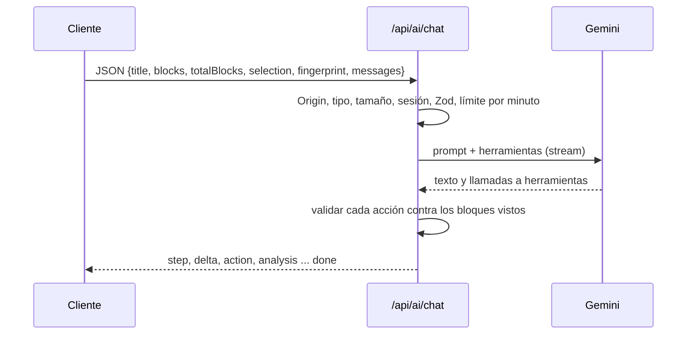

# PRD-8.1 — Chat de IA: servidor, protocolo NDJSON y herramientas

| Campo | Valor |
| :--- | :--- |
| Padre | [PRD-8 — Chat de IA del editor](PRD-8-ai-chat.md) |
| Dificultad / Esfuerzo | A (avanzada) / L (más de 3 días) |
| Dueño sugerido / Mentor | D1 / — |
| Depende de | [PRD-5.1](PRD-5.1-ai-foundation.md) (Gemini), [PRD-5.2](PRD-5.2-rate-limit.md) (límite), [PRD-5.4](PRD-5.4-ai-route-runner.md) (`runAiStreamRoute`) |
| Alimenta a | [PRD-8.2](PRD-8.2-chat-drawer-ui.md) (el cliente que lo consume), [PRD-8.4](PRD-8.4-action-cards-analysis.md) (renderiza lo que el servidor envía) |
| Código | `src/app/api/ai/chat/route.ts`, `src/features/ai/handlers.server.ts` (`handleChat`), `chat-stream.ts`, `function-calls.ts`, `stream-protocol.ts`, `stream-response.ts`, `chat-history.ts`, `prompts.ts` (`buildChatContents`, `selectVisibleBlocks`), `schemas.ts` (`chatRequestSchema`, `editActionSchema`, `articleAnalysisSchema`, `chatPlanSchema`) |
| ADRs | [0013](../adr/0013-chat-ia-protocolo-ndjson-y-function-calling.md), [0011](../adr/0011-ia-con-gemini.md), [0017](../adr/0017-politica-de-thinking-y-reintentos-gemini.md) |

## Resumen

Lo que pasa en el servidor cuando el autor escribe un mensaje en el chat del editor. Llega **el estado vivo del editor** (título, bloques numerados, selección, historial), se le presenta a Gemini junto con dos herramientas (`propose_edit` y `present_analysis`) y la respuesta vuelve como un **stream NDJSON** de eventos tipados. El servidor no confía en el modelo: valida cada propuesta contra los bloques que el modelo realmente vio y descarta las inválidas. **No toca el artículo ni la base de datos.**

## Qué necesitás entender antes

- [ ] **Streaming**: enviar una respuesta por partes mientras se genera, en vez de esperar a tenerla completa.
- [ ] **NDJSON**: un objeto JSON por línea. Es el formato del stream.
- [ ] **Function calling**: en vez de solo texto, el modelo puede "llamar a una función" (`propose_edit`) con argumentos estructurados; el servidor decide qué hacer.
- [ ] **Generadores asíncronos** (`async function*`, `for await`) y `ReadableStream`.
- [ ] **AbortSignal**: cancelar una petición en vuelo (si el navegador cierra la conexión, se cancela la llamada a Gemini).
- [ ] Zod y `discriminatedUnion` (validar según el valor de `op`).
- [ ] Glosario: [docs/README.md](../README.md#glosario) (NDJSON, bloque, snapshot).

## Alcance / fuera de alcance

| Dentro | Fuera |
| :--- | :--- |
| La ruta `POST /api/ai/chat` y su handler `handleChat` | El cliente que lee el stream (`chat-client.ts`) y el panel: [PRD-8.2](PRD-8.2-chat-drawer-ui.md) |
| El formato de petición y de eventos, y la validación de acciones | Cómo se aplica una propuesta en el editor: [PRD-8.3](PRD-8.3-editor-context-apply.md) |
| El prompt del chat y el recorte del artículo y del historial | Las tarjetas y la tarjeta de análisis: [PRD-8.4](PRD-8.4-action-cards-analysis.md) |
| Las herramientas del modelo y su traducción a eventos | Origin, JSON, tamaño máximo y sesión: [PRD-5.4](PRD-5.4-ai-route-runner.md) |

## Cómo funciona

Orden de lectura sugerido: `stream-protocol.ts` → `schemas.ts` (`chatRequestSchema`, `editActionSchema`) → `function-calls.ts` → `chat-stream.ts` → `stream-response.ts` → `prompts.ts` (`buildChatContents`) → `handlers.server.ts` (`handleChat`).

### 1. Vista de conjunto



`route.ts` es de tres líneas: `runAiStreamRoute(request, { schema: chatRequestSchema, handler: handleChat })` con `maxDuration = 30`. El límite por minuto se evalúa **antes** de crear el stream, así que un rechazo llega como JSON común con cuenta regresiva ([PRD-5.4](PRD-5.4-ai-route-runner.md)).

### 2. La petición (`chatRequestSchema`)

| Campo | Regla |
| :--- | :--- |
| `title` | Hasta 200 caracteres |
| `blocks` | Hasta 250 (`CHAT_MAX_BLOCKS`). Cada uno: `{ id: "b<N>", type, level?, markdown }`; el markdown no supera 30 000 caracteres y la suma tampoco |
| `totalBlocks` | Bloques del documento **completo** (≥ `blocks.length`); el cliente puede haber recortado |
| `selection` | `{ blockIds, text }` o `null`; el texto hasta 4000 caracteres |
| `fingerprint` | 8 caracteres hexadecimales. **El servidor solo valida el formato, no lo usa** (ver pendientes) |
| `messages` | De 1 a 20 mensajes, 8000 caracteres cada uno y 24 000 en total; **el último debe ser del usuario** |

### 3. Qué ve el modelo (`buildChatContents`)

- **Primer turno (usuario):** "Este es el artículo del autor en su estado actual", con el artículo entre `<<<CONTENIDO>>>` y `<<<FIN>>>`: título, bloques como `[b0] texto`, `[b1] texto`…, y la selección aparte.
- **Segundo turno (modelo):** una confirmación fija ("Entendido. Uso el artículo solo como material de referencia.").
- **Después:** el historial recortado (`trimChatHistory`: máx. 12 turnos y 16 000 caracteres, gana lo más reciente, debe empezar por un turno del usuario). Turnos consecutivos del mismo rol se unen.
- **Recorte del artículo por bloques completos** (`selectVisibleBlocks` → `fitBlocks`): máx. 30 000 caracteres y 250 bloques, con los de la selección primero. Si se omitió algo, el prompt lo avisa y marca los huecos con `[… N bloques omitidos …]`: el modelo sabe que no vio todo y no puede referenciar lo omitido.
- **Instrucción de sistema fija.** Le dice cuándo usar cada herramienta, que **nunca** mencione los ids `[bN]` al autor (son internos), que acompañe siempre las propuestas con una o dos frases, que proponga hasta 5 cambios por respuesta (el máximo técnico es 8), que no proponga dos cambios sobre el mismo bloque y que para "cambiar el tono de todo el artículo" use **una sola** propuesta `replace_range`.

Defensa contra inyección: el texto del artículo va como **datos**, no instrucciones, y `<<<`/`>>>` se neutralizan (`neutralizeDelimiters`) para que el texto no pueda cerrar el bloque. **No es una frontera de seguridad**: la defensa real es el diseño (el modelo solo propone y el autor confirma).

### 4. Las herramientas (`function-calls.ts`)

| Herramienta | Uso | Resultado en el stream |
| :--- | :--- | :--- |
| `propose_edit` | El autor pide escribir, agregar, reescribir, reemplazar, acortar, traducir o reestructurar | Un evento `action` por llamada, con `op` (6 valores), `markdown` y ubicación |
| `present_analysis` | El autor pide analizar, auditar o calificar | Un evento `analysis` (`score` 0-100, métricas, veredicto, fortalezas, debilidades, mejoras) |

Las seis operaciones de `propose_edit` son: `insert_after_block`, `insert_at_selection`, `append`, `replace_block`, `replace_selection` y `replace_range`. La declaración es **plana a propósito** (sin `oneOf` por operación): es menos fiable con function calling; los campos obligatorios de cada operación se explican en las descripciones y los exige `editActionSchema` después. El modo es `AUTO` y las llamadas son **terminales**: nunca se devuelve un `functionResponse` al modelo.

`modelPartsToStreamParts` convierte lo que devuelve el modelo en partes del stream: texto (ignora los trozos marcados como `thought`), acciones y análisis (validados con Zod; los inválidos se descartan y solo se anota el **nombre** de la herramienta, nunca el contenido). También sabe traducir una llamada `update_plan` a pasos de plan, **pero esa herramienta no está declarada** en `CHAT_TOOL_DECLARATIONS` ni mencionada en el prompt de producción: el modelo no puede invocarla (ver pendientes).

### 5. La validación de acciones (`runChatStream`)

Envuelve el stream del modelo:

```text
emitir paso "read" ("Leyendo el artículo") y "analyze" ("Analizando estructura") como hechos
por cada parte que llega del modelo:
  texto     -> reenviar; anotar que hay texto
  análisis  -> reenviar; anotar que hay análisis
  paso      -> (plan del modelo) reenviar
  acción    -> validar:
      más de 8 acciones            -> descartar "too_many_actions"
      id de bloque desconocido      -> "unknown_block"   (no está entre los bloques que el modelo vio)
      rango al revés o con hueco    -> "bad_range"       (hueco = bloque que el modelo nunca vio)
      selección sin selección real  -> "no_selection"
      si es válida -> emitir el paso "propose" en curso y reenviar la acción
al final: si no hubo texto, ni análisis, ni acción válida -> error invalid_response
          si hubo propuestas -> paso "propose" hecho
```

Los pasos `read` y `analyze` son **señalización de interfaz** (se emiten al principio ya como hechos), no trabajo medido.

### 6. El stream (`stream-response.ts` y `stream-protocol.ts`)

| Evento | Contenido |
| :--- | :--- |
| `delta` | Trozo de texto |
| `step` | `{ id, label, status: pending / running / done }` |
| `action` | Una edición validada |
| `analysis` | Un análisis editorial validado |
| `error` | `{ kind, message, retryAfter?, scope? }` |
| `done` | Fin correcto |

`encodeStreamEvent` escribe una línea por evento. El stream es **de tirón (pull)**: `ReadableStream` con `pull`: el origen solo avanza mientras el cliente sigue leyendo, y `cancel()` **aborta la llamada a Gemini** para no gastar cuota de una respuesta que nadie mira. Si algo falla a mitad, se envía un evento `error` y se cierra. `createNdjsonParser` (lado cliente, en el mismo archivo por ser compartido) ignora líneas inválidas o de tipo desconocido, retiene una línea partida entre dos trozos y **ignora eventos nuevos**, para que un servidor más nuevo pueda agregar eventos sin romper clientes viejos.

### 7. Tiempos y modelo

Temperatura 0,7 y hasta 8192 tokens de salida; un corte por `MAX_TOKENS` no es error. Plazos: 15 s hasta el primer dato (`CHAT_FIRST_CHUNK_TIMEOUT_MS`, cancela la petición) y 45 s en total (`CHAT_TIMEOUT_MS`). La ruta declara `maxDuration = 30` (ver pendientes). Detalles del cliente: [PRD-5.1](PRD-5.1-ai-foundation.md).

## Decisiones y por qué

| Decisión | Alternativas descartadas | Consecuencia |
| :--- | :--- | :--- |
| **Enviar el estado vivo del editor, no un id de post** ([ADR 0013](../adr/0013-chat-ia-protocolo-ndjson-y-function-calling.md)) | Leer el post de la base | Funciona sobre borradores sin guardar (el autoguardado va con retraso de 2 s †). Cuesta ancho de banda (hasta 200 KB por mensaje) |
| **Bloques numerados `bN`** † | Offsets de caracteres, números de línea, citas de texto | Un id corto es más fiable para un modelo pequeño y el servidor puede comprobar que existe. Vale solo para esa petición |
| **Llamadas terminales, sin ciclo de `functionResponse`** (comentario en `gemini.ts`) | Un ciclo agente | Una respuesta = una pasada. Más simple y predecible; el modelo no puede corregirse tras "ver" el resultado |
| **NDJSON sobre `fetch`** † | Server-Sent Events, WebSockets (no hay registro de que se evaluaran) | Sin dependencias; solo el cliente propio lo consume |
| **Stream de tirón con cancelación hacia arriba** (comentario en `stream-response.ts`) | Empujar sin control | "Detener" realmente deja de consumir cuota |
| **Validar cada acción contra los bloques que el modelo vio** | Confiar en el modelo | Una acción con un id inventado nunca llega al cliente |
| **Límite antes de abrir el stream** (comentario en `stream-response.ts`) | Dentro del stream | Un rechazo puede responderse como JSON con cuenta regresiva |
| **Sin persistir la conversación** † (el código lo declara: "se pierde al recargar por diseño") | Guardar en una tabla | Sin tabla, sin políticas RLS ni decisión de retención de contenido enviado a un tercero |

## Criterios de aceptación

- [ ] Sin sesión la ruta responde 401; con `Origin` distinto, 403; con más de 200 KB, 413.
- [ ] Un mensaje válido responde `application/x-ndjson` con eventos tipados y termina con `done`.
- [ ] Una acción con un `blockId` inexistente **no** llega al cliente.
- [ ] Nunca se emiten más de 8 acciones por respuesta.
- [ ] Una respuesta sin texto, análisis ni acción válida termina en `invalid_response`.
- [ ] Si el cliente cierra la conexión, se aborta la llamada a Gemini.
- [ ] Una petición rechazada por el límite responde JSON con `retryAfter` (no un stream).
- [ ] Los logs solo tienen metadatos: nunca el artículo ni el texto propuesto.

## Cómo verificarla a mano

1. `pnpm test`: `chat-stream.test.ts`, `function-calls.test.ts`, `stream-protocol.test.ts`, `stream-response.test.ts`, `chat-history.test.ts`, `first-chunk-deadline.test.ts`, `prompts.test.ts`, `schemas.test.ts`.
2. Sin necesidad de Gemini, mirá el e2e `e2e/editor-ai-drawer.spec.ts`: simula `/api/ai/chat` con `page.route`. Ojo: hoy su `beforeEach` no pasa (ver [PRD-X.1](PRD-X.1-testing-e2e.md)).
3. Con clave real: `pnpm dev`, abrí `/editor/new`, escribí unos párrafos y `Cmd/Ctrl+I`. Pedí "agregá una conclusión": debe llegar una tarjeta de propuesta.
4. Desde la consola del navegador (misma sesión), `fetch('/api/ai/chat', {method:'POST', headers:{'content-type':'application/json'}, body:'{}'})` responde 400 con un mensaje de validación de Zod (los campos obligatorios faltan).
5. `pnpm ai:smoke` prueba una llamada de function calling, pero con **su propia** lista de herramientas y prompt.

## Trabajo pendiente asignable

| Tarea | Dificultad |
| :--- | :--- |
| **`update_plan` sin declarar.** El código sabe traducir el plan a pasos (`function-calls.ts`, `chat-state.ts`), pero no está en `CHAT_TOOL_DECLARATIONS` ni en el prompt: el avance de pasos es código latente. Decidir: declararla (actualizando el prompt) o borrar el código muerto | A |
| **`fingerprint` sin uso en el servidor.** El cliente lo calcula y el servidor solo valida el formato. Quitarlo del contrato o usarlo para descartar respuestas de un documento viejo | M |
| **`maxDuration = 30` frente a `CHAT_TIMEOUT_MS = 45 s`.** El techo de la ruta es menor que el plazo total: en plataformas que respetan `maxDuration`, el plazo real es 30 s. Alinearlos | M |
| Artículos muy largos: el modelo solo ve una parte (30 000 caracteres o 250 bloques) y el autor **no recibe aviso**. Emitir un evento o un paso que lo informe | M |
| `pnpm ai:smoke` usa otra lista de herramientas y otro prompt que producción; hacer que importe los de producción | M |
| El prompt pide 5 propuestas por turno y el servidor admite 8: valorar si conviene un solo número | B |
| No hay prueba automática contra el modelo real; definir un caso de humo del chat con el prompt de producción | A |

## Preguntas de autoevaluación

1. ¿Por qué el chat manda bloques con ids `bN` y no un id de post o posiciones de caracteres?
2. ¿Por qué las llamadas a herramientas son terminales (sin `functionResponse`)? ¿Qué se pierde?
3. ¿Qué descarta `runChatStream` y por qué el servidor no puede simplemente confiar en el modelo?
4. ¿Qué significa que el stream sea "de tirón" y qué pasa si el usuario pulsa "Detener"?
5. ¿Por qué el límite por minuto se evalúa antes de abrir el stream?
6. ¿Qué pasa con `update_plan` hoy y qué harías con ese código?
