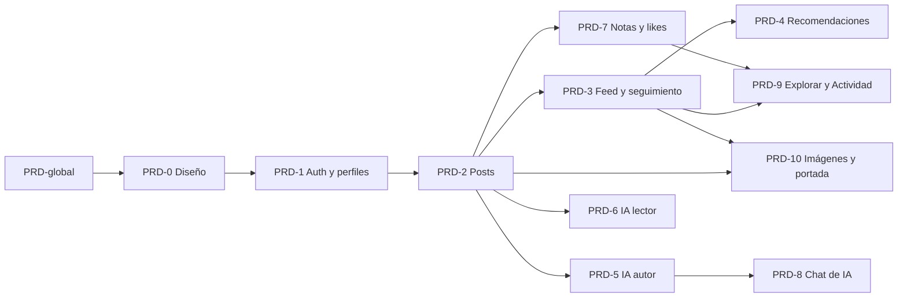

# PRDs por feature

Cada PRD describe **una feature**: qué problema resuelve, cómo funciona hoy, **por qué se decidió así** (con las alternativas descartadas) y qué le falta. Están escritos para que alguien nuevo entienda el proyecto sin haber estado en su construcción.

El producto completo, su filosofía KISS y la lista de qué se cortó y qué se reincorporó están en [`../PRD-global-vision.md`](../PRD-global-vision.md). Léelo primero.

## Índice

| PRD | Título | Qué cubre | Estado |
| :--- | :--- | :--- | :--- |
| [PRD-0](PRD-0-design-system.md) | Sistema de diseño y fundación | Convenciones de carpetas, primitivas de UI, tema oscuro, shell | Implementado (tema solo oscuro) |
| [PRD-1](PRD-1-auth.md) | Autenticación, perfiles y modelo base | Registro, onboarding de perfil, login por **email o username**, perfil, `/settings`, rutas privadas, RLS de `profiles` | Implementado |
| [PRD-2](PRD-2-posts.md) | Posts: artículos, editor y publicación | Editor markdown, autoguardado, tags, ciclo de estados, vista pública | Implementado (publica vía moderación de PRD-5) |
| [PRD-3](PRD-3-feed-follows.md) | Feed, seguimiento e historial de lectura | Feed en `/`, seguir autores, `reading_history`, perfil público de autor | Implementado con limitaciones |
| [PRD-4](PRD-4-recommendations.md) | Motor de recomendaciones | "Recomendados para ti" por scoring determinista de tags | Implementado |
| [PRD-5](PRD-5-ai-author.md) | IA para el autor | Moderación y auto-tagging al publicar; las herramientas de asistencia pasaron al chat | Reemplazado parcialmente (moderación vigente; asistencia pasó a PRD-8) |
| [PRD-6](PRD-6-ai-reader.md) | IA para el lector | Resumen bajo demanda de artículos largos, guardado en el post | Implementado |
| [PRD-7](PRD-7-notes-likes.md) | Notas, artículos y me gusta | Notas cortas, respuestas, likes, feed diferenciado | Implementado |
| [PRD-8](PRD-8-ai-chat.md) | Chat de IA del editor | Panel lateral que conversa, analiza y propone ediciones aplicables | Implementado |
| [PRD-9](PRD-9-explore-activity.md) | Explorar, Actividad y opciones de post | `/explore` con tags, `/activity`, menú de opciones de un post | Parcial (hay placeholders) |
| [PRD-10](PRD-10-post-images-cover.md) | Imágenes de artículos y portada en el feed | Subida de imágenes a Storage desde el editor, render seguro y portada (imagen o texto sobre color) en las tarjetas del feed | Implementado con limitaciones |

## Nombres de archivo y paquetes de trabajo

Cada PRD **padre** se parte en **paquetes de trabajo** (sub-PRDs) pequeños, para que una persona pueda ser dueña de uno, entenderlo entero y presentarlo. El reparto entre las 12 personas del equipo está en [`../team/reparto-de-tareas.md`](../team/reparto-de-tareas.md).

| Tipo | Patrón | Ejemplo | Qué es |
| :--- | :--- | :--- | :--- |
| Padre | `PRD-N-slug.md` | `PRD-1-auth.md` | La feature completa: problema, decisiones, criterios y límites |
| Paquete | `PRD-N.M-slug.md` | `PRD-1.1-auth-forms.md` | Una pieza del padre con un dueño: qué entender, cómo se lee el código, cómo se prueba a mano, qué queda pendiente |
| Transversal | `PRD-X.M-slug.md` | `PRD-X.1-testing-e2e.md` | Trabajo que atraviesa varias features (tests y herramientas) |

El slug es corto y describe el contenido, en inglés y en minúsculas, igual que los nombres de código.

| PRD padre | Paquetes de trabajo |
| :--- | :--- |
| [PRD-0](PRD-0-design-system.md) Sistema de diseño | [0.1 tema](PRD-0.1-theme-tokens.md) · [0.2 primitivas de UI](PRD-0.2-ui-primitives.md) · [0.3 shell](PRD-0.3-app-shell.md) |
| [PRD-1](PRD-1-auth.md) Autenticación | [1.1 formularios](PRD-1.1-auth-forms.md) · [1.2 seguridad](PRD-1.2-auth-security.md) · [1.3 perfil y ajustes](PRD-1.3-profile-settings.md) |
| [PRD-2](PRD-2-posts.md) Posts | [2.1 datos y RLS](PRD-2.1-posts-data-rls.md) · [2.2 editor Tiptap](PRD-2.2-editor-tiptap.md) · [2.3 autoguardado](PRD-2.3-autosave-drafts.md) · [2.4 publicar y tags](PRD-2.4-publish-dialog-tags.md) · [2.5 Mis posts](PRD-2.5-my-posts-page.md) · [2.6 detalle de post](PRD-2.6-post-detail.md) |
| [PRD-3](PRD-3-feed-follows.md) Feed y seguimiento | [3.1 seguimiento](PRD-3.1-follow-system.md) · [3.2 lista del feed](PRD-3.2-feed-list.md) · [3.3 perfil de autor](PRD-3.3-author-profile.md) |
| [PRD-4](PRD-4-recommendations.md) Recomendaciones | [4.1 scoring](PRD-4.1-scoring-core.md) · [4.2 consulta y UI](PRD-4.2-recs-query-ui.md) |
| [PRD-5](PRD-5-ai-author.md) IA para el autor | [5.1 fundación](PRD-5.1-ai-foundation.md) · [5.2 límite de peticiones](PRD-5.2-rate-limit.md) · [5.3 moderación](PRD-5.3-publish-moderation.md) · [5.4 route runner y caché](PRD-5.4-ai-route-runner.md) |
| [PRD-6](PRD-6-ai-reader.md) IA para el lector | [6.1 servidor](PRD-6.1-summary-backend.md) · [6.2 interfaz](PRD-6.2-summary-ui.md) |
| [PRD-7](PRD-7-notes-likes.md) Notas y me gusta | [7.1 tipos en la base](PRD-7.1-post-types-db.md) · [7.2 notas, UI](PRD-7.2-notes-ui.md) · [7.3 me gusta](PRD-7.3-likes.md) |
| [PRD-8](PRD-8-ai-chat.md) Chat de IA | [8.1 servidor](PRD-8.1-chat-server.md) · [8.2 cajón](PRD-8.2-chat-drawer-ui.md) · [8.3 contexto y aplicar](PRD-8.3-editor-context-apply.md) · [8.4 tarjetas y análisis](PRD-8.4-action-cards-analysis.md) |
| [PRD-9](PRD-9-explore-activity.md) Explorar y Actividad | [9.1 Explorar](PRD-9.1-explore-page.md) · [9.2 Actividad y navegación](PRD-9.2-activity-nav.md) · [9.3 opciones del post](PRD-9.3-post-options-drawer.md) |
| [PRD-10](PRD-10-post-images-cover.md) Imágenes y portada | [10.1 imágenes](PRD-10.1-post-images.md) · [10.2 portada](PRD-10.2-post-cover.md) (ya implementados por D1) |
| [PRD-global](../PRD-global-vision.md) (transversales) | [X.1 tests](PRD-X.1-testing-e2e.md) · [X.2 herramientas](PRD-X.2-dev-tooling.md) |

Un paquete sigue la misma cabecera que un PRD padre y estas secciones: Resumen, Qué necesitás entender antes, Alcance / fuera de alcance, Cómo funciona (en el orden en que conviene leer el código), Decisiones y por qué, Criterios de aceptación, Cómo verificarla a mano, Trabajo pendiente asignable y Preguntas de autoevaluación. Sus campos propios de cabecera son **Dificultad** (A avanzada, M media, B básica), **Esfuerzo** (S, M, L), **Dueño sugerido** y **Mentor**.

## Orden de lectura y dependencias

Si vas a tocar una zona, lee su PRD y luego los ADRs que enlaza en la cabecera.

| Si vas a tocar… | Lee |
| :--- | :--- |
| Login, registro, ajustes | PRD-1 |
| El editor o la publicación | PRD-2, luego PRD-5 y PRD-8 |
| Imágenes del artículo o la portada del feed | PRD-10 (y [ADR 0022](../adr/0022-imagenes-en-supabase-storage.md), [ADR 0023](../adr/0023-portada-de-articulos.md)) |
| El feed, seguir, el perfil | PRD-3, PRD-7, PRD-9 |
| Cualquier función de IA | PRD-5, PRD-6, PRD-8 y [ADR 0011](../adr/0011-ia-con-gemini.md) |
| La base de datos | El PRD de la feature y [`../db/schema.md`](../db/schema.md) |

## Cómo está escrito un PRD

Todos los PRDs padre siguen el mismo orden de secciones (los paquetes usan el suyo, descrito arriba):

| Sección | Para qué |
| :--- | :--- |
| Cabecera (tabla) | Estado, dependencias, migraciones, ADRs y dónde está el código |
| Resumen | Qué es y por qué existe, en 5 líneas |
| Problema y objetivo | Qué se quiere lograr |
| Alcance / fuera de alcance | Qué entra y qué se dejó afuera a propósito |
| Cómo funciona | Flujos, datos, pseudo-código y diagramas del comportamiento **actual** |
| Decisiones y por qué | Cada decisión con sus alternativas descartadas y sus consecuencias |
| Criterios de aceptación | Casillas que reflejan el comportamiento real |
| Limitaciones conocidas y deuda | Lo que no funciona, es un placeholder o quedó pendiente |
| Pruebas | Qué cubre cada test y qué no está cubierto |

### Convención de la cabecera

| Campo | Valores |
| :--- | :--- |
| **Estado** | `Implementado`, `Implementado con limitaciones`, `Parcial` o `Reemplazado parcialmente`. Se describe **el código**, no el estado de un entorno |
| **Depende de** | Otros PRDs necesarios para entenderlo |
| **Migraciones** | Archivos de `supabase/migrations/` que crea o modifica. Son dependencias, no una lista de "aplicar X" |
| **ADRs relacionados** | Decisiones de arquitectura enlazadas por nombre de archivo |
| **Código** | Carpetas y archivos principales |

### Convención de procedencia

Los motivos de una decisión no siempre quedaron escritos cuando se tomó. Para que nadie confunda una reconstrucción con historia:

| Marca | Significa |
| :--- | :--- |
| Sin marca | El motivo consta en el código (comentario, constante, nombre), en un ADR o en una restricción de la base, y se puede comprobar |
| `†` o "deducido" | Razonamiento **reconstruido** a partir del código y del contexto. Es plausible, pero no es una discusión registrada |
| "Motivo no registrado" | Se sabe qué se decidió, pero no por qué. No se inventa una razón |

Se aplica igual en las tablas "Decisiones y por qué" de todos los PRDs y en las "Alternativas consideradas" de los [ADRs](../adr/README.md#convenciones). Si al traspasar el proyecto alguien recuerda el motivo real, debe reemplazar la marca por la razón y citar la fuente.

## Reglas para mantenerlos

* **El PRD describe lo que hay, no lo que se planeó.** Si el código cambia, se actualiza el PRD en el mismo cambio.
* Una decisión de arquitectura nueva va a un ADR ([`../adr/`](../adr/README.md)); el PRD lo enlaza. Un ADR aceptado no se reescribe: se reemplaza con uno nuevo.
* Si algo quedó a medias, se anota en "Limitaciones conocidas y deuda" **en el PRD de esa feature**. No se dejan notas de estado sueltas en este índice.
* El idioma de los PRDs es español; los identificadores de código, en inglés.
* No se escribe estado de entorno ("aplicar la migración X") como estado del PRD.

## Cambios de rumbo respecto a los PRDs originales

Los PRDs 0 a 4 se escribieron **antes** de construir. Estas son las diferencias importantes entre lo que decían y lo que existe, con el PRD donde está explicada cada una. Sirve para entender por qué algo no coincide con un documento viejo o con una conversación previa. Las versiones originales de los PRDs no están versionadas en este repositorio, así que esta tabla es una referencia y no una cita verificable.

| Lo que decía el diseño original | Lo que hay hoy | Dónde |
| :--- | :--- | :--- |
| El feed vive en `/feed` | Vive en `/`; `/feed` devuelve 404 | [PRD-3](PRD-3-feed-follows.md) |
| Registro con email, contraseña y nombre | El registro pide email y una contraseña fuerte (con confirmación); el nombre y un **username** único se piden después en `/onboarding`. Se inicia sesión con email o username | [PRD-1](PRD-1-auth.md) |
| Los tags se ven en tarjetas, post y perfil, y filtran el feed con chips | No se muestran en tarjetas ni en el post; se guardan, alimentan las recomendaciones, se filtran por URL y hay chips solo en `/explore` | [PRD-2](PRD-2-posts.md), [PRD-3](PRD-3-feed-follows.md), [PRD-9](PRD-9-explore-activity.md) |
| "Nuevo post" crea la fila y abre el editor | La fila se crea en el **primer autoguardado con contenido** | [PRD-2](PRD-2-posts.md) |
| Publicar pasa el post a `pending_review` y queda pendiente de IA | Publicar **reserva**, **modera con Gemini** y termina en `published` o `rejected` (o no publica si hay límite de peticiones) | [PRD-2](PRD-2-posts.md), [PRD-5](PRD-5-ai-author.md) |
| Las funciones de IA son botones y diálogos separados | Son un **chat** lateral que propone ediciones aplicables | [PRD-8](PRD-8-ai-chat.md) |
| No hay rate limiting | Hay un límite por minuto en Postgres con dos carriles | [PRD-global](../PRD-global-vision.md#10-rate-limiting-de-ia) |
| La IA es OpenAI o Anthropic | Es Gemini | [PRD-global](../PRD-global-vision.md#4-stack-tecnológico) |
| Las notas no se editan | Las notas **sí** se editan (y borran) | [PRD-7](PRD-7-notes-likes.md) |
| Nuevo artículo crea la fila y aviso "solo desde computadora" | La fila es perezosa; el aviso es de interfaz (`DesktopOnly`), no de seguridad | [PRD-7](PRD-7-notes-likes.md) |
| La creación es un "Nuevo artículo" y un campo rápido de nota | Un menú **Crear** (Nota / Artículo); la nota se escribe en un diálogo | [PRD-7](PRD-7-notes-likes.md) |
| Recomendaciones con fallback explícito a posts recientes | El fallback ocurre de forma implícita (score 0 → desempate por recencia) | [PRD-4](PRD-4-recommendations.md) |
| Tema claro/oscuro | Solo oscuro, con azul de marca | [PRD-0](PRD-0-design-system.md) |
| El caché de IA se invalida comparando `updated_at` | Lo invalida un trigger de base de datos | [PRD-global](../PRD-global-vision.md#14-caché-de-resultados-de-ia) |

## Glosario

| Término | Significado |
| :--- | :--- |
| **Post** | Cualquier publicación: una nota o un artículo (`posts.type`) |
| **Nota** | Post corto (≤ 500 caracteres), sin título ni tags, publicado al instante |
| **Artículo** | Post largo en markdown, con título y tags, que pasa por moderación |
| **Respuesta** | Nota con `parent_post_id`: dejada sobre otro post (un solo nivel) |
| **Feed** | La portada `/`: posts publicados, del más reciente al más antiguo |
| **Reserva (claim)** | Pasar un artículo a `pending_review` con compare-and-set antes de moderarlo |
| **Carril (lane)** | Cada contador global del límite de IA: asistencia o moderación |
| **Chat de IA** | Panel lateral del editor (Cmd/Ctrl+I) que conversa y propone ediciones |
