# Reparto de tareas del equipo (12 personas)

El proyecto está construido y documentado. Este documento lo **reparte en 37 paquetes de trabajo** para que cada integrante sea dueño de una parte concreta: que la entienda, la pueda explicar, la verifique a mano y la mejore. El reparto es **desigual a propósito**: la carga sigue el nivel de cada persona y el riesgo de cada pieza, no un número igual de tareas.

## 1. Cómo usar este documento

1. Buscá tu rol (D1 a D12) en la [sección 2](#2-equipo-y-niveles) y tu sección personal en la [6](#6-una-sección-por-persona).
2. Abrí tus paquetes (`PRD-N.M`): cada uno dice qué entender antes, cómo funciona el código, cómo probarlo a mano y qué queda pendiente.
3. Seguí la lista de lectura de tu sección **en ese orden**.
4. Cuando termines, aplicá la [definición de terminado](#8-acuerdos-de-trabajo) y preparate para la [presentación](#9-cómo-presentar-tu-paquete).

> Un paquete `PRD-N.M` es una parte del PRD padre `PRD-N`. Por ejemplo, [PRD-1](../prds/PRD-1-auth.md) (autenticación) se parte en `1.1`, `1.2` y `1.3`. El índice completo está en [`docs/prds/README.md`](../prds/README.md).

## 2. Equipo y niveles

Los roles son marcadores: **completá la columna "Nombre"** con las personas reales. Los niveles son los declarados por el equipo y se revisan al final de la primera semana ([riesgo R2](#10-riesgos-y-mitigaciones)).

| Rol | Nombre | Qué se espera | Carga (puntos / % del total) |
| :--- | :--- | :--- | :--- |
| **D1** | _[Dylan]_ | Los paquetes más difíciles y de más riesgo (seguridad, base de datos, IA del servidor). Revisa lo crítico y mentorea | 22 / 31 % |
| **D2** | _[Alberto]_ | Editor, motor de aplicar ediciones, interfaz del chat y tipos de post. Segundo revisor de lo crítico | 16 / 23 % |
| **D3** | _[completar]_ | Paquetes de dificultad media con acompañamiento; acompaña a seis paquetes de básicos, con D2 y D1 como respaldo | 7 / 10 % |
| **D4** a **D12** | _[completar]_ | Paquetes chicos, visibles y acotados, siempre con un mentor (D1, D2 o D3) o con apoyo entre pares (D6) | 2 a 4 puntos cada uno (3 % a 6 %) |

## 3. Principios del reparto desigual

| Principio | Qué significa en la práctica | Por qué |
| :--- | :--- | :--- |
| **El riesgo decide la dificultad** | Lo que, si se rompe, expone datos o deja saltar la moderación (RLS, autenticación, límite de peticiones, publicación, protocolo del chat) es de D1 o D2 | Un error ahí no se ve en la pantalla y es caro. Un error en un botón sí se ve y es barato |
| **D1 carga más; D2, algo menos pero comparable** | D1 tiene 22 puntos y D2 16, ambos con paquetes avanzados. La diferencia la compensa D1 con la mentoría y la revisión de lo crítico | Es lo que se pidió: un perfil avanzado que comparta el trabajo difícil sin que todo recaiga en una sola persona |
| **D3 no toma paquetes avanzados** | Solo dificultad media, con mentor (D1 o D2) en los cuatro | Se declaró intermedio: conviene comprobarlo con trabajo real antes de darle piezas de seguridad |
| **Los básicos empiezan por lo visible** | Interfaz, formularios y páginas simples | Se aprende más rápido viendo el resultado en el navegador, y un fallo no compromete al resto |
| **Poco no es nada** | Todos tienen al menos 2 paquetes, tareas pendientes reales y una presentación | Cada paquete básico igual enseña un concepto real del proyecto (Server Actions, Zod, RLS a nivel conceptual, rutas, estado) |
| **Nadie trabaja solo** | Cada paquete no avanzado tiene un mentor (D1, D2 o D3) o, en cuatro paquetes básicos, apoyo entre pares de D6 | El mentor responde dudas, revisa y se asegura de que el dueño entienda lo que presenta. El apoyo entre pares no es una mentoría formal: si la duda supera a D6, se escala a D2 o D1 |
| **La mentoría se concentra en quien más sabe** | D1 y D2 acompañan 15 de los 25 paquetes con mentor o apoyo entre pares; D3 acompaña solo 6 | D3 es un nivel declarado y aún sin contrastar: se le da una carga de mentoría acotada hasta comprobarlo |

## 4. Balance de carga

Los puntos son una estimación del esfuerzo de **entender, verificar, presentar y cerrar las tareas pendientes** de un paquete, no de escribirlo desde cero (ya existe): **S = 1** (hasta un día), **M = 2** (dos a tres días) y **L = 4** (más de tres días). Total: **71 puntos**.

| Rol | Paquetes | Nº | Puntos | % de 71 | Dificultad (A / M / B) |
| :--- | :--- | :--- | :--- | :--- | :--- |
| D1 | 1.2, 2.1, 5.1, 5.2, 5.3, 8.1 | 6 | 22 | 28,6 % | 6 / 0 / 0 |
| D2 | 2.2, 4.1, 5.4, 7.1, 8.2, 8.3, 10.1 | 7 | 20 | 26,0 % | 5 / 2 / 0 |
| D3 | 2.3, 2.4, 3.1, 6.1 | 4 | 7 | 9,1 % | 0 / 4 / 0 |
| D4 | 0.1, 4.2, X.2 | 3 | 3 | 3,9 % | 0 / 0 / 3 |
| D5 | 0.2, 6.2 | 2 | 3 | 3,9 % | 0 / 0 / 2 |
| D6 | 0.3, 7.2 | 2 | 4 | 5,2 % | 0 / 2 / 0 |
| D7 | 1.1, 7.3 | 2 | 3 | 3,9 % | 0 / 0 / 2 |
| D8 | 1.3, 8.4 | 2 | 3 | 3,9 % | 0 / 1 / 1 |
| D9 | 2.5, 9.1, 10.2 | 3 | 4 | 5,2 % | 0 / 1 / 2 |
| D10 | 2.6, 9.2 | 2 | 2 | 2,6 % | 0 / 0 / 2 |
| D11 | 3.2, 9.3 | 2 | 3 | 3,9 % | 0 / 1 / 1 |
| D12 | 3.3, X.1 | 2 | 3 | 3,9 % | 0 / 1 / 1 |
| **Total** | | **37** | **77** | **100 %** | **11 / 12 / 14** |

Comprobación de la aritmética: 22 + 20 + 7 + 3 + 3 + 4 + 3 + 3 + 4 + 2 + 3 + 3 = 77; 6 + 7 + 4 + 3 + 2 + 2 + 2 + 2 + 3 + 2 + 2 + 2 = 37 paquetes; la suma de porcentajes es 100 %.

> **PRD-10 (imágenes y portada).** Ambos paquetes ya están implementados por D1 en producción ([PRD-10](../prds/PRD-10-post-images-cover.md)): no hay construcción pendiente, pero sí quedan por estudiar, presentar y revisar como el resto del catálogo. Para no ampliar la carga de D1, se reparten entre D2 (10.1, avanzado, ya lleva otros paquetes de Storage/RLS-adyacentes como 7.1) y D9 (10.2, medio, mentor D3 por su cercanía con 2.4 el diálogo de publicar). D1 sigue siendo revisor obligatorio de 10.1 por tocar `supabase/migrations/`.

> **Mentoría (no cuenta en los puntos).** Según el catálogo, D2 acompaña 9 paquetes (0.1, 0.2, 0.3, 2.3, 2.5, 2.6, 4.2, 8.4 y X.1, de D3, D4, D5, D6, D8, D9, D10 y D12), D1 acompaña 6 (2.4, 3.1, 5.4, 6.1, 7.1 y X.2, de D2, D3 y D4) y D3 acompaña 7 (1.1, 1.3, 3.2, 3.3, 6.2, 7.2 y 10.2, de D5, D6, D7, D8, D9, D11 y D12). Son 22 paquetes con mentor formal. Además, D6 da **apoyo entre pares** (no es mentoría formal) en 4 paquetes básicos: 7.3, 9.1, 9.2 y 9.3, de D7, D9, D10 y D11. Los 11 paquetes avanzados o de D2 sin mentor (1.2, 2.1, 2.2, 4.1, 5.1, 5.2, 5.3, 8.1, 8.2, 8.3 y 10.1) completan los 37: 22 + 4 + 11 = 37. Es carga real de tiempo: por eso la diferencia entre D1 y D2 no debe ampliarse y D3 necesita el chequeo del [riesgo R2](#10-riesgos-y-mitigaciones). D1 y D2 siguen siendo la vía de escalada de todos.

## 5. Catálogo de paquetes

La columna **Ola** indica en qué momento conviene estudiar y presentar cada paquete ([sección 7](#7-orden-de-trabajo-por-olas)).

| ID | Paquete | Dif. | Esfuerzo | Dueño | Mentor | Ola |
| :--- | :--- | :--- | :--- | :--- | :--- | :--- |
| 0.1 | [Tema y tokens de diseño](../prds/PRD-0.1-theme-tokens.md) | B | S | D4 | D2 | 1 |
| 0.2 | [Primitivas de UI](../prds/PRD-0.2-ui-primitives.md) | B | M | D5 | D2 | 1 |
| 0.3 | [Shell de la aplicación](../prds/PRD-0.3-app-shell.md) | M | M | D6 | D2 | 1 |
| 1.1 | [Formularios de registro y login](../prds/PRD-1.1-auth-forms.md) | B | M | D7 | D3 | 2 |
| 1.2 | [Seguridad de la autenticación](../prds/PRD-1.2-auth-security.md) | A | L | D1 | — | 1 |
| 1.3 | [Perfil y ajustes](../prds/PRD-1.3-profile-settings.md) | B | S | D8 | D3 | 2 |
| 2.1 | [Datos de posts y RLS](../prds/PRD-2.1-posts-data-rls.md) | A | L | D1 | — | 1 |
| 2.2 | [Editor Tiptap](../prds/PRD-2.2-editor-tiptap.md) | A | L | D2 | — | 2 |
| 2.3 | [Autoguardado y borradores](../prds/PRD-2.3-autosave-drafts.md) | M | M | D3 | D2 | 2 |
| 2.4 | [Diálogo de publicar y tags](../prds/PRD-2.4-publish-dialog-tags.md) | M | M | D3 | D1 | 3 |
| 2.5 | [Página "Mis posts"](../prds/PRD-2.5-my-posts-page.md) | B | S | D9 | D2 | 2 |
| 2.6 | [Detalle de post](../prds/PRD-2.6-post-detail.md) | B | S | D10 | D2 | 2 |
| 3.1 | [Sistema de seguimiento](../prds/PRD-3.1-follow-system.md) | M | M | D3 | D1 | 2 |
| 3.2 | [Lista del feed](../prds/PRD-3.2-feed-list.md) | M | M | D11 | D3 | 2 |
| 3.3 | [Perfil público de autor](../prds/PRD-3.3-author-profile.md) | B | S | D12 | D3 | 3 |
| 4.1 | [Núcleo del scoring de recomendaciones](../prds/PRD-4.1-scoring-core.md) | M | M | D2 | — | 2 |
| 4.2 | [Consulta y UI de recomendaciones](../prds/PRD-4.2-recs-query-ui.md) | B | S | D4 | D2 | 3 |
| 5.1 | [Fundación de IA (Gemini)](../prds/PRD-5.1-ai-foundation.md) | A | L | D1 | — | 1 |
| 5.2 | [Límite de peticiones](../prds/PRD-5.2-rate-limit.md) | A | M | D1 | — | 2 |
| 5.3 | [Moderación al publicar](../prds/PRD-5.3-publish-moderation.md) | A | L | D1 | — | 3 |
| 5.4 | [Route runner y caché de IA](../prds/PRD-5.4-ai-route-runner.md) | A | M | D2 | D1 | 3 |
| 6.1 | [Resumen para lectores: servidor](../prds/PRD-6.1-summary-backend.md) | M | S | D3 | D1 | 4 |
| 6.2 | [Resumen para lectores: interfaz](../prds/PRD-6.2-summary-ui.md) | B | S | D5 | D3 | 4 |
| 7.1 | [Tipos de post en la base](../prds/PRD-7.1-post-types-db.md) | A | M | D2 | D1 | 1 |
| 7.2 | [Notas: interfaz](../prds/PRD-7.2-notes-ui.md) | M | M | D6 | D3 | 3 |
| 7.3 | [Me gusta](../prds/PRD-7.3-likes.md) | B | S | D7 | D6 (pares) | 2 |
| 8.1 | [Chat de IA: servidor](../prds/PRD-8.1-chat-server.md) | A | L | D1 | — | 4 |
| 8.2 | [Chat de IA: interfaz del cajón](../prds/PRD-8.2-chat-drawer-ui.md) | M | M | D2 | — | 4 |
| 8.3 | [Contexto del editor y aplicar ediciones](../prds/PRD-8.3-editor-context-apply.md) | A | L | D2 | — | 4 |
| 8.4 | [Tarjetas de acción y análisis](../prds/PRD-8.4-action-cards-analysis.md) | M | M | D8 | D2 | 4 |
| 9.1 | [Página Explorar](../prds/PRD-9.1-explore-page.md) | B | S | D9 | D6 (pares) | 3 |
| 9.2 | [Actividad y navegación](../prds/PRD-9.2-activity-nav.md) | B | S | D10 | D6 (pares) | 2 |
| 9.3 | [Menú de opciones del post](../prds/PRD-9.3-post-options-drawer.md) | B | S | D11 | D6 (pares) | 3 |
| 10.1 | [Imágenes en el editor](../prds/PRD-10.1-post-images.md) | A | L | D2 | — | 2 |
| 10.2 | [Portada del feed](../prds/PRD-10.2-post-cover.md) | M | M | D9 | D3 | 3 |
| X.1 | [Tests e2e y unitarios](../prds/PRD-X.1-testing-e2e.md) | M | M | D12 | D2 | 4 |
| X.2 | [Herramientas de desarrollo](../prds/PRD-X.2-dev-tooling.md) | B | S | D4 | D1 | 1 |

**(pares)** = apoyo entre pares de D6, no mentoría formal. La vía de escalada de esos cuatro paquetes es D2 y luego D1, y D2 revisa sus cambios ([sección 8](#8-acuerdos-de-trabajo)).

## 6. Una sección por persona

Todos empiezan igual: [`docs/README.md`](../README.md) (mapa y [glosario](../README.md#glosario)) y [`PRD-global-vision.md`](../PRD-global-vision.md). Después, cada uno sigue su lista.

### D1 — (22 puntos)

| | |
| :--- | :--- |
| **Paquetes** | [1.2](../prds/PRD-1.2-auth-security.md) seguridad de autenticación · [2.1](../prds/PRD-2.1-posts-data-rls.md) datos de posts y RLS · [5.1](../prds/PRD-5.1-ai-foundation.md) fundación de IA · [5.2](../prds/PRD-5.2-rate-limit.md) límite de peticiones · [5.3](../prds/PRD-5.3-publish-moderation.md) moderación al publicar · [8.1](../prds/PRD-8.1-chat-server.md) chat, servidor |
| **Leer, en orden** | [PRD-1](../prds/PRD-1-auth.md), [ADR 0003](../adr/0003-seguridad-rls-y-proxy-minimo.md), [ADR 0007](../adr/0007-login-por-username-con-secret-key.md) → [PRD-2](../prds/PRD-2-posts.md), [`db/schema.md`](../db/schema.md), [ADR 0012](../adr/0012-integridad-de-escritura-de-posts.md) → [PRD-5](../prds/PRD-5-ai-author.md), [ADR 0011](../adr/0011-ia-con-gemini.md), [ADR 0017](../adr/0017-politica-de-thinking-y-reintentos-gemini.md) → [PRD-8](../prds/PRD-8-ai-chat.md), [ADR 0013](../adr/0013-chat-ia-protocolo-ndjson-y-function-calling.md), [`ai/overview.md`](../ai/overview.md) |
| **Mentorea** | D3 (2.4, 3.1, 6.1), D2 (5.4, 7.1) y D4 (X.2) |
| **Revisa obligatoriamente** | Todo cambio que toque migraciones, RLS, `proxy.ts`, el cliente admin (secret key) o la publicación |
| **Entrega** | Los seis paquetes explicados, más el mapa de seguridad del proyecto (qué protege cada capa) |

### D2 — (20 puntos)

| | |
| :--- | :--- |
| **Paquetes** | [2.2](../prds/PRD-2.2-editor-tiptap.md) editor Tiptap · [4.1](../prds/PRD-4.1-scoring-core.md) scoring · [5.4](../prds/PRD-5.4-ai-route-runner.md) route runner y caché · [7.1](../prds/PRD-7.1-post-types-db.md) tipos de post en la base · [8.2](../prds/PRD-8.2-chat-drawer-ui.md) interfaz del cajón · [8.3](../prds/PRD-8.3-editor-context-apply.md) contexto y aplicar ediciones · [10.1](../prds/PRD-10.1-post-images.md) imágenes en el editor |
| **Leer, en orden** | [PRD-2](../prds/PRD-2-posts.md), [ADR 0010](../adr/0010-editor-markdown.md) → [PRD-4](../prds/PRD-4-recommendations.md), [ADR 0004](../adr/0004-recomendaciones-scoring-determinista.md) → [PRD-7](../prds/PRD-7-notes-likes.md), [ADR 0009](../adr/0009-tipos-de-post-y-likes.md), [ADR 0015](../adr/0015-notas-editables.md) → [PRD-8](../prds/PRD-8-ai-chat.md), [ADR 0014](../adr/0014-aplicacion-de-ediciones-en-el-cliente-con-fingerprints.md), [ADR 0013](../adr/0013-chat-ia-protocolo-ndjson-y-function-calling.md) → [PRD-10](../prds/PRD-10-post-images-cover.md), [ADR 0022](../adr/0022-imagenes-en-supabase-storage.md) |
| **Mentorea** | D4 (0.1, 4.2), D5 (0.2), D6 (0.3), D8 (8.4), D9 (2.5), D10 (2.6), D12 (X.1) y D3 (2.3): 9 paquetes |
| **Revisa obligatoriamente** | Los paquetes avanzados de D1 (revisión cruzada) y todo cambio en el editor, el motor de aplicar o la subida de imágenes |
| **Entrega** | Los siete paquetes explicados, incluida una demo del motor de aplicar ediciones y otra de la subida de imágenes |

### D3 — (7 puntos)

| | |
| :--- | :--- |
| **Paquetes** | [2.3](../prds/PRD-2.3-autosave-drafts.md) autoguardado · [2.4](../prds/PRD-2.4-publish-dialog-tags.md) diálogo de publicar y tags · [3.1](../prds/PRD-3.1-follow-system.md) seguimiento · [6.1](../prds/PRD-6.1-summary-backend.md) resumen, servidor |
| **Leer, en orden** | [PRD-2](../prds/PRD-2-posts.md), [ADR 0010](../adr/0010-editor-markdown.md) → [PRD-3](../prds/PRD-3-feed-follows.md), [ADR 0021](../adr/0021-feed-en-raiz-y-global.md) → [PRD-6](../prds/PRD-6-ai-reader.md), [ADR 0011](../adr/0011-ia-con-gemini.md), [ADR 0020](../adr/0020-tags-como-metadato-interno.md) |
| **Es mentorado por** | D2 (2.3) y D1 (2.4, 3.1, 6.1) |
| **Mentorea (primera línea)** | D5 (6.2), D6 (7.2), D7 (1.1), D8 (1.3), D9 (10.2), D11 (3.2) y D12 (3.3): 7 paquetes. Cuando una duda lo supere, la escala a D2 o D1 ([riesgo R2](#10-riesgos-y-mitigaciones)) |
| **Entrega** | Los cuatro paquetes explicados y, en la primera semana, una explicación de uno de ellos a D2 para calibrar el nivel |

### D4 a D12

Cada uno lee, en este orden: el PRD padre de su paquete, su sub-PRD (`PRD-N.M`), los ADRs que enlaza y, al final, el glosario. Todos tienen una **entrega** común: la [presentación de 5 minutos](#9-cómo-presentar-tu-paquete) de cada paquete y al menos una tarea de "Trabajo pendiente asignable" cerrada, o la constancia de que no hay ninguna.

| Rol | Paquetes | Mentor | Lectura específica | Concepto principal que aprende |
| :--- | :--- | :--- | :--- | :--- |
| **D4** | [0.1](../prds/PRD-0.1-theme-tokens.md) tema · [4.2](../prds/PRD-4.2-recs-query-ui.md) recomendaciones, UI · [X.2](../prds/PRD-X.2-dev-tooling.md) herramientas | D2 (0.1, 4.2), D1 (X.2) | [PRD-0](../prds/PRD-0-design-system.md), [ADR 0008](../adr/0008-tema-oscuro-y-shell-de-aplicacion.md), [PRD-4](../prds/PRD-4-recommendations.md), [ADR 0016](../adr/0016-migraciones-sql-manuales.md) | Variables de CSS, consultas y scripts de desarrollo |
| **D5** | [0.2](../prds/PRD-0.2-ui-primitives.md) primitivas de UI · [6.2](../prds/PRD-6.2-summary-ui.md) resumen, UI | D2 (0.2), D3 (6.2) | [PRD-0](../prds/PRD-0-design-system.md), [ADR 0005](../adr/0005-shadcn-ui-como-primitivas.md), [PRD-6](../prds/PRD-6-ai-reader.md) | Componentes reutilizables y estados de carga |
| **D6** | [0.3](../prds/PRD-0.3-app-shell.md) shell · [7.2](../prds/PRD-7.2-notes-ui.md) notas, UI | D2 (0.3), D3 (7.2). **Da apoyo entre pares** a D7 (7.3), D9 (9.1), D10 (9.2) y D11 (9.3) | [PRD-0](../prds/PRD-0-design-system.md), [ADR 0008](../adr/0008-tema-oscuro-y-shell-de-aplicacion.md), [PRD-7](../prds/PRD-7-notes-likes.md), [ADR 0015](../adr/0015-notas-editables.md) | Layouts de Next.js, Server vs. Client Components |
| **D7** | [1.1](../prds/PRD-1.1-auth-forms.md) formularios de auth · [7.3](../prds/PRD-7.3-likes.md) me gusta | D3 (1.1), D6 apoyo entre pares (7.3) | [PRD-1](../prds/PRD-1-auth.md), [ADR 0007](../adr/0007-login-por-username-con-secret-key.md), [PRD-7](../prds/PRD-7-notes-likes.md), [ADR 0009](../adr/0009-tipos-de-post-y-likes.md) | Formularios, Zod y Server Actions |
| **D8** | [1.3](../prds/PRD-1.3-profile-settings.md) perfil y ajustes · [8.4](../prds/PRD-8.4-action-cards-analysis.md) tarjetas y análisis | D3 (1.3), D2 (8.4) | [PRD-1](../prds/PRD-1-auth.md), [PRD-8](../prds/PRD-8-ai-chat.md), [ADR 0014](../adr/0014-aplicacion-de-ediciones-en-el-cliente-con-fingerprints.md) | Formularios de edición y estado en el cliente |
| **D9** | [2.5](../prds/PRD-2.5-my-posts-page.md) Mis posts · [9.1](../prds/PRD-9.1-explore-page.md) Explorar · [10.2](../prds/PRD-10.2-post-cover.md) portada del feed | D2 (2.5), D6 apoyo entre pares (9.1), D3 (10.2) | [PRD-2](../prds/PRD-2-posts.md), [PRD-9](../prds/PRD-9-explore-activity.md), [ADR 0020](../adr/0020-tags-como-metadato-interno.md), [PRD-10](../prds/PRD-10-post-images-cover.md), [ADR 0023](../adr/0023-portada-de-articulos.md) | Server Components, consultas a Supabase y el diálogo de publicar |
| **D10** | [2.6](../prds/PRD-2.6-post-detail.md) detalle de post · [9.2](../prds/PRD-9.2-activity-nav.md) Actividad y navegación | D2 (2.6), D6 apoyo entre pares (9.2) | [PRD-2](../prds/PRD-2-posts.md), [PRD-9](../prds/PRD-9-explore-activity.md), [ADR 0008](../adr/0008-tema-oscuro-y-shell-de-aplicacion.md) | Rutas dinámicas y renderizado de markdown |
| **D11** | [3.2](../prds/PRD-3.2-feed-list.md) lista del feed · [9.3](../prds/PRD-9.3-post-options-drawer.md) menú de opciones | D3 (3.2), D6 apoyo entre pares (9.3) | [PRD-3](../prds/PRD-3-feed-follows.md), [ADR 0021](../adr/0021-feed-en-raiz-y-global.md), [PRD-9](../prds/PRD-9-explore-activity.md) | Paginación ("Cargar más") y componentes con opciones reales y opciones sin efecto |
| **D12** | [3.3](../prds/PRD-3.3-author-profile.md) perfil de autor · [X.1](../prds/PRD-X.1-testing-e2e.md) tests | D3 (3.3), D2 (X.1) | [PRD-3](../prds/PRD-3-feed-follows.md), [`guides/testing.md`](../guides/testing.md), [ADR 0018](../adr/0018-sin-ci-gates-manuales.md) | Pestañas, y cómo se prueba una aplicación (unitario vs. e2e) |

## 7. Orden de trabajo por olas

Como el código ya existe, nadie espera a que otro "termine" para empezar: todos leen y corren la app desde el primer día. Lo que sí depende de otros es el **orden de explicación y presentación**: primero los cimientos que los demás usan. Las flechas son "se explica antes que".

```mermaid
flowchart LR
  subgraph O0["Ola 0 · Preparación de todos"]
    S0["Leer README, PRD-global y el PRD padre<br/>Levantar el entorno y cargar datos de prueba"]
  end
  subgraph O1["Ola 1 · Cimientos"]
    N01["0.1 Tema"] --> N02["0.2 Primitivas"] --> N03["0.3 Shell"]
    N12["1.2 Seguridad de auth"]
    N21["2.1 Datos y RLS"]
    N71["7.1 Tipos de post (BD)"]
    N51["5.1 Fundación de IA"]
    NX2["X.2 Herramientas"]
  end
  subgraph O2["Ola 2 · Piezas de feature"]
    N11["1.1 Formularios de auth"]
    N13["1.3 Perfil y ajustes"]
    N22["2.2 Editor Tiptap"]
    N23["2.3 Autoguardado"]
    N25["2.5 Mis posts"]
    N26["2.6 Detalle de post"]
    N31["3.1 Seguimiento"]
    N32["3.2 Feed"]
    N41["4.1 Scoring"]
    N52["5.2 Límite de peticiones"]
    N73["7.3 Me gusta"]
    N92["9.2 Actividad y navegación"]
    N101["10.1 Imágenes en el editor"]
  end
  subgraph O3["Ola 3 · Piezas que combinan otras"]
    N24["2.4 Publicar y tags"]
    N33["3.3 Perfil de autor"]
    N42["4.2 Recomendaciones UI"]
    N53["5.3 Moderación"]
    N54["5.4 Route runner y caché"]
    N72["7.2 Notas UI"]
    N91["9.1 Explorar"]
    N93["9.3 Opciones del post"]
    N102["10.2 Portada del feed"]
  end
  subgraph O4["Ola 4 · IA avanzada y calidad"]
    N61["6.1 Resumen servidor"] --> N62["6.2 Resumen UI"]
    N81["8.1 Chat servidor"] --> N82["8.2 Cajón"]
    N83["8.3 Aplicar ediciones"] --> N84["8.4 Tarjetas y análisis"]
    NX1["X.1 Tests"]
  end
  S0 --> O1
  O1 --> O2
  O2 --> O3
  O3 --> O4
```

**Cómo se evita que los básicos se queden bloqueados**

| Situación | Regla |
| :--- | :--- |
| El entorno no arranca | Es el único bloqueo real. Seguir [`getting-started.md`](../guides/getting-started.md) y avisar a D4 (dueño de [X.2](../prds/PRD-X.2-dev-tooling.md)) y a D1 el mismo día |
| Un paquete básico depende de un cimiento que todavía no se explicó | Se lee el código igual; solo se **presenta** después de que el dueño del cimiento presente |
| El mentor (o D6, en apoyo entre pares) no responde | Escalar a D2 y, si no hay respuesta, a D1 ([sección 8](#8-acuerdos-de-trabajo)) |

## 8. Acuerdos de trabajo

### Definición de terminado (por paquete)

- [ ] Leíste el sub-PRD completo y sus ADRs, y respondés sus **preguntas de autoevaluación** sin mirar el código.
- [ ] Hiciste a mano todos los pasos de "Cómo verificarla a mano" y funcionan.
- [ ] Cerraste al menos una tarea de "Trabajo pendiente asignable" con un cambio revisado, o dejaste anotado que no hay tareas.
- [ ] Si tu cambio altera comportamiento visible, actualizaste el PRD o el ADR correspondiente en el mismo cambio.
- [ ] `pnpm lint` y `pnpm test` pasan; si tocaste un flujo visible, corriste el spec de `e2e/` que lo cubre (los e2e tienen desfases: ver [PRD-X.1](../prds/PRD-X.1-testing-e2e.md)).
- [ ] La persona designada como revisor aprobó el cambio.
- [ ] Presentaste tu paquete con la [plantilla de 5 minutos](#9-cómo-presentar-tu-paquete).

### Quién revisa a quién

| Tipo de paquete | Revisor obligatorio |
| :--- | :--- |
| Avanzado de D1 (1.2, 2.1, 5.1, 5.2, 5.3, 8.1) | D2 |
| Avanzado de D2 (2.2, 5.4, 7.1, 8.3, 10.1) | D1 |
| Medio de D2 (4.1, 8.2) | D1 |
| Medio de D3 (2.3, 2.4, 3.1, 6.1) | Su mentor (D2 para 2.3, D1 para el resto) |
| Básico o medio de D4 a D12 | Su mentor; en los cuatro paquetes con apoyo entre pares de D6 (7.3, 9.1, 9.2, 9.3), **D2**. **Además D1**, si el cambio toca migraciones, RLS, Server Actions, `proxy.ts` o el cliente admin |
| Cualquier cambio en `supabase/migrations/` | D1, siempre |

### Mentoría y cuando estás trabado

- **Cadencia.** Una conversación corta y fija por semana entre mentor y mentoreado (15 a 30 minutos): qué entendiste, qué no, qué sigue.
- **Antes de preguntar,** leé el sub-PRD y el ADR del tema y probá el paso a mano; al preguntar, decí qué probaste y qué esperabas.
- **Si llevás más de un día trabado,** avisá. Escalada: mentor (o D6, si tu paquete tiene apoyo entre pares) → D2 → D1.
- **No se toca código fuera de tu paquete** sin avisar antes a su dueño. Si necesitás un cambio en el paquete de otra persona, pedíselo con un ejemplo concreto.

### Ramas y commits

| Tema | Regla |
| :--- | :--- |
| Ramas | `<tipo>/<id>-<slug>`, por ejemplo `feat/2.5-my-posts-page`, `fix/X.2-verify-writes-email`, `docs/1.1-auth-forms` |
| Commits | [Conventional Commits](https://www.conventionalcommits.org/es/v1.0.0/): `feat(auth): ...`, `fix(e2e): ...`, `docs(prds): ...` |
| Atribución | Sin líneas de coautoría automáticas ni marcas de herramientas en los mensajes de commit |
| Entorno compartido | **Decisión abierta para D1:** un solo proyecto de Supabase de desarrollo para todos, o uno por persona. Compartido es más simple pero los e2e crean usuarios reales; individual exige aplicar las migraciones a mano en cada uno ([ADR 0016](../adr/0016-migraciones-sql-manuales.md)) |
| Secretos | Nunca se sube `.env.local`. La `SUPABASE_SECRET_KEY` salta RLS: no se comparte por chat ni se pega en issues |

## 9. Cómo presentar tu paquete

Cada persona presenta cada uno de sus paquetes en **5 minutos**. Se evalúa que entiendas lo que hay, no que lo hayas escrito.

| Minuto | Parte | Qué decir |
| :--- | :--- | :--- |
| 1 | **Qué** | Qué hace el paquete y qué problema resuelve, en lenguaje simple |
| 2 | **Cómo** | Recorré el código en el orden del sub-PRD ("Cómo funciona"), con archivos y funciones reales |
| 3 | **Por qué** | Las decisiones importantes y sus alternativas (sección "Decisiones y por qué" y los ADRs). Si el motivo está marcado con `†`, decí que es reconstruido |
| 4 | **Demo** | Mostrarlo funcionando en el navegador o con un test, siguiendo "Cómo verificarla a mano" |
| 5 | **Qué mejoraría** | Una tarea de "Trabajo pendiente asignable" y por qué la elegís |

**Autoevaluación antes de presentar:**

- [ ] Puedo explicar el paquete sin leer el código línea por línea.
- [ ] Sé qué archivos lo componen y cuál leería primero.
- [ ] Sé de qué otros paquetes depende y quién es su dueño.
- [ ] Puedo nombrar al menos una decisión, la alternativa descartada y su consecuencia.
- [ ] Sé qué NO hace mi paquete (alcance) y dónde está lo que falta.
- [ ] Respondí las preguntas de autoevaluación de mi sub-PRD.
- [ ] Puedo mostrar una limitación conocida real, no inventada.

## 10. Riesgos y mitigaciones

| # | Riesgo | Señal de alerta | Mitigación |
| :--- | :--- | :--- | :--- |
| **R1** | **D1 es un punto único de falla.** Tiene el 31 % de la carga, es mentor de tres personas y revisor obligatorio de lo crítico | Revisiones que se acumulan; respuestas que tardan más de un día | D2 es segundo revisor de todo lo crítico. La documentación (PRDs y ADRs) existe justamente para que las decisiones no vivan solo en la cabeza de D1. Los básicos no dependen de D1 para su trabajo diario: escalan por mentor |
| **R2** | **D3 está sobreestimado.** Su nivel es declarado y el reparto lo pone como mentor de 6 paquetes (1.1, 1.3, 3.2, 3.3, 6.2 y 7.2, de D5, D6, D7, D8, D11 y D12) | En la primera semana, explicaciones vagas o respuestas incorrectas a los básicos | Calibración en la semana 1: D3 explica uno de sus paquetes a D2. Si hay lagunas, la mentoría directa de sus paquetes se reparte entre D1 y D2 (por ejemplo, D2 toma 3.2 y 3.3, y D1 toma 6.2 y 7.2) y se revisa la carga de ambos. D1 y D2 siguen siendo la vía de escalada de todos, incluido el apoyo entre pares de D6, que tampoco está contrastado. Nunca se le da un paquete avanzado a D3 sin ese resultado |
| **R3** | **Los básicos se bloquean** (entorno, jerga, no saber qué preguntar) | Nadie abrió su paquete a los dos días; preguntas genéricas | Ola 0 con el entorno resuelto el primer día, glosario en [`docs/README.md`](../README.md#glosario), cadencia semanal con el mentor y "Cómo verificarla a mano" con pasos que se pueden seguir sin entender todo |
| **R4** | **El reparto desigual se vive como injusto** | Comentarios sobre "quién hizo más" | Este documento es público: puntos, criterios y mentoría a la vista. La mentoría de D1 y D2 y la revisión cruzada están contadas como carga real ([sección 4](#4-balance-de-carga)) |
| **R5** | **Los e2e están rotos y no hay CI**, así que un cambio puede romper algo sin que nadie lo note | `pnpm test:e2e` falla desde el primer día | Se cierra con [PRD-X.1](../prds/PRD-X.1-testing-e2e.md) en la Ola 4. Hasta entonces, `pnpm test` (unitarios) es la red confiable ([ADR 0018](../adr/0018-sin-ci-gates-manuales.md)) |
| **R6** | **Duplicar trabajo o pisar el código de otro** | Dos personas editan el mismo archivo | Cada archivo pertenece a un solo paquete (catálogo de la [sección 5](#5-catálogo-de-paquetes)); los cambios entre paquetes se piden al dueño |
| **R7** | **Se documenta lo que "debería" haber y no lo que hay** | Un PRD que contradice al código | Regla de [`docs/prds/README.md`](../prds/README.md): el PRD describe lo que hay; quien cambia el código actualiza el PRD en el mismo cambio |
