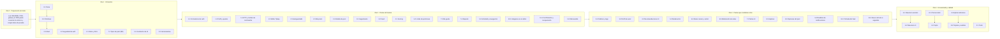

# Reparto de tareas del equipo (13 personas)

El proyecto está construido y documentado. Este documento lo **reparte en 44 paquetes de trabajo** para que cada integrante sea dueño de una parte concreta: que la entienda, la pueda explicar, la verifique a mano y la mejore. El reparto es **desigual a propósito**: la carga sigue la dificultad y el riesgo de cada paquete, no un número igual de tareas.

## 1. Cómo usar este documento

1. Buscá tu rol (D1 a D13) en la [sección 2](#2-equipo-y-roles) y tu sección personal en la [6](#6-una-sección-por-persona).
2. Abrí tus paquetes (`PRD-N.M`): cada uno dice qué entender antes, cómo funciona el código, cómo probarlo a mano y qué queda pendiente.
3. Seguí la lista de lectura de tu sección **en ese orden**.
4. Cuando termines, aplicá la [definición de terminado](#8-acuerdos-de-trabajo) y preparate para la [presentación](#9-cómo-presentar-tu-paquete).

> Un paquete `PRD-N.M` es una parte del PRD padre `PRD-N`. Por ejemplo, [PRD-1](../prds/PRD-1-auth.md) (autenticación) se parte en `1.1`, `1.2`, `1.3` y `1.4`. El índice completo está en [`docs/prds/README.md`](../prds/README.md).

## 2. Equipo y roles

Los roles D6 a D13 son marcadores: **completá la columna "Nombre"** con las personas reales. El acompañamiento que necesita cada uno se ajusta según cómo vaya la primera semana ([riesgo R2](#10-riesgos-y-mitigaciones)).

| Rol | Nombre | Qué se espera | Carga (puntos / % del total) |
| :--- | :--- | :--- | :--- |
| **D1** | _[Dylan]_ | Los paquetes más difíciles y de más riesgo: seguridad de auth, base de datos, el editor, scoring y una parte de la fundación de IA (D2 administra la clave de la API de IA y el chat). Revisa lo crítico de D2 y mentorea. Además diseñó la arquitectura del proyecto, repartió los roles de todo el equipo, configuró los workflows, las distintas herramientas y la protección de `main` en GitHub (ver [sección 8](#8-acuerdos-de-trabajo)), y dejó todo preparado para que el resto pudiera ponerse a programar sin problemas, sabiendo qué tarea le tocaba y cómo encararla — todo esto no entra en los puntos de la sección 4 | 24 / 25,26 % |
| **D2** | _[Alberto]_ | Maneja la clave de la API de **IA** y todo lo que depende de ella (fundación de IA, límite de peticiones, chat de servidor, aplicar ediciones), además del route runner y los tipos de post | 18 / 18,95 % |
| **D3** | _[Freddy]_ | Paquetes de dificultad avanzada y media, sin acompañamiento formal: ya implementó en producción reposts, las imágenes del editor, la moderación de notas y el realtime de notificaciones; D1 o D2 revisan esos cambios | 13 / 13,68 % |
| **D4** | _[Jhonaiker]_ | Paquetes de dificultad media con acompañamiento de D1 y D2; a su vez acompaña a seis paquetes básicos | 7 / 7,37 % |
| **D5** | _[Deiby]_ | Paquetes chicos, visibles y acotados, con mentor (D1 o D2); incluye su primer paso a un paquete medio (8.2, interfaz del cajón de chat, mentor D2) | 5 / 5,26 % |
| **D6** a **D13** | _[completar]_ | Paquetes chicos, visibles y acotados, siempre con un mentor (D1, D2, D3 o D4) o con apoyo entre pares (D7) | 2 a 5 puntos cada uno (2 % a 6 %) |

## 3. Principios del reparto desigual

| Principio | Qué significa en la práctica | Por qué |
| :--- | :--- | :--- |
| **El riesgo decide la dificultad** | Lo que, si se rompe, expone datos o deja saltar la moderación (RLS, autenticación, límite de peticiones, publicación, protocolo del chat) es de D1 o D2 | Un error ahí no se ve en la pantalla y es caro. Un error en un botón sí se ve y es barato |
| **D1 carga más; D2, algo menos pero comparable** | D1 tiene 24 puntos en 7 paquetes y D2 18 en 6, ambos con paquetes avanzados. D1 compensa la diferencia con la mentoría, la revisión de lo crítico y el trabajo de fundación (arquitectura, roles, entorno, CI) que no está en los puntos | Es lo que se pidió: un perfil avanzado que comparta el trabajo difícil sin que todo recaiga en una sola persona, con D1 manteniendo el rol de fundador del proyecto |
| **D3 tiene paquetes avanzados sin mentor formal** | A diferencia del resto de los roles chicos, D3 (Freddy) tiene paquetes de dificultad avanzada o media-alta (13 puntos), sin mentor formal, solo con revisor obligatorio (D1 o D2) | Ya los implementó en producción, con trabajo real entregado — no hay nada que validar en la semana 1 como con los paquetes recién asignados |
| **D4 no toma paquetes avanzados** | Solo dificultad media, con mentor (D1 o D2) en los cuatro | Se declaró intermedio: conviene comprobarlo con trabajo real antes de darle piezas de seguridad |
| **Los básicos empiezan por lo visible** | Interfaz, formularios y páginas simples | Se aprende más rápido viendo el resultado en el navegador, y un fallo no compromete al resto |
| **Poco no es nada** | Todos tienen al menos 2 paquetes, tareas pendientes reales y una presentación | Cada paquete básico igual enseña un concepto real del proyecto (Server Actions, Zod, RLS a nivel conceptual, rutas, estado) |
| **Nadie trabaja solo** | Cada paquete no avanzado tiene un mentor (D1, D2, D3 o D4) o, en cuatro paquetes básicos, apoyo entre pares de D7 | El mentor responde dudas, revisa y se asegura de que el dueño entienda lo que presenta. El apoyo entre pares no es una mentoría formal: si la duda supera a D7, se escala a D2 o D1 |
| **La mentoría se concentra en quien ya resolvió ese paquete** | D1, D2 y D4 acompañan 24 de los 44 paquetes con mentor formal; D3 acompaña 1 | D4 recién arranca en un paquete de dificultad media, por eso se le da una carga de mentoría acotada hasta ver cómo le va. D3 ya entregó sus cuatro paquetes en producción, así que no tiene esa limitación, pero tampoco se le pide mentorear más de lo que le tocó en el reparto |

## 4. Balance de carga

Los puntos son una estimación del esfuerzo de **entender, verificar, presentar y cerrar las tareas pendientes** de un paquete, no de escribirlo desde cero (ya existe): **S = 1** (hasta un día), **M = 2** (dos a tres días) y **L = 4** (más de tres días). Total: **95 puntos**.

| Rol | Paquetes | Nº | Puntos | % de 95 | Dificultad (A / M / B) |
| :--- | :--- | :--- | :--- | :--- | :--- |
| D1 | 1.1, 1.2, 1.4, 2.1, 2.2, 4.1, 5.3 | 7 | 24 | 25,26 % | 5 / 1 / 1 |
| D2 | 5.1, 5.2, 5.4, 7.1, 8.1, 8.3 | 6 | 18 | 18,95 % | 6 / 0 / 0 |
| D3 | 7.4, 5.5, 9.4, 10.1 | 4 | 13 | 13,68 % | 3 / 1 / 0 |
| D4 | 2.3, 2.4, 3.1, 6.1 | 4 | 7 | 7,37 % | 0 / 4 / 0 |
| D5 | 0.1, 4.2, X.2, 8.2 | 4 | 5 | 5,26 % | 0 / 1 / 3 |
| D6 | 0.2, 6.2, 11.1 | 3 | 5 | 5,26 % | 0 / 1 / 2 |
| D7 | 0.3, 7.2 | 2 | 4 | 4,21 % | 0 / 2 / 0 |
| D8 | 7.3, 11.2 | 2 | 2 | 2,11 % | 0 / 0 / 2 |
| D9 | 1.3, 8.4, 11.3 | 3 | 5 | 5,26 % | 0 / 2 / 1 |
| D10 | 2.5, 9.1, 10.2 | 3 | 4 | 4,21 % | 0 / 1 / 2 |
| D11 | 2.6, 9.2 | 2 | 2 | 2,11 % | 0 / 0 / 2 |
| D12 | 3.2, 9.3 | 2 | 3 | 3,16 % | 0 / 1 / 1 |
| D13 | 3.3, X.1 | 2 | 3 | 3,16 % | 0 / 1 / 1 |
| **Total** | | **44** | **95** | **100 %** | **14 / 15 / 15** |

Comprobación de la aritmética: 24 + 18 + 13 + 7 + 5 + 5 + 4 + 2 + 5 + 4 + 2 + 3 + 3 = 95; 7 + 6 + 4 + 4 + 4 + 3 + 2 + 2 + 3 + 3 + 2 + 2 + 2 = 44 paquetes; la suma de porcentajes es 100 %.

> **PRD-10 (imágenes y portada).** Ambos paquetes ya están implementados en producción ([PRD-10](../prds/PRD-10-post-images-cover.md)): no hay construcción pendiente, pero sí quedan por estudiar, presentar y revisar como el resto del catálogo. 10.1 (avanzado) es de D3 — se explica junto con el resto de sus paquetes ya implementados, más abajo; 10.2 (medio) es de D10, mentor D4 por su cercanía con 2.4 el diálogo de publicar. D1 sigue siendo revisor obligatorio de 10.1 por tocar `supabase/migrations/`.

> **PRD-1.4 (OTP y cambio de contraseña).** Igual que con PRD-10, no tiene construcción pendiente: ya está en producción. Es un paquete propio de D1: se estudia, se presenta y se revisa igual que cualquier otro paquete de D1 (sin revisor asignado, ver [sección 8](#8-acuerdos-de-trabajo)).

> **Paquetes de D3 (Freddy), ya implementados en producción.** Los cuatro paquetes de D3 (7.4 reposts, 10.1 imágenes en el editor, 5.5 moderación de notas, 9.4 realtime de notificaciones) tampoco tienen construcción pendiente: lo que queda es estudiarlos, presentarlos y que los revise el par correspondiente. D1 o D2 son revisores obligatorios de 7.4, 10.1 y 5.5 por ser RLS-adyacentes, de Storage o de moderación, y D2 (o D1 si escala) de 9.4; D1, además, por la regla general de cualquier cambio en `supabase/migrations/` (7.4, 10.1 y 9.4 la tocan).

La mentoría de cada paquete está en la columna **Mentor** del catálogo (sección 5); no se repite acá para no duplicar el dato y tener que mantenerlo en dos lugares.

## 5. Catálogo de paquetes

La columna **Ola** indica en qué momento conviene estudiar y presentar cada paquete ([sección 7](#7-orden-de-trabajo-por-olas)).

| ID | Paquete | Dif. | Esfuerzo | Dueño | Mentor | Ola |
| :--- | :--- | :--- | :--- | :--- | :--- | :--- |
| 0.1 | [Tema y tokens de diseño](../prds/PRD-0.1-theme-tokens.md) | B | S | D5 | D2 | 1 |
| 0.2 | [Primitivas de UI](../prds/PRD-0.2-ui-primitives.md) | B | M | D6 | D2 | 1 |
| 0.3 | [Shell de la aplicación](../prds/PRD-0.3-app-shell.md) | M | M | D7 | D2 | 1 |
| 1.1 | [Formularios de registro y login](../prds/PRD-1.1-auth-forms.md) | B | M | D1 | — | 2 |
| 1.2 | [Seguridad de la autenticación](../prds/PRD-1.2-auth-security.md) | A | L | D1 | — | 1 |
| 1.3 | [Perfil y ajustes](../prds/PRD-1.3-profile-settings.md) | B | S | D9 | D4 | 2 |
| 1.4 | [OTP de registro, recuperación y cambio de contraseña](../prds/PRD-1.4-auth-otp-y-cambio-password.md) | A | L | D1 (implementado) | — | 2 |
| 2.1 | [Datos de posts y RLS](../prds/PRD-2.1-posts-data-rls.md) | A | L | D1 | — | 1 |
| 2.2 | [Editor Tiptap](../prds/PRD-2.2-editor-tiptap.md) | A | L | D1 | — | 2 |
| 2.3 | [Autoguardado y borradores](../prds/PRD-2.3-autosave-drafts.md) | M | M | D4 | D2 | 2 |
| 2.4 | [Diálogo de publicar y tags](../prds/PRD-2.4-publish-dialog-tags.md) | M | M | D4 | D1 | 3 |
| 2.5 | [Página "Mis posts"](../prds/PRD-2.5-my-posts-page.md) | B | S | D10 | D2 | 2 |
| 2.6 | [Detalle de post](../prds/PRD-2.6-post-detail.md) | B | S | D11 | D2 | 2 |
| 3.1 | [Sistema de seguimiento](../prds/PRD-3.1-follow-system.md) | M | M | D4 | D1 | 2 |
| 3.2 | [Lista del feed](../prds/PRD-3.2-feed-list.md) | M | M | D12 | D4 | 2 |
| 3.3 | [Perfil público de autor](../prds/PRD-3.3-author-profile.md) | B | S | D13 | D4 | 3 |
| 4.1 | [Núcleo del scoring de recomendaciones](../prds/PRD-4.1-scoring-core.md) | M | M | D1 | — | 2 |
| 4.2 | [Consulta y UI de recomendaciones](../prds/PRD-4.2-recs-query-ui.md) | B | S | D5 | D2 | 3 |
| 5.1 | [Fundación de IA (Gemini)](../prds/PRD-5.1-ai-foundation.md) | A | L | D2 | — | 1 |
| 5.2 | [Límite de peticiones](../prds/PRD-5.2-rate-limit.md) | A | M | D2 | — | 2 |
| 5.3 | [Moderación al publicar](../prds/PRD-5.3-publish-moderation.md) | A | L | D1 | — | 3 |
| 5.4 | [Route runner y caché de IA](../prds/PRD-5.4-ai-route-runner.md) | A | M | D2 | D1 | 3 |
| 5.5 | [Moderación de notas por diccionario](../prds/PRD-5.5-notes-moderation.md) | A | L | D3 (implementado) | — | 3 |
| 6.1 | [Resumen para lectores: servidor](../prds/PRD-6.1-summary-backend.md) | M | S | D4 | D1 | 4 |
| 6.2 | [Resumen para lectores: interfaz](../prds/PRD-6.2-summary-ui.md) | B | S | D6 | D4 | 4 |
| 7.1 | [Tipos de post en la base](../prds/PRD-7.1-post-types-db.md) | A | M | D2 | D1 | 1 |
| 7.2 | [Notas: interfaz](../prds/PRD-7.2-notes-ui.md) | M | M | D7 | D4 | 3 |
| 7.3 | [Me gusta](../prds/PRD-7.3-likes.md) | B | S | D8 | D7 (pares) | 2 |
| 7.4 | [Reposts](../prds/PRD-7.4-reposts.md) | A | L | D3 (implementado) | — | 2 |
| 8.1 | [Chat de IA: servidor](../prds/PRD-8.1-chat-server.md) | A | L | D2 | — | 4 |
| 8.2 | [Chat de IA: interfaz del cajón](../prds/PRD-8.2-chat-drawer-ui.md) | M | M | D5 | D2 | 4 |
| 8.3 | [Contexto del editor y aplicar ediciones](../prds/PRD-8.3-editor-context-apply.md) | A | L | D2 | — | 4 |
| 8.4 | [Tarjetas de acción y análisis](../prds/PRD-8.4-action-cards-analysis.md) | M | M | D9 | D2 | 4 |
| 9.1 | [Página Explorar](../prds/PRD-9.1-explore-page.md) | B | S | D10 | D7 (pares) | 3 |
| 9.2 | [Actividad y navegación](../prds/PRD-9.2-activity-nav.md) | B | S | D11 | D7 (pares) | 2 |
| 9.3 | [Menú de opciones del post](../prds/PRD-9.3-post-options-drawer.md) | B | S | D12 | D7 (pares) | 3 |
| 9.4 | [Realtime del badge de notificaciones](../prds/PRD-9.4-notifications-realtime.md) | M | S | D3 (implementado) | — | 3 |
| 10.1 | [Imágenes en el editor](../prds/PRD-10.1-post-images.md) | A | L | D3 (implementado) | — | 2 |
| 10.2 | [Portada del feed](../prds/PRD-10.2-post-cover.md) | M | M | D10 | D4 | 3 |
| 11.1 | [Confirmación de email y recuperación](../prds/PRD-11.1-confirmacion-y-recuperacion.md) | M | M | D6 | D2 | 2 |
| 11.2 | [Email de bienvenida](../prds/PRD-11.2-bienvenida.md) | B | S | D8 | D3 | 2 |
| 11.3 | [Aviso de nuevo artículo a seguidores](../prds/PRD-11.3-nuevo-articulo-seguidos.md) | M | M | D9 | D2 | 3 |
| X.1 | [Tests e2e y unitarios](../prds/PRD-X.1-testing-e2e.md) | M | M | D13 | D2 | 4 |
| X.2 | [Herramientas de desarrollo](../prds/PRD-X.2-dev-tooling.md) | B | S | D5 | D1 | 1 |

**(pares)** = apoyo entre pares de D7, no mentoría formal. La vía de escalada de esos cuatro paquetes es D2 y luego D1, y D2 revisa sus cambios ([sección 8](#8-acuerdos-de-trabajo)).

## 6. Una sección por persona

Todos empiezan igual: [`docs/README.md`](../README.md) (mapa y [glosario](../README.md#glosario)) y [`PRD-global-vision.md`](../PRD-global-vision.md). Después, cada uno sigue su lista.

### D1 — Dylan (24 puntos)

| | |
| :--- | :--- |
| **Paquetes** | [1.1](../prds/PRD-1.1-auth-forms.md) formularios de registro y login · [1.2](../prds/PRD-1.2-auth-security.md) seguridad de autenticación · [1.4](../prds/PRD-1.4-auth-otp-y-cambio-password.md) OTP y cambio de contraseña · [2.1](../prds/PRD-2.1-posts-data-rls.md) datos de posts y RLS · [2.2](../prds/PRD-2.2-editor-tiptap.md) editor Tiptap · [4.1](../prds/PRD-4.1-scoring-core.md) scoring · [5.3](../prds/PRD-5.3-publish-moderation.md) moderación al publicar |
| **Leer, en orden** | [PRD-1](../prds/PRD-1-auth.md), [ADR 0003](../adr/0003-seguridad-rls-y-proxy-minimo.md), [ADR 0007](../adr/0007-login-por-username-con-secret-key.md) → [PRD-2](../prds/PRD-2-posts.md), [`db/schema.md`](../db/schema.md), [ADR 0010](../adr/0010-editor-markdown.md), [ADR 0012](../adr/0012-integridad-de-escritura-de-posts.md) → [PRD-4](../prds/PRD-4-recommendations.md), [ADR 0004](../adr/0004-recomendaciones-scoring-determinista.md) → [PRD-5](../prds/PRD-5-ai-author.md), [ADR 0017](../adr/0017-politica-de-thinking-y-reintentos-gemini.md) |
| **Mentorea** | D4 (2.4, 3.1, 6.1), D2 (5.4, 7.1) y D5 (X.2) |
| **Revisa obligatoriamente** | Todo cambio que toque migraciones, RLS, `proxy.ts`, el cliente admin (secret key) o la publicación — incluidos los paquetes propios de D2 (revisión cruzada) y los ya implementados de D3 que tocan `supabase/migrations/` (7.4, 9.4) |
| **Entrega** | Los siete paquetes explicados, más el mapa de seguridad del proyecto (qué protege cada capa) |

> **Además de sus paquetes.** D1 diseñó la arquitectura del proyecto, repartió los roles y los paquetes de las otras doce personas, configuró los workflows, las distintas herramientas y la protección de `main` en GitHub (nadie puede pushear directo ni mergear sin su aprobación como code owner, ver [sección 8](#8-acuerdos-de-trabajo)), y dejó todo preparado para que el resto pudiera ponerse a programar sin problemas, sabiendo qué tarea le tocaba y cómo encararla. Es trabajo real de fundación, distinto del trabajo de "entender, verificar, presentar y cerrar" que miden los puntos de la [sección 4](#4-balance-de-carga): no se le suma un número a su carga porque no es un paquete con dueño y presentación como el resto del catálogo, pero es la razón de fondo por la que, además de tener ya el puntaje más alto del equipo, D1 sigue siendo quien más carga real lleva.

### D2 — Alberto (18 puntos)

| | |
| :--- | :--- |
| **Paquetes** | [5.1](../prds/PRD-5.1-ai-foundation.md) fundación de IA · [5.2](../prds/PRD-5.2-rate-limit.md) límite de peticiones · [5.4](../prds/PRD-5.4-ai-route-runner.md) route runner y caché · [7.1](../prds/PRD-7.1-post-types-db.md) tipos de post en la base · [8.1](../prds/PRD-8.1-chat-server.md) chat, servidor · [8.3](../prds/PRD-8.3-editor-context-apply.md) contexto y aplicar ediciones |
| **Leer, en orden** | [PRD-5](../prds/PRD-5-ai-author.md), [ADR 0011](../adr/0011-ia-con-gemini.md), [ADR 0017](../adr/0017-politica-de-thinking-y-reintentos-gemini.md) → [PRD-7](../prds/PRD-7-notes-likes.md), [ADR 0009](../adr/0009-tipos-de-post-y-likes.md), [ADR 0015](../adr/0015-notas-editables.md) → [PRD-8](../prds/PRD-8-ai-chat.md), [ADR 0013](../adr/0013-chat-ia-protocolo-ndjson-y-function-calling.md), [ADR 0014](../adr/0014-aplicacion-de-ediciones-en-el-cliente-con-fingerprints.md) |
| **Mentorea** | D5 (0.1, 4.2, 8.2), D6 (0.2, 11.1), D7 (0.3), D9 (8.4, 11.3), D10 (2.5), D11 (2.6), D13 (X.1) y D4 (2.3): 12 paquetes |
| **Revisa obligatoriamente** | Todo cambio en la clave de la API de **IA** y los paquetes que dependen de ella, tres de los cuatro paquetes de D3 (7.4, 10.1 y 5.5, junto con D1) y 9.4 (solo D2, o D1 si escala). No revisa los paquetes de D1: D1 no tiene revisor asignado |
| **Entrega** | Los seis paquetes explicados, incluida una demo del motor de aplicar ediciones |

### D3 — Freddy (13 puntos)

| | |
| :--- | :--- |
| **Paquetes** | [7.4](../prds/PRD-7.4-reposts.md) reposts · [10.1](../prds/PRD-10.1-post-images.md) imágenes en el editor · [5.5](../prds/PRD-5.5-notes-moderation.md) moderación de notas por diccionario · [9.4](../prds/PRD-9.4-notifications-realtime.md) realtime del badge de notificaciones |
| **Leer, en orden** | [PRD-7](../prds/PRD-7-notes-likes.md), [ADR 0009](../adr/0009-tipos-de-post-y-likes.md) → [PRD-5](../prds/PRD-5-ai-author.md) → [PRD-9](../prds/PRD-9-explore-activity.md), [ADR 0027](../adr/0027-notificaciones-por-triggers-sql.md), [ADR 0036](../adr/0036-notificaciones-realtime.md) → [PRD-10](../prds/PRD-10-post-images-cover.md), [ADR 0022](../adr/0022-imagenes-en-supabase-storage.md) |
| **Mentorea / Es mentorado por** | No es mentorado: sus cuatro paquetes ya están implementados por él en producción. Mentorea a D8 en [11.2](../prds/PRD-11.2-bienvenida.md) |
| **Revisa obligatoriamente / Reviewer asignado** | No tiene revisión obligatoria propia asignada en el catálogo; en cambio, sus cuatro paquetes tienen a D1 o D2 como revisor obligatorio (RLS-adyacente y `supabase/migrations/` en 7.4, Storage y `supabase/migrations/` en 10.1, moderación en 5.5, Realtime/RLS en 9.4) |
| **Entrega** | Los cuatro paquetes explicados y presentados. El [riesgo R2](#10-riesgos-y-mitigaciones) no le aplica: sus cuatro paquetes ya están en producción, no hay nada que validar en la primera semana |

### D4 — Jhonaiker (7 puntos)

| | |
| :--- | :--- |
| **Paquetes** | [2.3](../prds/PRD-2.3-autosave-drafts.md) autoguardado · [2.4](../prds/PRD-2.4-publish-dialog-tags.md) diálogo de publicar y tags · [3.1](../prds/PRD-3.1-follow-system.md) seguimiento · [6.1](../prds/PRD-6.1-summary-backend.md) resumen, servidor |
| **Leer, en orden** | [PRD-2](../prds/PRD-2-posts.md), [ADR 0010](../adr/0010-editor-markdown.md) → [PRD-3](../prds/PRD-3-feed-follows.md), [ADR 0021](../adr/0021-feed-en-raiz-y-global.md) → [PRD-6](../prds/PRD-6-ai-reader.md), [ADR 0011](../adr/0011-ia-con-gemini.md), [ADR 0020](../adr/0020-tags-como-metadato-interno.md) |
| **Es mentorado por** | D2 (2.3) y D1 (2.4, 3.1, 6.1) |
| **Mentorea (primera línea)** | D6 (6.2), D7 (7.2), D9 (1.3), D10 (10.2), D12 (3.2) y D13 (3.3): 6 paquetes. Cuando una duda lo supere, la escala a D2 o D1 ([riesgo R2](#10-riesgos-y-mitigaciones)) |
| **Entrega** | Los cuatro paquetes explicados y, en la primera semana, una explicación de uno de ellos a D2 para confirmar cómo le está yendo con el acompañamiento |

### D5 a D13

Cada uno lee, en este orden: el PRD padre de su paquete, su sub-PRD (`PRD-N.M`), los ADRs que enlaza y, al final, el glosario. Todos tienen una **entrega** común: la [presentación de 5 minutos](#9-cómo-presentar-tu-paquete) de cada paquete y al menos una tarea de "Trabajo pendiente asignable" cerrada, o la constancia de que no hay ninguna.

| Rol | Nombre | Paquetes | Mentor | Lectura específica | Concepto principal que aprende |
| :--- | :--- | :--- | :--- | :--- | :--- |
| **D5** | _[Deiby]_ | [0.1](../prds/PRD-0.1-theme-tokens.md) tema · [4.2](../prds/PRD-4.2-recs-query-ui.md) recomendaciones, UI · [X.2](../prds/PRD-X.2-dev-tooling.md) herramientas · [8.2](../prds/PRD-8.2-chat-drawer-ui.md) interfaz del cajón de chat | D2 (0.1, 4.2, 8.2), D1 (X.2) | [PRD-0](../prds/PRD-0-design-system.md), [ADR 0008](../adr/0008-tema-oscuro-y-shell-de-aplicacion.md), [PRD-4](../prds/PRD-4-recommendations.md), [ADR 0016](../adr/0016-migraciones-sql-manuales.md), [PRD-8](../prds/PRD-8-ai-chat.md), [ADR 0013](../adr/0013-chat-ia-protocolo-ndjson-y-function-calling.md) | Variables de CSS, consultas, scripts de desarrollo y su primer componente de estado de cliente (el cajón de chat) |
| **D6** | _[completar]_ | [0.2](../prds/PRD-0.2-ui-primitives.md) primitivas de UI · [6.2](../prds/PRD-6.2-summary-ui.md) resumen, UI · [11.1](../prds/PRD-11.1-confirmacion-y-recuperacion.md) confirmación y recuperación | D2 (0.2, 11.1), D4 (6.2) | [PRD-0](../prds/PRD-0-design-system.md), [ADR 0005](../adr/0005-shadcn-ui-como-primitivas.md), [PRD-6](../prds/PRD-6-ai-reader.md), [PRD-11](../prds/PRD-11-emails-transaccionales.md) | Componentes reutilizables, estados de carga y los flujos nativos de Supabase Auth |
| **D7** | _[completar]_ | [0.3](../prds/PRD-0.3-app-shell.md) shell · [7.2](../prds/PRD-7.2-notes-ui.md) notas, UI | D2 (0.3), D4 (7.2). **Da apoyo entre pares** a D8 (7.3), D10 (9.1), D11 (9.2) y D12 (9.3) | [PRD-0](../prds/PRD-0-design-system.md), [ADR 0008](../adr/0008-tema-oscuro-y-shell-de-aplicacion.md), [PRD-7](../prds/PRD-7-notes-likes.md), [ADR 0015](../adr/0015-notas-editables.md) | Layouts de Next.js, Server vs. Client Components |
| **D8** | _[completar]_ | [7.3](../prds/PRD-7.3-likes.md) me gusta · [11.2](../prds/PRD-11.2-bienvenida.md) email de bienvenida | D7 apoyo entre pares (7.3), D3 (11.2) | [PRD-7](../prds/PRD-7-notes-likes.md), [ADR 0009](../adr/0009-tipos-de-post-y-likes.md), [PRD-1](../prds/PRD-1-auth.md) (para el `LoginDrawer` que usa 7.3), [PRD-11](../prds/PRD-11-emails-transaccionales.md) | Server Actions, Zod y un envío de email transaccional simple |
| **D9** | _[completar]_ | [1.3](../prds/PRD-1.3-profile-settings.md) perfil y ajustes · [8.4](../prds/PRD-8.4-action-cards-analysis.md) tarjetas y análisis · [11.3](../prds/PRD-11.3-nuevo-articulo-seguidos.md) aviso de nuevo artículo | D4 (1.3), D2 (8.4, 11.3) | [PRD-1](../prds/PRD-1-auth.md), [PRD-8](../prds/PRD-8-ai-chat.md), [ADR 0014](../adr/0014-aplicacion-de-ediciones-en-el-cliente-con-fingerprints.md), [PRD-11](../prds/PRD-11-emails-transaccionales.md) | Formularios de edición, estado en el cliente y fan-out de emails con funciones SQL `SECURITY DEFINER` |
| **D10** | _[completar]_ | [2.5](../prds/PRD-2.5-my-posts-page.md) Mis posts · [9.1](../prds/PRD-9.1-explore-page.md) Explorar · [10.2](../prds/PRD-10.2-post-cover.md) portada del feed | D2 (2.5), D7 apoyo entre pares (9.1), D4 (10.2) | [PRD-2](../prds/PRD-2-posts.md), [PRD-9](../prds/PRD-9-explore-activity.md), [ADR 0020](../adr/0020-tags-como-metadato-interno.md), [PRD-10](../prds/PRD-10-post-images-cover.md), [ADR 0023](../adr/0023-portada-de-articulos.md) | Server Components, consultas a Supabase y el diálogo de publicar |
| **D11** | _[completar]_ | [2.6](../prds/PRD-2.6-post-detail.md) detalle de post · [9.2](../prds/PRD-9.2-activity-nav.md) Actividad y navegación | D2 (2.6), D7 apoyo entre pares (9.2) | [PRD-2](../prds/PRD-2-posts.md), [PRD-9](../prds/PRD-9-explore-activity.md), [ADR 0008](../adr/0008-tema-oscuro-y-shell-de-aplicacion.md) | Rutas dinámicas y renderizado de markdown |
| **D12** | _[completar]_ | [3.2](../prds/PRD-3.2-feed-list.md) lista del feed · [9.3](../prds/PRD-9.3-post-options-drawer.md) menú de opciones | D4 (3.2), D7 apoyo entre pares (9.3) | [PRD-3](../prds/PRD-3-feed-follows.md), [ADR 0021](../adr/0021-feed-en-raiz-y-global.md), [PRD-9](../prds/PRD-9-explore-activity.md) | Paginación ("Cargar más") y componentes con opciones reales y opciones sin efecto |
| **D13** | _[completar]_ | [3.3](../prds/PRD-3.3-author-profile.md) perfil de autor · [X.1](../prds/PRD-X.1-testing-e2e.md) tests | D4 (3.3), D2 (X.1) | [PRD-3](../prds/PRD-3-feed-follows.md), [`guides/testing.md`](../guides/testing.md), [ADR 0018](../adr/0018-sin-ci-gates-manuales.md) | Pestañas, y cómo se prueba una aplicación (unitario vs. e2e) |

## 7. Orden de trabajo por olas

Como el código ya existe, nadie espera a que otro "termine" para empezar: todos leen y corren la app desde el primer día. Lo que sí depende de otros es el **orden de explicación y presentación**: primero los cimientos que los demás usan. Las flechas son "se explica antes que".

```mermaid
flowchart LR
  subgraph O0["Ola 0 · Preparación de todos"]
    S0["Leer README, PRD-global y el PRD padre<br/>Levantar el entorno y cargar datos de prueba"]
  end
  subgraph O1["Ola 1 · Cimientos"]
    N01["0.1 Tema"] --> N02["0.2 Primitivas"] --> N03["0.3 Shell"]
    N12["1.2 Seguridad de auth"]
    N21["2.1 Datos y RLS"]
    N71["7.1 Tipos de post (BD)"]
    N51["5.1 Fundación de IA"]
    NX2["X.2 Herramientas"]
  end
  subgraph O2["Ola 2 · Piezas de feature"]
    N11["1.1 Formularios de auth"]
    N13["1.3 Perfil y ajustes"]
    N14["1.4 OTP y cambio de contraseña"]
    N22["2.2 Editor Tiptap"]
    N23["2.3 Autoguardado"]
    N25["2.5 Mis posts"]
    N26["2.6 Detalle de post"]
    N31["3.1 Seguimiento"]
    N32["3.2 Feed"]
    N41["4.1 Scoring"]
    N52["5.2 Límite de peticiones"]
    N73["7.3 Me gusta"]
    N74["7.4 Reposts"]
    N92["9.2 Actividad y navegación"]
    N101["10.1 Imágenes en el editor"]
    N111["11.1 Confirmación y recuperación"]
    N112["11.2 Bienvenida"]
  end
  subgraph O3["Ola 3 · Piezas que combinan otras"]
    N24["2.4 Publicar y tags"]
    N33["3.3 Perfil de autor"]
    N42["4.2 Recomendaciones UI"]
    N53["5.3 Moderación"]
    N54["5.4 Route runner y caché"]
    N55["5.5 Moderación de notas"]
    N72["7.2 Notas UI"]
    N91["9.1 Explorar"]
    N93["9.3 Opciones del post"]
    N94["9.4 Realtime de notificaciones"]
    N102["10.2 Portada del feed"]
    N113["11.3 Nuevo artículo a seguidos"]
  end
  subgraph O4["Ola 4 · IA avanzada y calidad"]
    N61["6.1 Resumen servidor"] --> N62["6.2 Resumen UI"]
    N81["8.1 Chat servidor"] --> N82["8.2 Cajón"]
    N83["8.3 Aplicar ediciones"] --> N84["8.4 Tarjetas y análisis"]
    NX1["X.1 Tests"]
  end
  S0 --> O1
  O1 --> O2
  O2 --> O3
  O3 --> O4
```

**Cómo se evita que los básicos se queden bloqueados**

| Situación | Regla |
| :--- | :--- |
| El entorno no arranca | Es el único bloqueo real. Seguir [`getting-started.md`](../guides/getting-started.md) y avisar a D5 (dueño de [X.2](../prds/PRD-X.2-dev-tooling.md)) y a D1 el mismo día |
| Un paquete básico depende de un cimiento que todavía no se explicó | Se lee el código igual; solo se **presenta** después de que el dueño del cimiento presente |
| El mentor (o D7, en apoyo entre pares) no responde | Escalar a D2 y, si no hay respuesta, a D1 ([sección 8](#8-acuerdos-de-trabajo)) |

## 8. Acuerdos de trabajo

### Definición de terminado (por paquete)

- [ ] Leíste el sub-PRD completo y sus ADRs, y respondés sus **preguntas de autoevaluación** sin mirar el código.
- [ ] Hiciste a mano todos los pasos de "Cómo verificarla a mano" y funcionan.
- [ ] Cerraste al menos una tarea de "Trabajo pendiente asignable" con un cambio revisado, o dejaste anotado que no hay tareas.
- [ ] Si tu cambio altera comportamiento visible, actualizaste el PRD o el ADR correspondiente en el mismo cambio.
- [ ] `pnpm lint` y `pnpm test` pasan; si tocaste un flujo visible, corriste el spec de `e2e/` que lo cubre (los e2e tienen desfases: ver [PRD-X.1](../prds/PRD-X.1-testing-e2e.md)).
- [ ] La persona designada como revisor aprobó el cambio.
- [ ] Presentaste tu paquete con la [plantilla de 5 minutos](#9-cómo-presentar-tu-paquete).

### Quién revisa a quién

| Tipo de paquete | Revisor obligatorio |
| :--- | :--- |
| Paquetes propios de D1 (1.1, 1.2, 1.4, 2.1, 2.2, 4.1, 5.3) | Sin revisor asignado: D1 es quien aprueba los PRs de todo el repo ([sección 8](#8-acuerdos-de-trabajo)) |
| Paquetes propios de D2 (5.1, 5.2, 5.4, 7.1, 8.1, 8.3) | D1 |
| Avanzado de D3, ya implementado (7.4, 10.1, 5.5) | D1 o D2 (a definir por paquete; D1 siempre en 7.4 y 10.1 por tocar `supabase/migrations/`) |
| Medio de D3, ya implementado (9.4) | D2 (o D1 si escala) |
| Medio de D4 (2.3, 2.4, 3.1, 6.1) | Su mentor (D2 para 2.3, D1 para el resto) |
| Básico o medio de D5 a D13 | Su mentor; en los cuatro paquetes con apoyo entre pares de D7 (7.3, 9.1, 9.2, 9.3), **D2**. **Además D1**, si el cambio toca migraciones, RLS, Server Actions, `proxy.ts` o el cliente admin (incluye 11.3, por la función `SECURITY DEFINER` sobre `auth.users`) |
| Cualquier cambio en `supabase/migrations/` | D1, siempre |

### Mentoría y cuando estás trabado

- **Cadencia.** Una conversación corta y fija por semana entre mentor y mentoreado (15 a 30 minutos): qué entendiste, qué no, qué sigue.
- **Antes de preguntar,** leé el sub-PRD y el ADR del tema y probá el paso a mano; al preguntar, decí qué probaste y qué esperabas.
- **Si llevás más de un día trabado,** avisá. Escalada: mentor (o D7, si tu paquete tiene apoyo entre pares) → D2 → D1.
- **No se toca código fuera de tu paquete** sin avisar antes a su dueño. Si necesitás un cambio en el paquete de otra persona, pedíselo con un ejemplo concreto.

### Ramas y commits

| Tema | Regla |
| :--- | :--- |
| Ramas | `<tipo>/<id>-<slug>`, por ejemplo `feat/2.5-my-posts-page`, `fix/X.2-verify-writes-email`, `docs/1.1-auth-forms` |
| Commits | [Conventional Commits](https://www.conventionalcommits.org/es/v1.0.0/): `feat(auth): ...`, `fix(e2e): ...`, `docs(prds): ...` |
| Atribución | Sin líneas de coautoría automáticas ni marcas de herramientas en los mensajes de commit |
| Protección de `main` | D1 dejó configurada la rama `main` con reglas de GitHub que no se pueden saltear editando código: nadie puede pushear directo, toda entrega es por PR, hace falta al menos una aprobación y pasar los 5 checks de CI (`lint`, `typecheck`, `test`, `build`, `gitleaks`). Además el `CODEOWNERS` marca a D1 como dueño de todo el repo, así que esa aprobación tiene que ser suya |
| Entorno compartido | **Decisión abierta para D1:** un solo proyecto de Supabase de desarrollo para todos, o uno por persona. Compartido es más simple pero los e2e crean usuarios reales; individual exige aplicar las migraciones a mano en cada uno ([ADR 0016](../adr/0016-migraciones-sql-manuales.md)) |
| Secretos | Nunca se sube `.env.local`. La `SUPABASE_SECRET_KEY` salta RLS: no se comparte por chat ni se pega en issues |

## 9. Cómo presentar tu paquete

Cada persona presenta cada uno de sus paquetes en **5 minutos**. Se evalúa que entiendas lo que hay, no que lo hayas escrito.

| Minuto | Parte | Qué decir |
| :--- | :--- | :--- |
| 1 | **Qué** | Qué hace el paquete y qué problema resuelve, en lenguaje simple |
| 2 | **Cómo** | Recorré el código en el orden del sub-PRD ("Cómo funciona"), con archivos y funciones reales |
| 3 | **Por qué** | Las decisiones importantes y sus alternativas (sección "Decisiones y por qué" y los ADRs). Si el motivo está marcado con `†`, decí que es reconstruido |
| 4 | **Demo** | Mostrarlo funcionando en el navegador o con un test, siguiendo "Cómo verificarla a mano" |
| 5 | **Qué mejoraría** | Una tarea de "Trabajo pendiente asignable" y por qué la elegís |

**Autoevaluación antes de presentar:**

- [ ] Puedo explicar el paquete sin leer el código línea por línea.
- [ ] Sé qué archivos lo componen y cuál leería primero.
- [ ] Sé de qué otros paquetes depende y quién es su dueño.
- [ ] Puedo nombrar al menos una decisión, la alternativa descartada y su consecuencia.
- [ ] Sé qué NO hace mi paquete (alcance) y dónde está lo que falta.
- [ ] Respondí las preguntas de autoevaluación de mi sub-PRD.
- [ ] Puedo mostrar una limitación conocida real, no inventada.

## 10. Riesgos y mitigaciones

| # | Riesgo | Señal de alerta | Mitigación |
| :--- | :--- | :--- | :--- |
| **R1** | **D1 es un punto único de falla.** Tiene el 25 % de la carga puntuada, es mentor de tres personas, revisor obligatorio de lo crítico, el único code owner del repositorio (nadie mergea sin su aprobación) y, además, el único que diseñó la arquitectura, repartió los roles y dejó configurados los workflows, las herramientas y la protección de `main` en GitHub. Sus propios paquetes, además, no tienen revisor asignado | Revisiones que se acumulan; respuestas que tardan más de un día | La documentación (PRDs y ADRs) existe justamente para que las decisiones no vivan solo en la cabeza de D1. Los 5 checks de CI (`lint`, `typecheck`, `test`, `build`, `gitleaks`) igual corren sobre los paquetes de D1 aunque no tenga revisor humano. Los básicos no dependen de D1 para su trabajo diario: escalan por mentor |
| **R2** | **D4 mentorea 6 paquetes sin haber pasado todavía por esa carga.** El reparto lo pone como mentor de 1.3, 3.2, 3.3, 6.2, 7.2 y 10.2 (de D9, D12, D13, D6, D7 y D10) desde su primer paquete de dificultad media | En la primera semana, explicaciones vagas o respuestas incorrectas a los básicos | Calibración en la semana 1: D4 explica uno de sus paquetes a D2. Si hay lagunas, la mentoría directa de sus paquetes se reparte entre D1 y D2 (por ejemplo, D2 toma 3.2 y 3.3, y D1 toma 6.2 y 7.2) y se revisa la carga de ambos. D1 y D2 siguen siendo la vía de escalada de todos, incluido el apoyo entre pares de D7. Nunca se le da un paquete avanzado a D4 sin pasar por esta calibración. (Este riesgo no aplica a D3/Freddy: sus paquetes ya están en producción) |
| **R3** | **Los básicos se bloquean** (entorno, jerga, no saber qué preguntar) | Nadie abrió su paquete a los dos días; preguntas genéricas | Ola 0 con el entorno resuelto el primer día, glosario en [`docs/README.md`](../README.md#glosario), cadencia semanal con el mentor y "Cómo verificarla a mano" con pasos que se pueden seguir sin entender todo |
| **R4** | **El reparto desigual se vive como injusto** | Comentarios sobre "quién hizo más" | Este documento es público: puntos, criterios y mentoría a la vista. La mentoría de D1 y D2 y la revisión cruzada están contadas como carga real ([sección 4](#4-balance-de-carga)) |
| **R5** | **Los e2e están rotos y no hay CI de tests**, así que un cambio puede romper algo sin que nadie lo note | `pnpm test:e2e` falla desde el primer día | Se cierra con [PRD-X.1](../prds/PRD-X.1-testing-e2e.md) en la Ola 4. Hasta entonces, `pnpm test` (unitarios) es la red confiable ([ADR 0018](../adr/0018-sin-ci-gates-manuales.md)) |
| **R6** | **Duplicar trabajo o pisar el código de otro** | Dos personas editan el mismo archivo | Cada archivo pertenece a un solo paquete (catálogo de la [sección 5](#5-catálogo-de-paquetes)); los cambios entre paquetes se piden al dueño |
| **R7** | **Se documenta lo que "debería" haber y no lo que hay** | Un PRD que contradice al código | Regla de [`docs/prds/README.md`](../prds/README.md): el PRD describe lo que hay; quien cambia el código actualiza el PRD en el mismo cambio |
